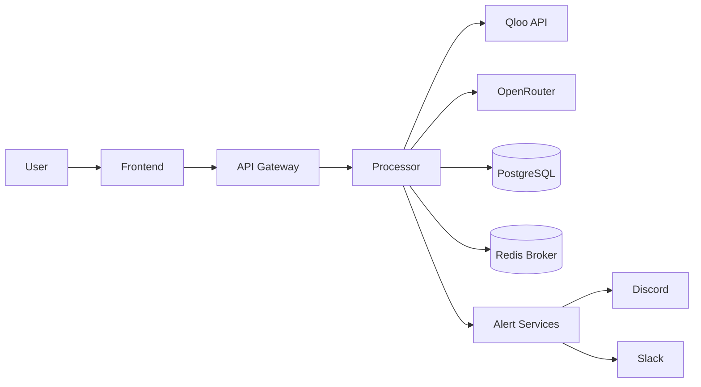
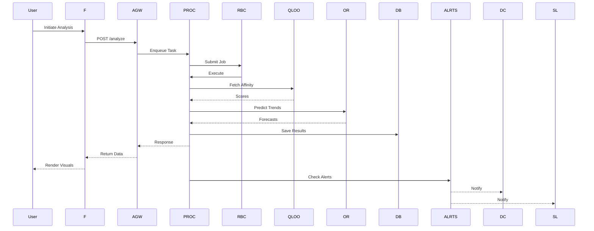
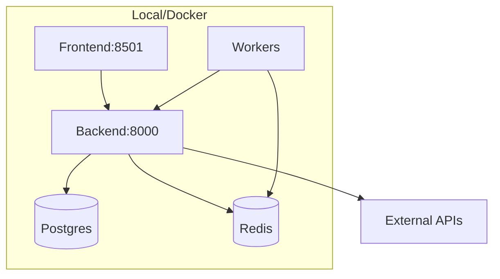

# CAESER (Cultural Affinity Simulation Engine for Retail)

> 🏆 Built for the [Qloo LLM Hackathon 2025](https://qloo-hackathon.devpost.com/)  
> This project was designed and developed in just less than 12 days — merging Qloo’s cultural intelligence with LLM-powered prediction engines to shape retail’s next frontier.

[](LICENSE)
[](#)
[](#)
[](#)

---

<p align="center">
  
  <h2>Empowering retailers with predictive cultural intelligence</h2>
</p>

---

## 📖 Table of Contents

1. [🧩 Overview](#overview)
2. [✨ Key Features](#key-features)
3. [🚀 Quickstart Guide](#quickstart-guide)
4. [🏗 Architecture & Diagrams](#architecture--diagrams)
5. [⚙️ Installation & Setup](#installation--setup)
6. [🔧 Configuration](#configuration)
7. [📡 Usage Examples](#usage-examples)
8. [📂 Project Structure](#project-structure)
9. [🛠️ Advanced Topics](#advanced-topics)
10. [📈 Benchmarks & Metrics](#benchmarks--metrics)
11. [🗺 Roadmap &  Vision](#roadmap---vision)
12. [❓ FAQ](#faq)
13. [🤝 Contributing](#contributing)
14. [🐞 Troubleshooting](#troubleshooting)
15. [📜 License](#license)
16. [📞 Contact & Acknowledgments](#contact--acknowledgments)

---

## 🧩 Overview

CAESER is a modular, full-stack AI platform that merges cultural affinity analytics with demand forecasting. By tapping into Qloo Insights for affinity data and leveraging OpenRouter LLMs for predictive simulations, CAESER helps retailers optimize inventory, marketing, and localization strategies based on data-driven cultural insights.

Retailers face challenges:

* **Cultural Disconnect**: Hard to tune campaigns to nuanced preferences.
* **Forecast Uncertainty**: Over/understock risks and missed trends.
* **Siloed Data**: Fragmented analytics impede decision alignment.

CAESER’s unified approach delivers:

1. **Insight**: Deep cultural affinity scores by region, demographic, and genre.
2. **Prediction**: AI-driven hype and demand forecasts.
3. **Simulation**: Synthetic persona modeling for scenario testing.

---

## ✨ Key Features

### 1. Cultural Affinity Analysis

* Fetch region-specific affinity across brands, genres, media.
* Visualize heatmaps, radar charts, bar graphs.
* Compare cross-regional cultural overlaps.

### 2. Demand Forecasting Engine

* LLM-based trend predictions with temporal accuracy.
* Predict peak windows, confidence intervals, decay functions.
* Generate location heatmaps for demand intensity.

### 3. Hype Score Algorithm

* 59+ metrics: sentiment velocity, novelty index, spend momentum.
* Sentiment analysis with emoji-state mapping.
* Configurable decay timers and weight modules.

### 4. Synthetic Buyer Modeling

* Simulate millions of personas with dopamine loops, nostalgia triggers.
* "What-if" launch scenarios for pricing, region, timing.
* Persona exports: CSV, JSON, interactive reports.

### 5. Proactive Monitoring & Alerts

* Real-time anomaly detection: bot spikes, black-swan events.
* Discord/Slack/Webhook alerts on hype thresholds.
* Configurable alert rules per campaign.

### 6. Interactive Dashboard

* Streamlit UI: drag-and-drop filters, geospatial maps, time-series explorers.
* Real-time streaming charts and persona visualizers.
* User-defined custom reports and exportable dashboards.

### 7. Modular Integrations

* Connect to Google Sheets, Salesforce, email, SMS, analytics platforms.
* Plugin-based SDK for third-party connectors.
* Secure OAuth and API token management.

### 8. Containerized Deployment

* Docker Compose stacks: backend, frontend, DB, broker.
* Production-ready defaults and environment separation.
* Helm charts for Kubernetes deployments.

---

## 🚀 Quickstart Guide

### Prerequisites

* **Docker & Docker Compose v2+**
* **Python 3.11+** (for local dev)
* **API Keys**: QLOO\_API\_KEY, OPENROUTER\_API\_KEY

### Clone & Configure

```bash
git clone https://github.com/SANIUL-blackdragon/CAESER.git
cd CAESER
cp .env.example .env
# Update .env with your API keys and DB credentials
```

### Docker Deployment

```bash
docker-compose up --build -d
```

* Backend: [http://localhost:8000](http://localhost:8000)
* Dashboard: [http://localhost:8501](http://localhost:8501)

### Local Development

```bash
# Backend
pip install -r requirements.txt
alembic upgrade head
uvicorn api.main:app --reload --host 0.0.0.0 --port 8000

# Frontend
cd frontend
pip install streamlit
streamlit run src/main.py --server.port=8501
```

---

## 🏗 Architecture & Diagrams

### System Flow Diagram



### Component Sequence



### Deployment Topology



---

## ⚙️ Installation & Setup

1. **Clone**:

   ```bash
   git clone ...
   cd CAESER
   ```
2. **Env Vars**:

   ```bash
   cp .env.example .env
   # Populate keys and URLs
   ```
3. **Backend**:

   ```bash
   pip install -r requirements.txt
   alembic upgrade head
   uvicorn api.main:app --reload
   ```
4. **Frontend**:

   ```bash
   cd frontend
   pip install streamlit
   streamlit run src/main.py
   ```
5. **Docker**:

   ```bash
   ```

docker-compose up --build -d

````

---

## 🔧 Configuration

Edit `.env`:
```ini
QLOO_API_KEY=...
OPENROUTER_API_KEY=...
DB_URL=postgresql://...
REDIS_URL=redis://...
HYPE_THRESHOLD=85
DISCORD_WEBHOOK=...
SLACK_WEBHOOK=...
````

> **Note:** Use secret management in production.

---

## 📡 Usage Examples

### Analyze API

```bash
curl -X POST http://localhost:8000/analyze \
  -H 'Content-Type: application/json' \
  -d '{
    "product_name": "Sneaker X",
    "description": "Limited-edition running shoes",
    "tags": ["sneakers","sports"],
    "target_area": "North America",
    "sources": ["google_trends","twitter"],
    "gender": "All"
}'
```

**Response**:

```json
{
  "success": true,
  "task_id": "xyz123",
  "hype_score": 88.4,
  "trend_prediction": {"peak_date":"2025-12-01","confidence":0.91},
  "personas": [{"name":"Urban Athletes","score":0.89}]
}
```

### Alerts Endpoint

```bash
GET http://localhost:8000/alerts?min_score=85
```

### CLI Tools

* Load Demo: `python scripts/load_demo.py`
* Run Tests: `pytest --cov`

---

## 📂 Project Structure

```
CAESER/
├── api/            # FastAPI backend
│   ├── main.py     # App entry
│   ├── routers/    # Endpoints
│   ├── services/   # Business logic
│   └── models/     # Schemas & ORM
├── frontend/       # Streamlit UI
│   ├── src/        # App code
│   └── assets/     # Images & CSS
├── scripts/        # CLI utilities
├── docs/           # Guides & architecture
├── docker-compose.yml
├── Dockerfile
├── requirements.txt
└── README.md
```

---

## 🛠️ Advanced Topics

### 1. Custom Connectors

* Place in `api/services/connectors/`.
* Follow existing adapter patterns.

### 2. Performance Tuning

* Index `affinity_scores(timestamp)`.
* Cache Qloo calls in Redis.
* Batch API requests.

### 3. Scaling

* Load balance backend behind NGINX.
* Autoscale Celery workers.
* Managed DB & Redis services.

---

## 📈 Benchmarks & Metrics

| Task                             | Latency (ms) | Throughput | Notes           |
| -------------------------------- | ------------ | ---------- | --------------- |
| Single affinity fetch            | 100          | 250 req/s  | Cached in Redis |
| Batch affinity fetch (5 regions) | 300          | 150 req/s  |                 |
| Trend forecast (LLM call)        | 450          | 60 req/s   | Parallel calls  |
| Dashboard load                   | 900          | —          | Cold start      |

---

## 🗺 Roadmap &  Vision

CAESER is evolving toward a next-gen platform code-named ****—an all-encompassing cultural and demand forecasting engine with the following capabilities:

### 1. System Initialization & Self-Optimization

* Global UTC sync, performance benchmarking on boot.
* Softmax loss-based model tuning, real-time weight optimization.
* Crash recovery, checkpointing, evolutionary suggestion engine.

### 2. Data Ingestion & Collection

* Scrape cross-platform reviews and ratings (MAL, IMDb, Steam).
* Track real-time metrics: Google Trends, TikTok, Reddit, X, Discord.
* Stealth-scrape with TOR, anti-fingerprint browsers.
* Ingest logistics (UPS, FedEx), credit-card broker data.
* Merchant data ingestion: store logs, ad-click streams.

### 3. Data Processing & Storage

* Unified vault with timestamp alignment, dedupe, multilingual support.
* DeepSeek R1 for semantic enrichment: NER, embeddings.
* Detailed audit logs, traceability for compliance.

### 4. Cultural Intelligence Integration

* Qloo Taste AI cross-domain graphs.
* Psychographic vectors: memes, subcultures, genre crossovers.
* Cultural graph lookups for crossover interest prediction.

### 5. Tokenization & ETA Estimation

* Text-to-token pipelines, runtime ETA updates in UI.
* Dynamic scraping and scoring ETA predictions.

### 6. Synthetic Behavioral Modeling

* Simulate dopamine loops, nostalgia, social validation behaviors.
* "What-if" scenario syntheses: timing, pricing, regions.
* Fandom dynamic clusters: echo chambers, influencer cliques.

### 7. Hype & Tactic Scoring

* 59+ metrics: sentiment velocity, novelty index, decay timers.
* Emoji-state translations, nuanced sentiment timelines.
* Tactic scoring: headline risk, ad fatigue, cost-efficiency.

### 8. Demand & Campaign Forecasting

* Multi-horizon forecasts: short-, mid-, long-term curves.
* Channel KPI predictions: CPC, CPM, conversion rates.
* Region-specific heatmaps, ROI surface visualizations.

### 9. Proactive Monitoring & Simulations

* Synthetic A/B tests: price×bundle×region scenario planning.
* Real-time outcome vs. prediction tracking, anomaly detection.

### 10. Continuous Improvement & Feedback

* Softmax loss comparisons, drift detection, auto-retraining triggers.
* Merchant feedback loop: annotation-driven tuning.

### 11. Marketing & Execution Playbooks

* AI-generated go-to-market plans: CTAs, budgets, launch timing.
* Fandom-product matrices, merchandising suggestions.
* Plugin binaries for Shopify, CLI, bots.

### 12. Enterprise-Grade Enhancements

* Explainable AI outputs, multitenancy, RBAC, audit trails.
* Plugin framework SDK, PII auto-scrubbing (GDPR/CCPA).
* Historical campaign backtesting, competitor benchmarking.
* Gamified UX for ROI scorecard experimentation.

> ** Timeline:** Integration begins Q4 2025 with self-optimization and data ingestion modules, targeting full feature parity by Q2 2026.

---


### User Perspective: Your Crystal Ball for Product Success

#### As a user (e.g., a marketing or retail professional), CAESER empowers you to gauge the potential of your product and craft data-driven marketing strategies. Here's how you interact with it:

- The Goal
Imagine you're launching "Cyberpunk Sneakers"—high-top sneakers with neon accents and a futuristic design. You want to know if they'll be a hit and how to market them effectively.

-The Interface
CAESER's Streamlit Dashboard provides a user-friendly, web-based interface with intuitive forms and dynamic visualizations.

-The Process

Input Product Details:

Product Name: Cyberpunk Sneakers
Description: High-top sneakers with neon accents and a futuristic design
Tags: sneakers, cyberpunk, futuristic, fashion
Target Market: Specify location (e.g., North America), age group, and gender


Click "Analyze":
The system springs into action:

Web Scraping: Collects data from social platforms like Reddit, TikTok, and Instagram for mentions of your keywords.
Google Trends: Analyzes search volume for relevant terms.
Qloo Integration: Queries the Qloo API for cultural affinity data, revealing what brands, movies, or music your audience loves.
Hype Score Calculation: Generates a single score reflecting your product's market buzz.

AI Predictions:

Demand Uplift: Estimates sales growth potential.
Peak Demand: Predicts when your product will be most popular.
Marketing Strategy: Offers tailored advice, e.g., "Focus on TikTok influencers in the techwear niche."


View Results:
The Streamlit dashboard displays:

Charts and Graphs: Visualizations of cultural affinity, demand forecasts, and trends.
Key Metrics: Hype Score, predicted uplift, and confidence level.
Actionable Advice: Clear, data-backed marketing recommendations.


Export and Share:
Download results as PDF or CSV for easy sharing with your team.

In short: CAESER is your go-to tool for predicting product success and crafting winning marketing strategies, all powered by AI and real-time data.

### Developer Perspective: Under the Hood

#### For developers, CAESER is a sophisticated, modular system combining modern tech stacks, AI, and data pipelines. Here's a detailed look at how it works:

-The Tech Stack

Backend: FastAPI (in the api directory) serves as the core engine.
Frontend: Streamlit (in the frontend directory) delivers an interactive UI.
Database: PostgreSQL with Alembic for schema migrations.
Caching: Redis for high-performance caching of API responses and data.
Web Scraping: Scrapy for crawling websites and gathering data.
AI/ML:

OpenRouter: Accesses Large Language Models (LLMs) like DeepSeek for predictions.
Qloo: Provides cultural affinity data via API.
Prophet & statsmodels: Powers time-series forecasting.


Containerization: Docker and docker-compose.yml for a seamless, reproducible environment.

- The Workflow

Frontend Request:

User submits product details via the Streamlit dashboard, hitting the /analyze endpoint in FastAPI.


Async Processing with Celery:

The /analyze endpoint queues a scraping task using Celery, keeping the app responsive during data collection.


Web Scraping (scrapers directory):

social_media_spider.py: A configurable Scrapy spider (guided by scraper_config.json) crawls platforms like Reddit and TikTok.
Specialized scrapers (google_trends.py, affiliate_purchases.py, etc.) fetch targeted data.
All data is stored in the social_data table in PostgreSQL.


Data Enrichment & Analysis (api/services directory):

qloo_service.py: Queries the Qloo API for cultural insights, caching results in Redis and PostgreSQL.
hype_engine.py: Calculates the Hype Score by analyzing scraped data and sentiment (using TextBlob).
predict_trend.py: Uses Prophet or statsmodels for demand forecasting based on time-series data.
llm_service.py: Constructs a prompt with product details, cultural insights, and Hype Score, then queries OpenRouter’s LLM for predictions and marketing strategies.


Database Management (data and migrations directories):

init_db.py and Alembic migrations define a robust schema with tables for social_data, predictions, hype_scores, categories, competitors, and more.


Frontend Response:

Analysis results are sent back to the Streamlit dashboard for user-friendly visualization.


Monitoring & Alerts (api/cron.py, api/services/discord_service.py):

A cron job performs periodic health checks.
discord_service.py sends notifications to a Discord channel when key thresholds (e.g., Hype Score) are met.

## 🧠 Judging Criteria Match


| Criteria                 | Our Approach                                                                    |
| ------------------------ | ------------------------------------------------------------------------------- |
| **LLM Integration**      | Uses OpenRouter’s DeepSeek LLMs for prediction + strategy generation            |
| **Qloo API Use**         | Deep integration for affinity scoring, real-time persona generation             |
| **Originality**          | Synthetic buyer modeling, 59+ hype metrics, sentiment-to-emoji translators      |
| **Technical Execution**  | Fully modular backend + frontend stack, Docker-ready, Redis, Celery, PostgreSQL |
| **Real-World Potential** | Retailers can deploy this to optimize product strategy instantly                |


## ❓ FAQ

**Q1:** Can CAESER be used outside retail?
**A1:** Absolutely—media, entertainment, and consumer goods.

**Q2:** How to support new regions?
**A2:** Ensure Qloo API covers that region and pass region code.

**Q3:** What are API rate limits?
**A3:** Governed by Qloo/OpenRouter plans; CAESER does not throttle.

---

## 🤝 Contributing

1. Fork repo
2. `git checkout -b feature/awesome`
3. Commit tests/documentation
4. PR with clear changelog

See [CONTRIBUTING.md](docs/md/CONTRIBUTING.md).

---

## 🐞 Troubleshooting

* **Missing API Key**: Double-check `.env`.
* **DB Refused**: Verify `DB_URL` and service status.
* **Celery Stuck**: `celery -A api.worker status`.

---

## 📜 License

Distributed under [Modified MIT](LICENSE) with commercial-use clauses.

---

## 📞 Contact & Acknowledgments

* **Maintainer:** Saniul (`SANIUL-blackdragon`)
* **Email:** (mdalifsaniul@gmail.com)
* **Inspired by:** FastAPI, Streamlit, Celery, Qloo

> *"Culture is the lens through which commerce finds meaning."*

---

*Thank you for exploring CAESER & —shaping retail’s future together!*
