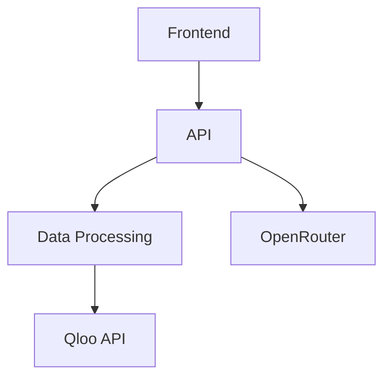

# CÆSER Architecture Documentation

## Module Organization

### Core Modules
1. **API Layer** (`/api`)
   - Depends on: data/, services/
   - Provides: REST endpoints for frontend
2. **Data Processing** (`/data`)
   - Depends on: external APIs (Qloo)
   - Provides: cleaned data for API layer
3. **Frontend** (`/frontend`)
   - Depends on: api/
   - Provides: user interface

### Dependency Graph

## Data Flow
1. User request → Frontend
2. Frontend → API endpoint
3. API → Data processing
4. Data processing → External APIs
5. Response flows back through chain

## Key Dependencies
- **External**:
  - Qloo API (cultural data)
  - OpenRouter (LLM predictions)
- **Internal**:
  - api → data (data access)
  - frontend → api (data fetching)

## Interface Contracts
1. API endpoints:
   - Input/Output formats documented in api/README.md
2. Data schemas:
   - Defined in data/schemas/
3. Component props:
   - Documented in component files

## Folder Structure

PS D:\LAPTOP\TO_EARN\AI\CAESER> tree
Folder PATH listing
Volume serial number is 0072-1D5D
D:.
├───api
│   ├───controllers
│   ├───models
│   ├───routes
│   ├───services
│   └───utils
├───bin
│   └───sqlite
├───data
│   ├───processed
│   ├───raw
│   ├───schemas
│   └───temp
├───docs
│   ├───img
│   ├───md
│   └───txt
├───frontend
│   ├───components
│   ├───public
│   ├───src
│   └───styles
├───notebooks
└───tests
PS D:\LAPTOP\TO_EARN\AI\CAESER> tree /F
Folder PATH listing
Volume serial number is 0072-1D5D
D:.
│   .env
│   .gitignore
│   gap_analysis_2025-07-21.md
│   package.json
│   README.md
│
├───api
│   │   README.md
│   │
│   ├───controllers
│   ├───models
│   ├───routes
│   ├───services
│   │       discordService.js
│   │       hypeEngine.js
│   │       llmService.js
│   │       qlooService.js
│   │
│   └───utils
│           circuitBreaker.js
│
├───bin
│   └───sqlite
│           sqldiff.exe
│           sqlite3.exe
│           sqlite3_analyzer.exe
│           sqlite3_rsync.exe
│
├───data
│   │   caeser.db
│   │   init_db.js
│   │   README.md
│   │
│   ├───processed
│   ├───raw
│   ├───schemas
│   └───temp
├───docs
│   │   README.md
│   │   test_results.md
│   │
│   ├───img
│   │       mermaid_diagram_2025207-1.png
│   │       mermaid_diagram_2025207-2.png
│   │
│   ├───md
│   │       architecture.md
│   │       CAESER_MVP_Day1_Day1,5_Plan.markdown
│   │       CAESER_MVP_Day2_Day2,5_Plan.markdown
│   │       CAESER_MVP_Day3_Day3,5_Plan.markdown
│   │       CAESER_MVP_Day4_Day4,5_Plan.markdown
│   │       CAESER_MVP_Day5_Day5_0_Plan.markdown
│   │       CAESER_MVP_Development_Plan.markdown
│   │       checklist.md
│   │       naming-conventions.md
│   │       OPENROUTER_LLM_INTEGRATION.md
│   │       Qloo-Insights-API-Guide.markdown
│   │
│   └───txt
│           draft.txt
│           qloo-draft.txt
│
├───frontend
│   │   README.md
│   │
│   ├───components
│   ├───public
│   ├───src
│   │       App.js
│   │
│   └───styles
├───notebooks
└───tests
        llmService.test.js
        qlooService.test.js
        README.md
