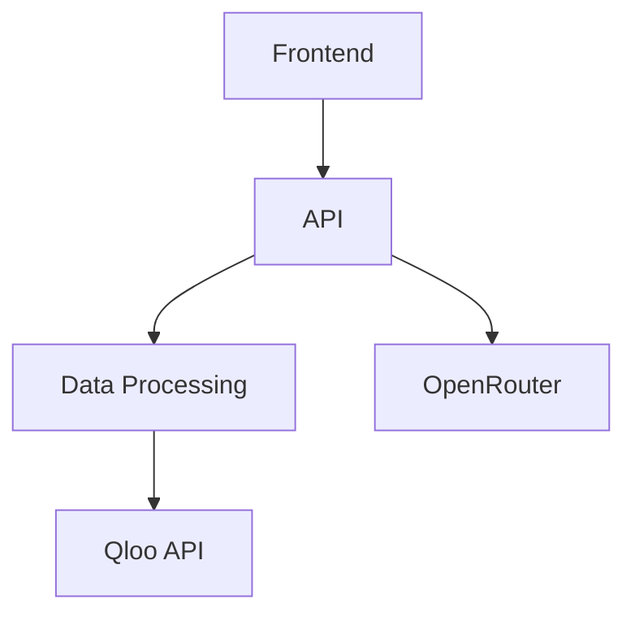

# CÆSER Architecture Documentation

## Module Organization

### Core Modules
1. **API Layer** (`/api`)
   - Depends on: data/, services/
   - Provides: REST endpoints for frontend
2. **Data Processing** (`/data`)
   - Depends on: external APIs (Qloo)
   - Provides: cleaned data for API layer
3. **Frontend** (`/frontend`)
   - Depends on: api/
   - Provides: user interface

### Dependency Graph

## Data Flow
1. User request → Frontend
2. Frontend → API endpoint
3. API → Data processing
4. Data processing → External APIs
5. Response flows back through chain

## Key Dependencies
- **External**:
  - Qloo API (cultural data)
  - OpenRouter (LLM predictions)
- **Internal**:
  - api → data (data access)
  - frontend → api (data fetching)

## Interface Contracts
1. API endpoints:
   - Input/Output formats documented in api/README.md
2. Data schemas:
   - Defined in data/schemas/
3. Component props:
   - Documented in component files