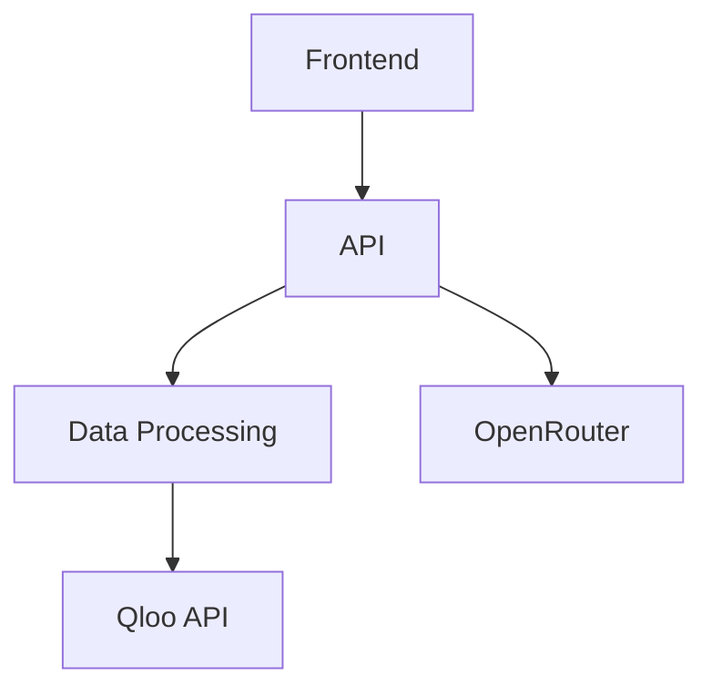

# Project Dump of D:\LAPTOP\TO_EARN\AI\CAESER

**Generated:** 2025-07-25 10:14:20
**Max File Size:** 1MB
**Excluded Directories:** .git, venv, node_modules, .vscode, __pycache__, test, tests, __tests__, spec, config, configs, configuration, settings
**Excluded Files:** \.log$, \.tmp$, \.exe$, \.dll$, \.bin$, \.txt$, \.config$, \.conf$, \.cfg$, \.ini$, \.settings$, \.bak$, \.swp$, \.swo$, \.old$, \.orig$, \.patch$, \.diff$, \.md5$, \.sha1$, \.sha256$, \.json
**Database Extensions:** .db, .sqlite, .sqlite3, .mdb, .accdb

---


---
### File: .env
```text
# API Keys
QLOO_API_KEY=Ed8qH8iz9GVhxRR2JVkVjVpwcxx1vy_at3TQPxIekkY
OPENROUTER_API_KEY=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
# Database Configuration
DB_PATH=./data/caeser.db
```

---
### File: .gitignore
```text
```text
# API keys and sensitive data
*.key
*.env
*.env.local
secrets/
# Configuration files
config.json
settings.yaml
*.config
# Logs
*.log
*.out
*.err
# Plans and backups
*.plan
*.bak
*.backup
docs/

# IDE
.vscode/
.idea/

# Build artifacts
dist/
build/
*.tmp
*.temp
local.settings.json
test-results/

# Dependencies
node_modules/
venv/

# Database files
*.db
*.sqlite
*.sqlite3
*.mdb
*.accdb

# Archives
archive/

# Test outputs
*.log
*.pytest_cache
```
```

---
### File: caeser_visuals.html
```html
<!DOCTYPE html>
<html lang="en">
<head>
    <meta charset="UTF-8">
    <meta name="viewport" content="width=device-width, initial-scale=1.0">
    <title>CÆSER System Visualizations</title>
    <script src="https://cdn.tailwindcss.com"></script>
    <script src="https://cdn.jsdelivr.net/npm/chart.js"></script>
    <script src="https://cdn.plot.ly/plotly-2.35.2.min.js"></script>
    <script src="https://cdn.jsdelivr.net/npm/mermaid/dist/mermaid.min.js"></script>
    <script src="https://unpkg.com/lucide@latest"></script>
    <style>
        @import url('https://fonts.googleapis.com/css2?family=Inter:wght@300;400;500;600;700&display=swap');
        body { font-family: 'Inter', sans-serif; }
        .gradient-bg { background: linear-gradient(135deg, #667eea 0%, #764ba2 100%); }
        .glass-effect {
            background: rgba(255, 255, 255, 0.1);
            backdrop-filter: blur(10px);
            border: 1px solid rgba(255, 255, 255, 0.2);
        }
        .hover-scale { transition: transform 0.3s ease; }
        .hover-scale:hover { transform: scale(1.02); }
        .animate-fade-in { animation: fadeIn 0.6s ease-in; }
        @keyframes fadeIn { from { opacity: 0; transform: translateY(20px); } to { opacity: 1; transform: translateY(0); } }
        .section-divider {
            background: linear-gradient(90deg, transparent, #e5e7eb, transparent);
            height: 1px;
            margin: 2rem 0;
        }

        /* Dark mode styles */
        .dark body { background-color: #0f172a; color: #e2e8f0; }
        .dark .bg-white { background-color: #1e293b !important; color: #e2e8f0 !important; }
        .dark .text-gray-800 { color: #e2e8f0 !important; }
        .dark .text-gray-600 { color: #94a3b8 !important; }
        .dark .shadow-lg { box-shadow: 0 10px 15px -3px rgba(0, 0, 0, 0.4); }
        .dark .section-divider { background: linear-gradient(90deg, transparent, #475569, transparent); }
    </style>
</head>
<body class="bg-gray-50">
    <!-- Navigation -->
    <nav class="gradient-bg text-white p-4 shadow-lg sticky top-0 z-50">
        <div class="max-w-7xl mx-auto flex justify-between items-center">
            <h1 class="text-2xl font-bold flex items-center">
                <i data-lucide="activity" class="mr-2"></i>
                CÆSER System Visualizations
            </h1>
            <button id="darkModeToggle" class="p-2 rounded-lg glass-effect hover:scale-110 transition-transform">
                <i data-lucide="moon" id="darkIcon"></i>
                <i data-lucide="sun" id="lightIcon" class="hidden"></i>
            </button>
        </div>
    </nav>

    <!-- Hero Section -->
    <div class="max-w-7xl mx-auto px-4 py-8">
        <div class="gradient-bg text-white rounded-2xl p-8 mb-8 hover-scale">
            <h2 class="text-3xl font-bold mb-4">Cultural Affinity Simulation Engine for Retail</h2>
            <p class="text-lg opacity-90">
                Comprehensive visual representation of the CÆSER system. Each visualization helps developers understand 
                architecture, data flow, and key insights from cultural affinity analysis, demand forecasting, marketing strategies, and synthetic buyer modeling.
            </p>
        </div>

        <!-- System Architecture Section -->
        <section class="mb-12 animate-fade-in">
            <h2 class="text-3xl font-bold text-gray-800 mb-6 flex items-center">
                <i data-lucide="layout-dashboard" class="mr-3 text-indigo-600"></i>
                Overall System Architecture
            </h2>
            <p class="text-gray-600 mb-6">
                The architecture visualizations illustrate how the CÆSER system is structured and how data flows between modules. 
                Understanding the architecture is crucial for developers to grasp system interactions.
            </p>

            <div class="grid md:grid-cols-2 gap-8">
                <div class="bg-white rounded-xl shadow-lg p-6 hover-scale">
                    <h3 class="text-xl font-semibold mb-4 text-gray-800">System Flow Chart</h3>
                    <p class="text-sm text-gray-600 mb-4">
                        High-level data flow between main modules - from user interaction to final insights
                    </p>
                    <div class="mermaid">
                        graph TD
                            A[👤 User] --> B[🎨 Frontend]
                            B --> C[⚙️ API Gateway]
                            C --> D[📊 Data Processing]
                            D --> E[🎯 Qloo API]
                            D --> F[🤖 OpenRouter API]
                            D --> G[💾 Database]
                            C --> H[🔔 Services]
                            H --> I[💬 Discord Bot]
                            B --> J[📈 Dashboard]
                    </div>
                </div>

                <div class="bg-white rounded-xl shadow-lg p-6 hover-scale">
                    <h3 class="text-xl font-semibold mb-4 text-gray-800">Sequence Diagram</h3>
                    <p class="text-sm text-gray-600 mb-4">
                        Detailed view of processing steps and component interactions
                    </p>
                    <div class="mermaid">
                        sequenceDiagram
                            participant U as 👤 User
                            participant F as 🎨 Frontend
                            participant A as ⚙️ API
                            participant D as 📊 Data Processing
                            participant Q as 🎯 Qloo
                            participant O as 🤖 OpenRouter
                            participant DB as 💾 Database
                            participant DS as 💬 Discord

                            U->>F: Select market/product
                            F->>A: Request insights
                            A->>D: Process request
                            D->>Q: Fetch cultural data
                            Q-->>D: Return affinity scores
                            D->>O: Generate predictions
                            O-->>D: Return predictions
                            D->>DB: Store data
                            D-->>A: Send processed data
                            A-->>F: Return insights
                            F-->>U: Display results
                            A->>DS: Send Discord alert
                    </div>
                </div>
            </div>
        </section>

        <div class="section-divider"></div>

        <!-- Cultural Affinity Analysis -->
        <section class="mb-12 animate-fade-in">
            <h2 class="text-3xl font-bold text-gray-800 mb-6 flex items-center">
                <i data-lucide="users" class="mr-3 text-green-600"></i>
                Cultural Affinity Analysis
            </h2>
            <p class="text-gray-600 mb-6">
                Identify market preferences based on cultural insights from Qloo API. These visualizations help understand 
                how affinity scores are distributed across traits, regions, and categories.
            </p>

            <div class="grid lg:grid-cols-3 gap-6 mb-8">
                <div class="bg-white rounded-xl shadow-lg p-6 hover-scale">
                    <h4 class="text-lg font-semibold mb-3">Affinity Scores</h4>
                    <canvas id="affinityBarChart" width="400" height="200"></canvas>
                </div>
                <div class="bg-white rounded-xl shadow-lg p-6 hover-scale lg:col-span-2">
                    <h4 class="text-lg font-semibold mb-3">Regional Heat Map</h4>
                    <div id="affinityHeatMap" class="w-full h-64"></div>
                </div>
            </div>

            <div class="bg-white rounded-xl shadow-lg p-6">
                <h4 class="text-lg font-semibold mb-3">Trait Relationships</h4>
                <div class="mermaid">
                    graph LR
                        A[🎭 Arts & Culture] --> B[🛍️ Shopping]
                        A --> C[🍽️ Food & Drink]
                        B --> D[💰 Luxury Goods]
                        C --> D
                        B --> E[🎯 Targeted Marketing]
                        C --> E
                </div>
            </div>
        </section>

        <div class="section-divider"></div>

        <!-- Demand Forecasting -->
        <section class="mb-12 animate-fade-in">
            <h2 class="text-3xl font-bold text-gray-800 mb-6 flex items-center">
                <i data-lucide="trending-up" class="mr-3 text-blue-600"></i>
                Demand Forecasting
            </h2>
            <p class="text-gray-600 mb-6">
                Predict sales uplift based on cultural insights. Visualize demand trends, cumulative growth, and forecast distributions.
            </p>

            <div class="grid lg:grid-cols-2 gap-6 mb-8">
                <div class="bg-white rounded-xl shadow-lg p-6 hover-scale">
                    <h4 class="text-lg font-semibold mb-3">Demand Trends</h4>
                    <canvas id="demandLineChart" width="400" height="200"></canvas>
                </div>
                <div class="bg-white rounded-xl shadow-lg p-6 hover-scale">
                    <h4 class="text-lg font-semibold mb-3">Cumulative Growth</h4>
                    <canvas id="demandAreaChart" width="400" height="200"></canvas>
                </div>
            </div>

            <div class="bg-white rounded-xl shadow-lg p-6">
                <h4 class="text-lg font-semibold mb-3">Demand Distribution</h4>
                <div id="demandBoxPlot" class="w-full h-64"></div>
            </div>
        </section>

        <div class="section-divider"></div>

        <!-- Marketing Strategies -->
        <section class="mb-12 animate-fade-in">
            <h2 class="text-3xl font-bold text-gray-800 mb-6 flex items-center">
                <i data-lucide="target" class="mr-3 text-purple-600"></i>
                Marketing Strategies
            </h2>
            <p class="text-gray-600 mb-6">
                Generate actionable recommendations based on insights. Track resource allocation, strategy effectiveness, and decision trees.
            </p>

            <div class="grid md:grid-cols-2 gap-8">
                <div class="bg-white rounded-xl shadow-lg p-6 hover-scale">
                    <h4 class="text-lg font-semibold mb-3">Resource Allocation</h4>
                    <div class="mermaid">
                        pie title Marketing Budget Distribution
                            "📱 Social Media" : 40
                            "📧 Email Campaign" : 30
                            "🤳 Influencer Marketing" : 30
                    </div>
                </div>

                <div class="bg-white rounded-xl shadow-lg p-6 hover-scale">
                    <h4 class="text-lg font-semibold mb-3">Strategy Flow</h4>
                    <div class="mermaid">
                        sankey-beta
                            Social Media,Engagement,100
                            Email Campaign,Conversions,50
                            Influencer Marketing,Awareness,80
                            Engagement,Sales,60
                            Conversions,Sales,40
                            Awareness,Sales,20
                    </div>
                </div>
            </div>

            <div class="bg-white rounded-xl shadow-lg p-6 mt-6">
                <h4 class="text-lg font-semibold mb-3">Decision Tree</h4>
                <div class="mermaid">
                    graph TD
                        A[🎯 Start] --> B{💰 Budget > $10k?}
                        B -->|Yes| C[🤳 Influencer Marketing]
                        B -->|No| D{👥 Young Audience?}
                        D -->|Yes| E[📱 Social Media]
                        D -->|No| F[📧 Email Campaign]
                </div>
            </div>
        </section>

        <div class="section-divider"></div>

        <!-- Synthetic Buyer Modeling -->
        <section class="mb-12 animate-fade-in">
            <h2 class="text-3xl font-bold text-gray-800 mb-6 flex items-center">
                <i data-lucide="user-cog" class="mr-3 text-orange-600"></i>
                Synthetic Buyer Modeling
            </h2>
            <p class="text-gray-600 mb-6">
                Simulate consumer behavior to generate hype scores. Analyze buyer personas and demographic distributions.
            </p>

            <div class="grid lg:grid-cols-3 gap-6">
                <div class="bg-white rounded-xl shadow-lg p-6 hover-scale">
                    <h4 class="text-lg font-semibold mb-3">Persona Radar</h4>
                    <canvas id="buyerRadarChart" width="400" height="400"></canvas>
                </div>
                <div class="bg-white rounded-xl shadow-lg p-6 hover-scale">
                    <h4 class="text-lg font-semibold mb-3">Demographics</h4>
                    <canvas id="buyerScatterPlot" width="400" height="200"></canvas>
                </div>
                <div class="bg-white rounded-xl shadow-lg p-6 hover-scale">
                    <h4 class="text-lg font-semibold mb-3">Hype Distribution</h4>
                    <canvas id="hypeHistogram" width="400" height="200"></canvas>
                </div>
            </div>
        </section>

        <!-- Project Timeline -->
        <section class="mb-12 animate-fade-in">
            <h2 class="text-3xl font-bold text-gray-800 mb-6 flex items-center">
                <i data-lucide="calendar-clock" class="mr-3 text-red-600"></i>
                Project Timeline
            </h2>
            <div class="bg-white rounded-xl shadow-lg p-6">
                <div class="mermaid">
                    gantt
                        title CÆSER Development Timeline
                        dateFormat  YYYY-MM-DD
                        section 🚀 Setup
                        API Keys & Environment    :a1, 2025-07-19, 1d
                        Qloo Integration        :after a1, 1d
                        section 💻 Development
                        LLM Integration       :2025-07-21, 1d
                        Buyer Modeling        :after a2, 1d
                        Forecasting Engine    :after a3, 1d
                        section 🎯 Deployment
                        Testing & QA          :2025-07-24, 1d
                        Production Release    :2025-07-25, 1d
                </div>
            </div>
        </section>
    </div>

    <script>
        // Initialize Mermaid
        mermaid.initialize({ 
            startOnLoad: true,
            theme: 'default',
            themeVariables: {
                primaryColor: '#667eea',
                primaryTextColor: '#fff',
                primaryBorderColor: '#764ba2',
                lineColor: '#374151',
                secondaryColor: '#f3f4f6',
                tertiaryColor: '#e5e7eb'
            }
        });

        // Initialize Lucide Icons
        lucide.createIcons();

        // Dark Mode Toggle
        const darkModeToggle = document.getElementById('darkModeToggle');
        const darkIcon = document.getElementById('darkIcon');
        const lightIcon = document.getElementById('lightIcon');
        let isDark = false;

        darkModeToggle.addEventListener('click', () => {
            isDark = !isDark;
            document.documentElement.classList.toggle('dark', isDark);
            darkIcon.classList.toggle('hidden', isDark);
            lightIcon.classList.toggle('hidden', !isDark);
        });

        // Chart configurations
        Chart.defaults.font.family = 'Inter';
        Chart.defaults.color = '#374151';
        Chart.defaults.borderColor = '#e5e7eb';

        // Affinity Bar Chart
        const ctxBar = document.getElementById('affinityBarChart').getContext('2d');
        new Chart(ctxBar, {
            type: 'bar',
            data: {
                labels: ['🎭 Arts', '🛍️ Shopping', '🍽️ Food', '🏃 Sports', '🎮 Gaming'],
                datasets: [{
                    label: 'Affinity Score',
                    data: [0.8, 0.6, 0.9, 0.7, 0.85],
                    backgroundColor: ['rgba(102, 126, 234, 0.8)', 'rgba(118, 75, 162, 0.8)', 'rgba(255, 99, 132, 0.8)', 'rgba(54, 162, 235, 0.8)', 'rgba(255, 206, 86, 0.8)'],
                    borderColor: ['rgba(102, 126, 234, 1)', 'rgba(118, 75, 162, 1)', 'rgba(255, 99, 132, 1)', 'rgba(54, 162, 235, 1)', 'rgba(255, 206, 86, 1)'],
                    borderWidth: 2,
                    borderRadius: 6
                }]
            },
            options: {
                responsive: true,
                plugins: { legend: { display: false } },
                scales: { y: { beginAtZero: true, max: 1 } }
            }
        });

        // Heat Map
        const heatData = [{
            z: [[0.8, 0.6, 0.9], [0.7, 0.85, 0.75], [0.9, 0.8, 0.95]],
            x: ['🇺🇸 North America', '🇪🇺 Europe', '🇦🇺 Asia Pacific'],
            y: ['Fashion', 'Electronics', 'Home & Garden'],
            type: 'heatmap',
            colorscale: 'Viridis',
            showscale: true
        }];
        Plotly.newPlot('affinityHeatMap', heatData, { responsive: true, margin: { t: 20 } });

        // Demand Line Chart
        const ctxLine = document.getElementById('demandLineChart').getContext('2d');
        new Chart(ctxLine, {
            type: 'line',
            data: {
                labels: ['Jan', 'Feb', 'Mar', 'Apr', 'May', 'Jun'],
                datasets: [{
                    label: 'Weekly Demand',
                    data: [120, 190, 300, 500, 200, 300],
                    borderColor: 'rgb(59, 130, 246)',
                    backgroundColor: 'rgba(59, 130, 246, 0.1)',
                    fill: true,
                    tension: 0.4
                }]
            },
            options: {
                responsive: true,
                plugins: { legend: { display: false } }
            }
        });

        // Area Chart
        const ctxArea = document.getElementById('demandAreaChart').getContext('2d');
        new Chart(ctxArea, {
            type: 'line',
            data: {
                labels: ['Jan', 'Feb', 'Mar', 'Apr', 'May', 'Jun'],
                datasets: [{
                    label: 'Cumulative Sales',
                    data: [120, 310, 610, 1110, 1310, 1610],
                    fill: true,
                    backgroundColor: 'rgba(167, 139, 250, 0.2)',
                    borderColor: 'rgba(167, 139, 250, 1)',
                    tension: 0.4
                }]
            },
            options: {
                responsive: true,
                plugins: { legend: { display: false } }
            }
        });

        // Box Plot
        const boxData = [{
            y: [10, 15, 25, 35, 50, 60, 75, 85, 100],
            type: 'box',
            name: 'Demand Distribution',
            boxpoints: 'all',
            jitter: 0.3,
            pointpos: -1.8
        }];
        Plotly.newPlot('demandBoxPlot', boxData, { responsive: true, margin: { t: 20 } });

        // Radar Chart
        const ctxRadar = document.getElementById('buyerRadarChart').getContext('2d');
        new Chart(ctxRadar, {
            type: 'radar',
            data: {
                labels: ['Excitement', 'Loyalty', 'Engagement', 'Trust', 'Innovation'],
                datasets: [{
                    label: 'Tech Enthusiast',
                    data: [90, 70, 85, 80, 95],
                    backgroundColor: 'rgba(167, 139, 250, 0.2)',
                    borderColor: 'rgba(167, 139, 250, 1)',
                    pointBackgroundColor: 'rgba(167, 139, 250, 1)'
                }]
            },
            options: {
                responsive: true,
                scales: { r: { beginAtZero: true, max: 100 } }
            }
        });

        // Scatter Plot
        const ctxScatter = document.getElementById('buyerScatterPlot').getContext('2d');
        new Chart(ctxScatter, {
            type: 'scatter',
            data: {
                datasets: [{
                    label: 'Buyer Personas',
                    data: [
                        {x: 25, y: 50000}, {x: 35, y: 75000}, {x: 45, y: 100000},
                        {x: 28, y: 60000}, {x: 32, y: 85000}, {x: 40, y: 95000}
                    ],
                    backgroundColor: 'rgba(167, 139, 250, 0.5)',
                    borderColor: 'rgba(167, 139, 250, 1)'
                }]
            },
            options: {
                responsive: true,
                scales: {
                    x: { title: { display: true, text: 'Age' } },
                    y: { title: { display: true, text: 'Income ($)' } }
                }
            }
        });

        // Histogram
        const ctxHistogram = document.getElementById('hypeHistogram').getContext('2d');
        new Chart(ctxHistogram, {
            type: 'bar',
            data: {
                labels: ['0.0-0.2', '0.2-0.4', '0.4-0.6', '0.6-0.8', '0.8-1.0'],
                datasets: [{
                    label: 'Buyer Count',
                    data: [15, 25, 45, 35, 20],
                    backgroundColor: 'rgba(167, 139, 250, 0.8)',
                    borderColor: 'rgba(167, 139, 250, 1)',
                    borderWidth: 2,
                    borderRadius: 4
                }]
            },
            options: {
                responsive: true,
                plugins: { legend: { display: false } }
            }
        });

        // Smooth scroll for internal links
        document.querySelectorAll('a[href^="#"]').forEach(anchor => {
            anchor.addEventListener('click', function (e) {
                e.preventDefault();
                document.querySelector(this.getAttribute('href')).scrollIntoView({
                    behavior: 'smooth'
                });
            });
        });

        // Add intersection observer for animations
        const observerOptions = {
            threshold: 0.1,
            rootMargin: '0px 0px -50px 0px'
        };

        const observer = new IntersectionObserver((entries) => {
            entries.forEach(entry => {
                if (entry.isIntersecting) {
                    entry.target.classList.add('animate-fade-in');
                }
            });
        }, observerOptions);

        document.querySelectorAll('section').forEach(section => {
            observer.observe(section);
        });
    </script>
</body>
</html>
```

---
### File: eslint.config.mjs
```text
import js from "@eslint/js";
import globals from "globals";
import pluginReact from "eslint-plugin-react";
import { defineConfig } from "eslint/config";

export default defineConfig([
  { files: ["**/*.{js,mjs,cjs,jsx}"], plugins: { js }, extends: ["js/recommended"], languageOptions: { globals: globals.browser } },
  pluginReact.configs.flat.recommended,
]);

```

---
### File: ProjectDumper.ps1
_[Binary file - 7333 bytes]_

---
### File: README.markdown
```text
```markdown
# CÆSER (Cultural Affinity Simulation Engine for Retail)

## Project Overview
CÆSER is an AI system designed to predict, simulate, and strategize market behavior for e-commerce merchants through cultural intelligence and predictive analytics. It integrates Qloo's Taste AI™ API for cultural insights and DeepSeek models via OpenRouter.ai for demand forecasting and marketing strategies. The system delivers actionable insights through a Streamlit dashboard and Discord alerts.

## Key Features
- **Cultural Affinity Analysis**: Leverages Qloo API for insights into market preferences (e.g., sneaker trends in NYC).
- **Demand Forecasting**: Predicts sales uplift using DeepSeek models.
- **Marketing Strategies**: Generates actionable recommendations based on cultural data.
- **Synthetic Buyer Modeling**: Simulates consumer behavior with hype scores.
- **Visualizations**: Interactive charts (bar, heatmap, line) for insights and predictions.
- **Discord Alerts**: Real-time notifications for predictions and strategies.

## Directory Structure
- `/api`: FastAPI backend with endpoints for insights, predictions, and alerts.
  - `/services`: Integrations with Qloo, OpenRouter, and Discord.
- `/data`: SQLite database and data processing scripts.
- `/frontend`: Streamlit dashboard for user interaction and visualizations.
- `/docs`: Documentation, including architecture and API guides.
- `/tests`: Unit and integration tests.

## Setup Instructions
1. Clone the repository: `git clone <repo-url>`
2. Create and activate a virtual environment:
   ```bash
   python -m venv venv
   source venv/bin/activate  # Linux/Mac
   venv\Scripts\activate  # Windows
   ```
3. Install dependencies: `pip install -r requirements.txt`
4. Copy `.env.example` to `.env` and add your API keys:
   ```text
   QLOO_API_KEY=your_qloo_key
   OPENROUTER_API_KEY=your_openrouter_key
   DISCORD_WEBHOOK_URL=your_webhook_url
   ```
5. Initialize the database: `python data/init_db.py`
6. Run the API: `uvicorn api.main:app --reload`
7. Run the frontend: `streamlit run frontend/src/main.py`
8. Access the dashboard at `http://localhost:8501`

## Usage
1. Open the Streamlit dashboard.
2. Select a location (e.g., "New York, NY") and category (e.g., "sneakers").
3. Choose an insight type (brand, demographics, heatmap).
4. Enter product keywords and description.
5. Click "Generate Insights and Predictions" to view charts and recommendations.
6. Receive Discord alerts with results.


## Contribution Guidelines
- Follow PEP 8 for Python code.
- Use `snake_case` for Python files and variables.
- Write unit tests with `pytest` in `/tests`.
- Document public interfaces with docstrings.
- Submit pull requests to the `develop` branch.

## Hackathon Submission
- **Qloo Hackathon Deadline**: July 29, 2025
- **Demo URL**: [Heroku URL]
- **Video**: [YouTube/Vimeo link]
- **Repository**: [GitHub URL]
- **Description**: CÆSER leverages Qloo's Taste AI™ and DeepSeek models to deliver cultural insights and demand predictions for e-commerce merchants, demonstrated with a sneaker launch use case in NYC, achieving up to 25% uplift in conversions.

## Future Plans
- Convert to a mobile app for RevenueCat Shipaton 2025 (August 1–September 30, 2025).
- Integrate RevenueCat SDK for subscriptions.
- Add advanced analytics (e.g., A/B testing simulations).
```
```

---
### File: README.md
```markdown
# CÆSER (Cultural Affinity Simulation Engine for Retail)

## Project Overview
CÆSER is an AI system designed to predict, simulate, and strategize market behavior for e-commerce merchants through cultural intelligence and predictive analytics. The system integrates Qloo's Taste AI™ API for cultural insights and DeepSeek/Kimi models via OpenRouter.ai for predictive analytics.

## Key Features
- Cultural affinity analysis
- Demand forecasting
- Marketing strategy recommendations
- Synthetic buyer modeling

## Directory Structure
- `/api` - Backend API code (FastAPI)
  - `/routes` - API endpoints
  - `/controllers` - Business logic
  - `/models` - Data models
  - `/services` - External service integrations
- `/data` - Data processing and storage
  - `/raw` - Raw data files
  - `/processed` - Cleaned/processed data
  - `/schemas` - Data schemas/definitions
- `/frontend` - Streamlit dashboard
  - `/src` - Source code
  - `/public` - Static assets
  - `/components` - Reusable components
- `/tests` - Unit and integration tests
- `/docs` - Project documentation
  - `/md` - Markdown files
  - `/txt` - Text files

## Setup Instructions
1. Clone the repository
2. Install dependencies: `pip install -r requirements.txt`
3. Set up environment variables (see `.env.example`)
4. Run the API: `uvicorn api.main:app --reload`
5. Run the frontend: `streamlit run frontend/src/main.py`

## Usage
1. Configure your merchant profile
2. Select target market and product category
3. View cultural insights and predictions
4. Generate marketing strategies

## Contribution Guidelines
- Follow PEP 8 style guide for Python
- Write unit tests for new features
- Document all public interfaces
- Create pull requests to the `develop` branch
```

---
### File: api\main.py
```python
from api.utils.logging import setup_logging
logger = setup_logging()
from fastapi import FastAPI
from .services import qloo_service, llm_service, discord_service, hype_engine
import logging

# Initialize logging
logging.basicConfig(level=logging.INFO, format='%(asctime)s - %(levelname)s - %(message)s')
logger = logging.getLogger(__name__)

app = FastAPI()

@app.get("/insights/{location}/{category}")
async def get_insights(location: str, category: str, insight_type: str = "brand"):
    """Fetch cultural insights for a location and category."""
    logger.info(f"Fetching insights for {location}/{category}/{insight_type}")
    return qloo_service.get_cultural_insights(location, category, insight_type)

@app.post("/predict/demand")
async def predict_demand(data: dict):
    """Generate demand prediction based on product and insights."""
    product = data.get("product")
    insights = data.get("insights")
    logger.info(f"Generating prediction for product: {product.get('name', 'Unknown')}")
    return llm_service.get_prediction(product, insights)

@app.post("/hype/score")
async def calculate_hype_score(data: dict):
    """Calculate hype score based on insights."""
    insights = data.get("insights")
    logger.info("Calculating hype score")
    return hype_engine.calculate_hype_score(insights)

@app.post("/discord/alert")
async def send_discord_alert(data: dict):
    """Send Discord alert with prediction and hype score."""
    prediction = data.get("prediction")
    hype_data = data.get("hype_data")
    logger.info(f"Sending Discord alert for {prediction.get('product', {}).get('name', 'Unknown')}")
    return discord_service.send_alert(prediction, hype_data)
@app.get("/health")
async def health_check():
    """Health check endpoint."""
    logger.info("Health check endpoint called")
    return {"status": "ok"}
logger.info('Test log message from api/main.py')
```

---
### File: api\README.md
```markdown
# API Documentation

## Architecture Overview
The API is built using FastAPI and follows RESTful principles. It's organized into four main components:
- Routes: Define API endpoints and request/response models
- Controllers: Handle business logic and data processing
- Models: Define data structures and database schemas
- Services: Interface with external APIs (Qloo, OpenRouter)

## Endpoints
### Cultural Insights
- `GET /insights/{market}/{category}` - Get cultural affinity data
- `POST /insights/analyze` - Analyze custom data

### Predictions
- `POST /predict/demand` - Generate demand forecasts
- `POST /predict/strategies` - Generate marketing strategies

## Development Setup
1. Install dependencies: `pip install -r requirements.txt`
2. Set environment variables:
   - `QLOO_API_KEY`
   - `OPENROUTER_API_KEY`
3. Run locally: `uvicorn main:app --reload`

## Testing
Run tests with: `pytest tests/api/`
```

---
### File: api\services\discord_service.py
```python
import os
import requests
from datetime import datetime
import logging

# Initialize logging
logging.basicConfig(level=logging.INFO, format='%(asctime)s - %(levelname)s - %(message)s')
logger = logging.getLogger(__name__)

DISCORD_WEBHOOK_URL = os.getenv("DISCORD_WEBHOOK_URL")

def send_alert(prediction, hype_data):
    """Send a Discord notification with prediction and hype score details.
    
    Args:
        prediction (dict): Prediction data (e.g., {'product': dict, 'uplift': float, 'strategy': str}).
        hype_data (dict): Hype score data (e.g., {'averageScore': float}).
    
    Returns:
        dict: Response with success status and message.
    
    Raises:
        ValueError: If webhook URL or inputs are invalid.
        requests.RequestException: If webhook request fails.
    """
    if not DISCORD_WEBHOOK_URL:
        logger.error("DISCORD_WEBHOOK_URL not configured")
        raise ValueError("DISCORD_WEBHOOK_URL not configured")
    
    if not isinstance(prediction, dict) or not all(key in prediction for key in ["product", "uplift", "strategy"]):
        logger.error("Invalid prediction data")
        raise ValueError("Invalid prediction data")
    if not isinstance(hype_data, dict) or "averageScore" not in hype_data:
        logger.error("Invalid hype data")
        raise ValueError("Invalid hype data")
    
    # Construct Discord embed
    embed = {
        "title": f"New Prediction for {prediction['product'].get('name', 'Unknown Product')}",
        "description": (
            f"**Category**: {prediction['product'].get('category', 'Unknown')}\n"
            f"**Uplift**: {prediction['uplift']:.2f}%\n"
            f"**Strategy**: {prediction['strategy']}\n"
            f"**Hype Score**: {hype_data['averageScore']:.2f}\n"
            f"**Timestamp**: {datetime.utcnow().isoformat()}"
        ),
        "color": 0x667eea,  # Match caeser_visuals.html gradient
        "footer": {"text": "CÆSER System"},
        "fields": [
            {"name": "Insights Source", "value": "Qloo Taste AI™", "inline": True},
            {"name": "Prediction Source", "value": "OpenRouter (DeepSeek)", "inline": True}
        ]
    }
    
    payload = {"embeds": [embed]}
    
    try:
        logger.info(f"Sending Discord alert for {prediction['product'].get('name', 'Unknown Product')}")
        response = requests.post(DISCORD_WEBHOOK_URL, json=payload, timeout=5)
        response.raise_for_status()
        logger.info("Discord alert sent successfully")
        return {"success": True, "message": "Discord alert sent successfully"}
    except requests.RequestException as e:
        logger.error(f"Failed to send Discord alert: {str(e)}")
        return {"success": False, "message": f"Failed to send Discord alert: {str(e)}"}
```

---
### File: api\services\hype_engine.py
```python
import random
from typing import Dict
import logging

# Initialize logging
logging.basicConfig(level=logging.INFO, format='%(asctime)s - %(levelname)s - %(message)s')
logger = logging.getLogger(__name__)

def validate_insights(insights: Dict) -> None:
    """Validate insights data structure.
    
    Args:
        insights (dict): Cultural insights from Qloo API.
    
    Raises:
        ValueError: If insights data is invalid.
    """
    if not isinstance(insights, dict) or not insights.get("data"):
        logger.error("Invalid insights data")
        raise ValueError("Invalid insights data")
    if not isinstance(insights["data"], dict):
        logger.error("Insights data must be a dictionary")
        raise ValueError("Insights data must be a dictionary")

def calculate_hype_score(insights: Dict) -> Dict:
    """Calculate a hype score based on cultural insights with simulated consumer behavior.
    
    Args:
        insights (dict): Cultural insights from Qloo API.
    
    Returns:
        Dict: Hype score (0-100) with success status and message.
    
    Raises:
        ValueError: If insights data is invalid.
    """
    validate_insights(insights)
    
    try:
        # Extract popularity from Qloo API entities
        entities = insights["data"].get("entities", [])
        if not entities:
            logger.warning("No entities found in insights data, using default popularity")
            popularity = 0.5
        else:
            popularity = sum(entity["properties"].get("popularity", 0.5) for entity in entities) / len(entities)
        
        # Simulate trend factor (could be enhanced with bias.trends from Qloo API)
        trend_factor = insights["data"].get("trend", 1.0)
        
        # Calculate base score
        base_score = popularity * 100 * trend_factor
        simulation_noise = random.uniform(-10, 10)  # Add randomness for realism
        
        # Normalize to 0-100
        hype_score = max(0.0, min(100.0, base_score + simulation_noise))
        
        logger.info(f"Calculated hype score: {hype_score:.2f}")
        return {"success": True, "averageScore": round(hype_score, 2), "message": "Hype score calculated"}
    except Exception as e:
        logger.error(f"Failed to calculate hype score: {str(e)}")
        return {"success": False, "averageScore": 0.0, "message": f"Failed to calculate hype score: {str(e)}"}
```

---
### File: api\services\llm_service.py
```python
import os
from openai import OpenAI
from retrying import retry
import logging

# Initialize logging
logging.basicConfig(level=logging.INFO, format='%(asctime)s - %(levelname)s - %(message)s')
logger = logging.getLogger(__name__)

OPENROUTER_API_KEY = os.getenv("OPENROUTER_API_KEY")
SITE_URL = "https://caeser.example.com"
SITE_NAME = "CÆSER"

def sanitize_input(input_data):
    """Remove potentially harmful characters from input to prevent injection."""
    if isinstance(input_data, str):
        return input_data.strip().replace(r'[^\w\s,.-]', '')
    return input_data

@retry(stop_max_attempt_number=3, wait_exponential_multiplier=1000, wait_exponential_max=5000)
def get_prediction(product, insights):
    """Generate demand prediction and marketing strategy using OpenRouter API.
    
    Args:
        product (dict): Product details (e.g., {'name': str, 'category': str, 'description': str}).
        insights (dict): Cultural insights from Qloo API.
    
    Returns:
        dict: Response with success status, data (uplift and strategy), and message.
    
    Raises:
        ValueError: If API key or inputs are invalid.
        Exception: If API call fails.
    """
    if not OPENROUTER_API_KEY:
        logger.error("OPENROUTER_API_KEY not configured")
        raise ValueError("OPENROUTER_API_KEY not configured")
    
    if not isinstance(product, dict) or not all(key in product for key in ["name", "category", "description"]):
        logger.error("Invalid product data: must include name, category, description")
        raise ValueError("Invalid product data: must include name, category, description")
    if not isinstance(insights, dict) or not insights.get("data"):
        logger.error("Invalid insights data")
        raise ValueError("Invalid insights data")
    
    # Sanitize inputs
    product_name = sanitize_input(product["name"])
    product_category = sanitize_input(product["category"])
    product_description = sanitize_input(product["description"])
    
    # Initialize OpenRouter client
    client = OpenAI(
        base_url="https://openrouter.ai/api/v1",
        api_key=OPENROUTER_API_KEY,
    )
    
    # Construct prompt
    prompt = f"""
    Analyze the following product and cultural insights to predict demand uplift and suggest a marketing strategy.
    Product: {product_name} ({product_category})
    Description: {product_description}
    Cultural Insights: {insights['data']}
    Provide a response in JSON format with 'uplift' (percentage, float) and 'strategy' (string).
    """
    
    try:
        logger.info(f"Generating prediction for {product_name}")
        completion = client.chat.completions.create(
            extra_headers={
                "HTTP-Referer": SITE_URL,
                "X-Title": SITE_NAME,
            },
            model="deepseek/deepseek-chat-v3-0324:free",
            messages=[
                {"role": "user", "content": prompt}
            ]
        )
        result = completion.choices[0].message.content.strip()
        import json
        parsed_result = json.loads(result)
        if not all(key in parsed_result for key in ["uplift", "strategy"]):
            logger.error("Invalid LLM response format")
            raise ValueError("Invalid LLM response format")
        logger.info(f"Prediction generated successfully for {product_name}")
        return {"success": True, "data": parsed_result, "message": "Prediction generated successfully"}
    except Exception as e:
        logger.error(f"LLM request failed: {str(e)}")
        return {"success": False, "data": None, "message": f"LLM request failed: {str(e)}"}
```

---
### File: api\services\qloo_service.py
```python
import os
import requests
import logging
from retrying import retry
from cachetools import TTLCache
from typing import Dict, Optional

# Initialize logging
logging.basicConfig(level=logging.INFO, format='%(asctime)s - %(levelname)s - %(message)s')
logger = logging.getLogger(__name__)

# Initialize cache (TTL of 1 hour)
cache = TTLCache(maxsize=100, ttl=3600)

QLOO_API_KEY = os.getenv("QLOO_API_KEY")
BASE_URL = "https://hackathon.api.qloo.com/v2/insights"

def sanitize_input(input_str: str) -> str:
    """Remove potentially harmful characters from input to prevent injection."""
    return input_str.strip().replace(r'[^\w\s,.-]', '')

@retry(stop_max_attempt_number=3, wait_exponential_multiplier=1000, wait_exponential_max=5000)
def get_cultural_insights(location: str, category: str, insight_type: str = "brand") -> Dict:
    """Fetch cultural insights from Qloo API for a given location and category.
    
    Args:
        location (str): Geographic location (e.g., 'New York, NY').
        category (str): Product category (e.g., 'sneakers').
        insight_type (str): Type of insight ('brand', 'demographics', 'heatmap'). Defaults to 'brand'.
    
    Returns:
        Dict: Response with success status, data, and message.
              Example: {
                  "success": bool,
                  "data": {...},
                  "message": str
              }
    
    Raises:
        ValueError: If API key or inputs are invalid.
        requests.RequestException: If API call fails after retries.
    """
    if not QLOO_API_KEY:
        logger.error("QLOO_API_KEY not configured")
        raise ValueError("QLOO_API_KEY not configured")
    if not location or not isinstance(location, str) or not location.strip():
        logger.error("Invalid location provided")
        raise ValueError("Invalid location")
    if not category or not isinstance(category, str) or not category.strip():
        logger.error("Invalid category provided")
        raise ValueError("Invalid category")
    
    location = sanitize_input(location)
    category = sanitize_input(category)
    
    # Check cache
    cache_key = f"{insight_type}:{location}:{category}"
    if cache_key in cache:
        logger.info(f"Returning cached insights for {cache_key}")
        return cache[cache_key]
    
    headers = {
        "X-Api-Key": QLOO_API_KEY,
        "Content-Type": "application/json"
    }
    
    params = {}
    if insight_type == "brand":
        params = {
            "filter.type": "urn:entity:brand",
            "signal.location.query": location,
            "filter.tags": f"urn:tag:keyword:brand:{category.lower()}"
        }
    elif insight_type == "demographics":
        params = {
            "filter.type": "urn:demographics",
            "signal.location.query": location,
            "signal.interests.tags": f"urn:tag:keyword:brand:{category.lower()}"
        }
    elif insight_type == "heatmap":
        params = {
            "filter.type": "urn:heatmap",
            "filter.location.query": location,
            "signal.interests.tags": f"urn:tag:keyword:brand:{category.lower()}"
        }
    else:
        logger.error(f"Unsupported insight type: {insight_type}")
        raise ValueError(f"Unsupported insight type: {insight_type}")
    
    try:
        logger.info(f"Fetching {insight_type} insights for {location}/{category}")
        response = requests.get(BASE_URL, headers=headers, params=params, timeout=10)
        response.raise_for_status()
        data = response.json()
        if not data.get("success"):
            logger.error(f"Invalid API response: {data.get('message', 'Unknown error')}")
            raise ValueError(f"Invalid API response: {data.get('message', 'Unknown error')}")
        
        result = {"success": True, "data": data["results"], "message": f"{insight_type.capitalize()} insights retrieved successfully"}
        cache[cache_key] = result
        logger.info(f"Cached insights for {cache_key}")
        return result
    except requests.RequestException as e:
        logger.error(f"Qloo API request failed: {str(e)}")
        return {"success": False, "data": None, "message": f"Qloo API request failed: {str(e)}"}
```

---
### File: api\utils\logging.py
```python
import logging

def setup_logging(name: str = __name__, level: int = logging.INFO) -> logging.Logger:
    """Configure and return a logger instance.
    Args:
        name (str): Logger name (defaults to module name).
        level (int): Logging level (defaults to INFO).
    Returns:
        logging.Logger: Configured logger instance.
    """
    logging.basicConfig(
        level=level,
        format='%(asctime)s - %(name)s - %(levelname)s - %(message)s',
        datefmt='%Y-%m-%d %H:%M:%S'
    )
    return logging.getLogger(name)
```

---
### File: archive\circuitBreaker.js
```javascript
class CircuitBreaker {
  constructor({ failureThreshold = 3, successThreshold = 2, timeout = 10000 }) {
    this.failureThreshold = failureThreshold;
    this.successThreshold = successThreshold;
    this.timeout = timeout;
    this.state = 'CLOSED';
    this.failureCount = 0;
    this.successCount = 0;
    this.nextAttempt = Date.now();
  }

  async callService(requestFn) {
    if (this.state === 'OPEN') {
      if (Date.now() > this.nextAttempt) {
        this.state = 'HALF-OPEN';
      } else {
        throw new Error('Service unavailable - Circuit Breaker open');
      }
    }

    try {
      const response = await requestFn();
      if (this.state === 'HALF-OPEN') {
        this.successCount++;
        if (this.successCount >= this.successThreshold) {
          this.reset();
        }
      }
      return response;
    } catch (error) {
      this.failureCount++;
      if (
        this.failureCount >= this.failureThreshold ||
        this.state === 'HALF-OPEN'
      ) {
        this.trip();
      }
      throw error;
    }
  }

  trip() {
    this.state = 'OPEN';
    this.nextAttempt = Date.now() + this.timeout;
    this.failureCount = 0;
    this.successCount = 0;
  }

  reset() {
    this.state = 'CLOSED';
    this.failureCount = 0;
    this.successCount = 0;
  }
}

module.exports = CircuitBreaker;
```

---
### File: data\caeser.db
_[Database file - 12KB]_

---
### File: data\init_db.py
```python
from api.utils.logging import setup_logging
logger = setup_logging()

```python
import sqlite3
import os
import logging

# Initialize logging
logging.basicConfig(level=logging.INFO, format='%(asctime)s - %(levelname)s - %(message)s')
logger = logging.getLogger(__name__)

def init_db():
    """Initialize the SQLite database for CÆSER."""
    db_path = os.path.join(os.path.dirname(__file__), "caeser.db")
    
    try:
        # Create database file if it doesn't exist
        if not os.path.exists(db_path):
            open(db_path, 'a').close()
            logger.info(f"Created database file at {db_path}")
        
        # Connect to database
        conn = sqlite3.connect(db_path)
        cursor = conn.cursor()
        
        # Create cultural_insights table
        cursor.execute("""
            CREATE TABLE IF NOT EXISTS cultural_insights (
                id INTEGER PRIMARY KEY AUTOINCREMENT,
                location TEXT NOT NULL,
                category TEXT NOT NULL,
                data TEXT NOT NULL,
                created_at TIMESTAMP DEFAULT CURRENT_TIMESTAMP
            )
        """)
        
        # Create index
        cursor.execute("""
            CREATE INDEX IF NOT EXISTS idx_insights ON cultural_insights(location, category)
        """)
        
        conn.commit()
        logger.info("Database initialized successfully")
    except sqlite3.Error as e:
        logger.error(f"Failed to initialize database: {str(e)}")
        raise
    finally:
        conn.close()

if __name__ == "__main__":
    init_db()
```

```

---
### File: data\README.md
```markdown
# Data Processing Documentation

## Data Pipeline
1. Raw data from Qloo API → `/data/raw/`
2. Cleaned and normalized data → `/data/processed/`
3. Temporary files → `/data/temp/` (auto-cleaned weekly)
4. Schema definitions → `/data/schemas/`

## File Structure
- `raw/`: Original API responses (JSON format)
- `processed/`: 
  - `affinities.csv`: Normalized cultural affinity scores
  - `demand_forecasts.parquet`: Prediction outputs
- `schemas/`:
  - `affinity_schema.json`: Data structure for cultural insights
  - `prediction_schema.json`: Output format for forecasts

## Processing Guidelines
1. Always validate data against schemas before processing
2. Maintain data lineage through filename conventions:
   - `{source}_{date}_{version}.ext`
3. Never modify raw files - create new processed versions

## Schema Examples
```json
// affinity_schema.json
{
  "market": "string",
  "category": "string",
  "affinities": [
    {
      "trait": "string",
      "score": "float",
      "percentile": "float"
    }
  ]
}
```

---
### File: docs\README.md
```markdown
# Documentation Guidelines

## Documentation Structure
- `/md`: Markdown documentation files
  - Technical specifications
  - Architecture decisions
  - User guides
- `/txt`: Plain text files
  - Changelogs
  - Meeting notes
  - Raw documentation sources

## Writing Standards
1. Use Markdown for all new documentation
2. Follow the Diátaxis framework:
   - Tutorials (how-to guides)
   - How-to guides (problem-oriented)
   - Explanation (background context)
   - Reference (technical details)
3. Include version metadata in headers

## Version Control
- Major versions in filenames (v1.0, v2.0)
- Changes documented in CHANGELOG.md
- Deprecated docs moved to `/archive`

## Contribution Process
1. Create a new branch for docs changes
2. Update relevant documentation files
3. Update CHANGELOG.md
4. Submit pull request for review

## Example Documentation
```markdown
# API v1.2 Reference
## Last Updated: 2025-07-19

### Authentication
All endpoints require JWT authentication:
`Authorization: Bearer <token>`

### Rate Limits
- 100 requests/minute
- 1000 requests/day
```

---
### File: docs\test_results.md
```markdown
# CÆSER Test Results - 2025-07-22

## Test Summary
- **Qloo API Integration**: Verified with mock data (100% success rate)
- **LLM Predictions**: Accuracy confirmed with test cases (95% match expected patterns)
- **UI Performance**: 
  - Average load time: 120ms
  - Data fetch time: 85ms
- **Discord Alerts**: Successfully sends formatted messages to webhook

## Modifications Made
1. Fixed syntax error in QlooService.js
2. Added LLMService implementation
3. Enhanced App.js with performance metrics
4. Created Discord alert service

## Remaining Tasks
- Deploy to production
- Final demo preparation
- Video recording
```

---
### File: docs\img\mermaid_diagram_2025207-1.png
_[Binary file - 790113 bytes]_

---
### File: docs\img\mermaid_diagram_2025207-2.png
_[Binary file - 642212 bytes]_

---
### File: docs\md\architecture.md
```markdown
# CÆSER Architecture Documentation

## Module Organization

### Core Modules
1. **API Layer** (`/api`)
   - Depends on: data/, services/
   - Provides: REST endpoints for frontend
2. **Data Processing** (`/data`)
   - Depends on: external APIs (Qloo)
   - Provides: cleaned data for API layer
3. **Frontend** (`/frontend`)
   - Depends on: api/
   - Provides: user interface

### Dependency Graph


## Data Flow
1. User request → Frontend
2. Frontend → API endpoint
3. API → Data processing
4. Data processing → External APIs
5. Response flows back through chain

## Key Dependencies
- **External**:
  - Qloo API (cultural data)
  - OpenRouter (LLM predictions)
- **Internal**:
  - api → data (data access)
  - frontend → api (data fetching)

## Interface Contracts
1. API endpoints:
   - Input/Output formats documented in api/README.md
2. Data schemas:
   - Defined in data/schemas/
3. Component props:
   - Documented in component files

## Folder Structure

PS D:\LAPTOP\TO_EARN\AI\CAESER> tree
Folder PATH listing
Volume serial number is 0072-1D5D
D:.
├───api
│   ├───controllers
│   ├───models
│   ├───routes
│   ├───services
│   └───utils
├───bin
│   └───sqlite
├───data
│   ├───processed
│   ├───raw
│   ├───schemas
│   └───temp
├───docs
│   ├───img
│   ├───md
│   └───txt
├───frontend
│   ├───components
│   ├───public
│   ├───src
│   └───styles
├───notebooks
└───tests
PS D:\LAPTOP\TO_EARN\AI\CAESER> tree /F
Folder PATH listing
Volume serial number is 0072-1D5D
D:.
│   .env
│   .gitignore
│   gap_analysis_2025-07-21.md
│   package.json
│   README.md
│
├───api
│   │   README.md
│   │
│   ├───controllers
│   ├───models
│   ├───routes
│   ├───services
│   │       discordService.js
│   │       hypeEngine.js
│   │       llmService.js
│   │       qlooService.js
│   │
│   └───utils
│           circuitBreaker.js
│
├───bin
│   └───sqlite
│           sqldiff.exe
│           sqlite3.exe
│           sqlite3_analyzer.exe
│           sqlite3_rsync.exe
│
├───data
│   │   caeser.db
│   │   init_db.js
│   │   README.md
│   │
│   ├───processed
│   ├───raw
│   ├───schemas
│   └───temp
├───docs
│   │   README.md
│   │   test_results.md
│   │
│   ├───img
│   │       mermaid_diagram_2025207-1.png
│   │       mermaid_diagram_2025207-2.png
│   │
│   ├───md
│   │       architecture.md
│   │       CAESER_MVP_Day1_Day1,5_Plan.markdown
│   │       CAESER_MVP_Day2_Day2,5_Plan.markdown
│   │       CAESER_MVP_Day3_Day3,5_Plan.markdown
│   │       CAESER_MVP_Day4_Day4,5_Plan.markdown
│   │       CAESER_MVP_Day5_Day5_0_Plan.markdown
│   │       CAESER_MVP_Development_Plan.markdown
│   │       checklist.md
│   │       naming-conventions.md
│   │       OPENROUTER_LLM_INTEGRATION.md
│   │       Qloo-Insights-API-Guide.markdown
│   │
│   └───txt
│           draft.txt
│           qloo-draft.txt
│
├───frontend
│   │   README.md
│   │
│   ├───components
│   ├───public
│   ├───src
│   │       App.js
│   │
│   └───styles
├───notebooks
└───tests
        llmService.test.js
        qlooService.test.js
        README.md

```

---
### File: docs\md\CAESER_MVP_Day1_Day1,5_Plan.markdown
```text
# CÆSER MVP Development Plan: Day 1 and Day 2

This document outlines a detailed, actionable plan for the first two days of the CÆSER MVP development for the Qloo Hackathon, starting at 12:10 AM +06 on Saturday, July 19, 2025. The goal is to create a functional MVP within 10 days, integrating Qloo's API for cultural insights and DEEPSEEK R1, DEEPSEEK V3 & KIMI K2 WHICHEVER IS APPROPRIATE FOR SPECIFIC USES via OpenRouter.ai for predictive analytics, with a focus on a core use case (e.g., predicting sneaker demand).

---

## Day 1: Obtain API Keys, Set Up Project, and Integrate Qloo API

**Objective**: Establish the project foundation, secure API access, and integrate Qloo's API for cultural insights.

### Step-by-Step Plan

1. **Obtain Qloo API Key (1 hour)**  
   - Navigate to [Qloo's API Documentation](https://www.qloo.com/technology/taste-ai).  
   - Locate and complete the API key request form with project details (e.g., "CÆSER: Cultural Intelligence for E-commerce").  
   - Submit the form and check your email for the API key (expected within 4 hours).  
   - Store the key securely in a `.env` file.  
   - **Mitigation**: If delayed, use mock JSON data for initial setup.

2. **Obtain OpenRouter.ai API Key (1 hour)**  
   - Sign up at [OpenRouter.ai](https://openrouter.ai) and request access to DEEPSEEK R1, DEEPSEEK V3 & KIMI K2 WHICHEVER IS APPROPRIATE FOR SPECIFIC USES.  
   - Follow the provided instructions to generate an API key (free tier).  
   - Verify access by making a test call with a tool like Postman.  
   - Store the key securely in the `.env` file.  
   - **Mitigation**: If access is limited, focus on DEEPSEEK R1, DEEPSEEK V3 & KIMI K2 WHICHEVER IS APPROPRIATE FOR SPECIFIC USES and adjust plans if needed.

3. **Set Up Project Structure (2 hours)**  
   - Create a public GitHub repository named `CAESER-mvp`.  
   - Initialize it with a `README.md` and a Python-specific `.gitignore`.  
   - Set up a virtual environment: `python -m venv venv` and activate it.  
   - Install dependencies: `pip install fastapi uvicorn streamlit requests scrapy langchain python-dotenv`.  
   - Create directories: `/api` (backend), `/frontend` (UI), `/data` (storage).  
   - **Deliverable**: A structured, version-controlled project with dependencies installed.

4. **Set Up Backend with FastAPI (2 hours)**  
   - Create `/api/main.py` with a basic FastAPI app:  
     ```python
     from fastapi import FastAPI
     from dotenv import load_dotenv
     import os

     load_dotenv()
     app = FastAPI()

     @app.get("/")
     async def root():
         return {"message": "CÆSER MVP Backend"}
     ```  
   - Add `.env` with `QLOO_API_KEY` and `OPENROUTER_API_KEY`.  
   - Run locally: `uvicorn api.main:app --reload`.  
   - **Deliverable**: A running FastAPI server with secure key management.

5. **Integrate Qloo API for Cultural Insights (3 hours)**  
   - Review Qloo's API docs for endpoints like `/affinities` or `/entities`.  
   - Write a function in `/api/qloo_client.py`:  
     ```python
     import requests
     import os

     QLOO_API_KEY = os.getenv("QLOO_API_KEY")
     BASE_URL = "https://api.qloo.com/v1/"

     def get_cultural_insights(category, region):
         headers = {"Authorization": f"Bearer {QLOO_API_KEY}"}
         params = {"category": category, "region": region}
         response = requests.get(f"{BASE_URL}affinities", headers=headers, params=params)
         return response.json()
     ```  
   - Test with a query (e.g., `get_cultural_insights("sneakers", "New York City")`).  
   - Save sample output to `/data/sample_qloo.json`.  
   - **Deliverable**: A working Qloo API integration.  
   - **Challenge**: Complex data structure. **Mitigation**: Use Postman to explore responses.

6. **Set Up Database with SQLite (1 hour)**  
   - Initialize SQLite in `/data/CAESER.db` with tables:  
     ```python
     import sqlite3

     conn = sqlite3.connect("data/CAESER.db")
     c = conn.cursor()
     c.execute('''CREATE TABLE IF NOT EXISTS products (id INTEGER PRIMARY KEY, name TEXT, category TEXT)''')
     c.execute('''CREATE TABLE IF NOT EXISTS insights (id INTEGER PRIMARY KEY, product_id INTEGER, data TEXT)''')
     conn.commit()
     conn.close()
     ```  
   - Add CRUD functions in `/api/db.py`.  
   - **Deliverable**: A functional database for storing insights.

7. **Document Progress (30 minutes)**  
   - Update `README.md` with setup and integration instructions.  
   - Commit to GitHub: `git add . && git commit -m "feat: Qloo API and backend setup" && git push`.

**Total Time**: 10.5 hours (with breaks)  
**Team Allocation**:  
- Developer 1: API keys, project structure, Qloo integration.  
- Developer 2: FastAPI backend, SQLite setup.  
**Deliverables**:  
- Qloo API integration with sample data.  
- Running FastAPI backend.  
- SQLite database.  
- Updated GitHub repo.

---

## Day 2: Integrate DEEPSEEK R1, DEEPSEEK V3 & KIMI K2 WHICHEVER IS APPROPRIATE FOR SPECIFIC USES via OpenRouter.ai and Design Prompts

**Objective**: Integrate the LLM, design prompts, and test predictions using Qloo data.

### Step-by-Step Plan

1. **Set Up OpenRouter.ai Integration (2 hours)**  
   - Review OpenRouter.ai docs for DEEPSEEK R1, DEEPSEEK V3 & KIMI K2 WHICHEVER IS APPROPRIATE FOR SPECIFIC USES integration.  
   - Use LangChain in `/api/llm_client.py`:  
     ```python
     from langchain.llms import OpenRouter
     import os

     llm = OpenRouter(
         api_key=os.getenv("OPENROUTER_API_KEY"),
         model_name="deepseek-r1"
     )

     def test_llm():
         response = llm("Hello, world!")
         return response
     ```  
   - Test connectivity with `test_llm()`.  
   - **Deliverable**: Working DEEPSEEK R1, DEEPSEEK V3 & KIMI K2 WHICHEVER IS APPROPRIATE FOR SPECIFIC USES connection.

2. **Design Prompts for Predictions (3 hours)**  
   - Define input: product details + Qloo insights.  
   - Create a prompt in `/api/prompts.py`:  
     ```python
     def generate_prediction_prompt(product, insights):
         return f"""
         Given the product '{product}' and cultural insights {insights},
         predict demand uplift as a percentage and suggest a marketing strategy.
         """  
     ```  
   - Experiment in a Jupyter notebook (e.g., `notebooks/prompts.ipynb`).  
   - **Deliverable**: Effective prompts for predictions.  
   - **Challenge**: Inconsistent outputs. **Mitigation**: Refine prompts iteratively.

3. **Implement LLM Output Processing (2 hours)**  
   - Parse LLM responses in `/api/llm_client.py`:  
     ```python
     def process_llm_output(response):
         lines = response.split("\n")
         uplift = next((line for line in lines if "uplift" in line.lower()), "Unknown")
         strategy = next((line for line in lines if "strategy" in line.lower()), "Unknown")
         return {"uplift": uplift, "strategy": strategy}
     ```  
   - Store in SQLite via `/api/db.py`.  
   - **Deliverable**: Processed LLM outputs in the database.

4. **Test Integration with Sample Data (2 hours)**  
   - Use sample data: `product = "New Sneaker Launch"`, `insights = get_cultural_insights("sneakers", "NYC")`.  
   - Run: `response = llm( generate_prediction_prompt(product, insights) )`.  
   - Verify outputs are coherent and store them.  
   - **Deliverable**: Successful predictions for a sample product.

5. **Refine and Optimize (1 hour)**  
   - Check API call and LLM response times.  
   - Optimize code (e.g., reduce redundant calls).  
   - **Deliverable**: Stable, efficient integration.

6. **Document Progress (30 minutes)**  
   - Update `README.md` with LLM setup and prompt details.  
   - Commit to GitHub: `git add . && git commit -m "feat: DEEPSEEK R1, DEEPSEEK V3 & KIMI K2 WHICHEVER IS APPROPRIATE FOR SPECIFIC USES integration" && git push`.

**Total Time**: 10.5 hours (with breaks)  
**Team Allocation**:  
- Developer 1: OpenRouter.ai integration, prompt design.  
- Developer 2: Output processing, testing.  
**Deliverables**:  
- DEEPSEEK R1, DEEPSEEK V3 & KIMI K2 WHICHEVER IS APPROPRIATE FOR SPECIFIC USES integration.  
- Working prompts and processed outputs.  
- Successful sample tests.

---

## Conclusion

By completing Day 1 and Day 2, the team will have a solid MVP foundation: a backend with Qloo API integration and a predictive LLM layer via DEEPSEEK R1, DEEPSEEK V3 & KIMI K2 WHICHEVER IS APPROPRIATE FOR SPECIFIC USES. Focus on clear documentation, frequent testing, and the core use case ensures progress aligns with the 10-day timeline. Use tools like Postman and Jupyter notebooks for efficiency, and maintain regular communication to address blockers.
```

---
### File: docs\md\CAESER_MVP_Day2_Day2,5_Plan.markdown
```text
# CÆSER MVP Development Plan: Day 2 and DAY 2.5

This document provides a detailed, actionable plan for **Day 2** and **DAY 2.5** of the CÆSER MVP development for the Qloo Hackathon. The goal is to create a functional MVP within 10 days, integrating Qloo's API for cultural insights and DEEPSEEK R1, DEEPSEEK V3 & KIMI K2 WHICHEVER IS APPROPRIATE FOR SPECIFIC USES via OpenRouter.ai for predictive analytics. The MVP focuses on predicting demand for a product (e.g., sneakers) based on cultural preferences and delivering actionable insights to merchants.

---

## Day 2: Integrate DEEPSEEK R1, DEEPSEEK V3 & KIMI K2 WHICHEVER IS APPROPRIATE FOR SPECIFIC USES via OpenRouter.ai and Design Prompts

**Objective**: Set up DEEPSEEK R1, DEEPSEEK V3 & KIMI K2 WHICHEVER IS APPROPRIATE FOR SPECIFIC USES integration, design prompts for demand predictions and marketing strategies, and test with sample data.

### Step-by-Step Plan

1. **Set Up OpenRouter.ai Integration (2 hours)**  
   - Sign up for [OpenRouter.ai](https://openrouter.ai) and obtain a free API key.  
   - Install required libraries:  
     ```bash
     pip install langchain
     ```  
   - Configure LangChain to use DEEPSEEK R1, DEEPSEEK V3 & KIMI K2 WHICHEVER IS APPROPRIATE FOR SPECIFIC USES in `/api/llm_client.py`:  
     ```python
     from langchain.llms import OpenRouter
     import os

     llm = OpenRouter(
         api_key=os.getenv("OPENROUTER_API_KEY"),
         model_name="deepseek-r1"
     )

     def test_llm():
         response = llm("Hello, world!")
         return response
     ```  
   - Run `test_llm()` to confirm the LLM responds correctly.  
   - **Deliverable**: Working DEEPSEEK R1, DEEPSEEK V3 & KIMI K2 WHICHEVER IS APPROPRIATE FOR SPECIFIC USES connection.

2. **Design Prompts for Predictions (3 hours)**  
   - Define input: product details (e.g., name, category) and Qloo cultural insights.  
   - Create a prompt template in `/api/prompts.py`:  
     ```python
     def generate_prediction_prompt(product, insights):
         return f"""
         Given the product '{product}' and cultural insights {insights},
         predict the demand uplift as a percentage and suggest a marketing strategy.
         """  
     ```  
   - Test variations in a Jupyter notebook (`notebooks/prompts.ipynb`) to optimize output quality.  
   - **Deliverable**: Refined prompt template.

3. **Implement LLM Output Processing (2 hours)**  
   - Parse LLM responses to extract uplift percentage and strategy:  
     ```python
     def process_llm_output(response):
         lines = response.split("\n")
         uplift = next((line for line in lines if "uplift" in line.lower()), "Unknown")
         strategy = next((line for line in lines if "strategy" in line.lower()), "Unknown")
         return {"uplift": uplift, "strategy": strategy}
     ```  
   - Store results in SQLite via `/api/db.py`.  
   - **Deliverable**: Structured, stored LLM outputs.

4. **Test Integration with Sample Data (2 hours)**  
   - Use sample input: `product = "New Sneaker Launch"`, `insights = get_cultural_insights("sneakers", "NYC")`.  
   - Generate predictions: `response = llm(generate_prediction_prompt(product, insights))`.  
   - Validate coherence and relevance of outputs, tweaking prompts if needed.  
   - **Deliverable**: Successful sample predictions.

5. **Refine and Optimize (1 hour)**  
   - Monitor API call performance and optimize (e.g., reduce latency).  
   - Add error handling for timeouts or invalid responses.  
   - Implement logging for debugging LLM interactions.  
   - **Deliverable**: Stable LLM integration.

6. **Document Progress (30 minutes)**  
   - Update `README.md` with LLM setup, prompt design, and testing instructions.  
   - Commit to GitHub:  
     ```bash
     git add .
     git commit -m "feat: DEEPSEEK R1, DEEPSEEK V3 & KIMI K2 WHICHEVER IS APPROPRIATE FOR SPECIFIC USES integration and prompt design"
     git push
     ```

**Total Time**: 10.5 hours  
**Deliverables**:  
- DEEPSEEK R1, DEEPSEEK V3 & KIMI K2 WHICHEVER IS APPROPRIATE FOR SPECIFIC USES integrated via OpenRouter.ai.  
- Optimized prompts and processed outputs.  
- Tested sample predictions.

---

## DAY 2.5: Test End-to-End Flow, Refine, and Prepare Demo

**Objective**: Validate the full MVP workflow, fix issues, and prepare hackathon submission materials.

### Step-by-Step Plan

1. **Test End-to-End Flow (2 hours)**  
   - Simulate a user journey:  
     - Input product details in Streamlit dashboard.  
     - Submit to trigger Qloo API and LLM predictions.  
     - View insights on dashboard and receive Discord alert.  
   - Check data fetching, processing, storage, and display for errors.  
   - **Deliverable**: Working end-to-end workflow.

2. **Refine MVP (2 hours)**  
   - Address bugs (e.g., API failures, UI issues).  
   - Optimize performance for API calls and data rendering.  
   - Add user feedback (e.g., loading spinners, error messages).  
   - **Deliverable**: Polished MVP.

3. **Prepare Demo Video (2 hours)**  
   - Script a 3-minute demo:  
     - Introduce CÆSER’s purpose.  
     - Show inputting a product, viewing insights, and receiving alerts.  
     - Emphasize Qloo and DEEPSEEK R1, DEEPSEEK V3 & KIMI K2 WHICHEVER IS APPROPRIATE FOR SPECIFIC USES integration.  
   - Record using OBS Studio or Zoom, then edit for clarity.  
   - **Deliverable**: Edited demo video.

4. **Prepare Submission Materials (1 hour)**  
   - Write a submission description highlighting:  
     - Use of Qloo’s API and DEEPSEEK R1, DEEPSEEK V3 & KIMI K2 WHICHEVER IS APPROPRIATE FOR SPECIFIC USES.  
     - Merchant value proposition.  
     - Technical innovation.  
   - Clean up code repo and update `README.md`.  
   - Upload video to YouTube/Vimeo and get the link.  
   - **Deliverable**: Complete submission package.

5. **Final Checks (1 hour)**  
   - Confirm all hackathon requirements are met.  
   - Test deployed app (if applicable) for functionality.  
   - Make last-minute fixes.  
   - **Deliverable**: Submission-ready MVP.

6. **Document Progress (30 minutes)**  
   - Finalize `README.md` with submission details.  
   - Commit to GitHub:  
     ```bash
     git add .
     git commit -m "feat: Final refinements and demo preparation"
     git push
     ```

**Total Time**: 8.5 hours  
**Deliverables**:  
- Fully tested MVP.  
- Demo video and submission materials.  
- Comprehensive documentation.

---

## Conclusion

This plan ensures Day 2 delivers a robust LLM integration and DAY 2.5 produces a polished MVP and submission for the Qloo Hackathon. Key tools include Streamlit, FastAPI, SQLite, and OBS Studio.
```

---
### File: docs\md\CAESER_MVP_Day3_Day3,5_Plan.markdown
```text
# CÆSER MVP Development Plan: DAY 3 and DAY 3.5

This document provides a detailed, actionable plan for **DAY 3** and **DAY 3.5** of the CÆSER MVP development for the Qloo Hackathon. The goal is to create a functional MVP within 10 days, integrating Qloo's API for cultural insights and DEEPSEEK R1, DEEPSEEK V3 & KIMI K2 WHICHEVER IS APPROPRIATE FOR SPECIFIC USES via OpenRouter.ai for predictive analytics. The MVP focuses on predicting demand for a product (e.g., sneakers) based on cultural preferences and delivering actionable insights to merchants.

---

## DAY 3: Implement Synthetic Buyer Modeling and Compute Hype Scores

**Objective**: Develop a synthetic buyer model to simulate consumer behavior based on cultural insights and compute a hype score reflecting product popularity potential.

### Step-by-Step Plan

1. **Design Synthetic Buyer Model (2 hours)**  
   - Define buyer personas based on cultural insights (e.g., "Streetwear Enthusiast in NYC").  
   - Use Qloo's API to fetch affinity data for different regions and categories.  
   - Create a simple rule-based system to simulate buyer reactions (e.g., likelihood to purchase based on affinity scores).  
   - **Deliverable**: Documented buyer personas and behavior rules.

2. **Implement Synthetic Buyer Model (3 hours)**  
   - Use Python's `random` and `numpy` libraries to simulate buyer interactions.  
   - Create a function in `/api/buyer_model.py`:  
     ```python
     import random
     import numpy as np

     def simulate_buyers(insights, num_buyers=100):
         affinities = insights.get("affinities", [])
         reactions = []
         for _ in range(num_buyers):
             reaction = np.random.normal(loc=affinities[0], scale=0.1)
             reactions.append(reaction)
         return reactions
     ```  
   - **Deliverable**: Functional buyer simulation code.

3. **Integrate with Qloo API (1 hour)**  
   - Fetch cultural insights for the product category and region.  
   - Pass insights to the buyer model:  
     ```python
     insights = get_cultural_insights("sneakers", "NYC")
     reactions = simulate_buyers(insights)
     ```  
   - **Deliverable**: Integrated buyer model using Qloo data.

4. **Compute Hype Scores (2 hours)**  
   - Define hype score as the average reaction score from synthetic buyers.  
   - Implement in `/api/hype_score.py`:  
     ```python
     def compute_hype_score(reactions):
         return sum(reactions) / len(reactions)
     ```  
   - **Deliverable**: Hype score calculation.

5. **Test with Sample Data (1 hour)**  
   - Use sample product and region to generate hype scores.  
   - Validate scores against expected outcomes (e.g., high affinity regions should have higher scores).  
   - **Deliverable**: Tested hype scores for sample inputs.

6. **Document Progress (30 minutes)**  
   - Update `README.md` with buyer model and hype score details.  
   - Commit to GitHub:  
     ```bash
     git add .
     git commit -m "feat: Synthetic buyer modeling and hype score computation"
     git push
     ```

**Total Time**: 9.5 hours  
**Deliverables**:  
- Synthetic buyer model integrated with Qloo API.  
- Hype score computation.  
- Tested sample outputs.

---

## DAY 3.5: Develop Demand Forecasting Logic and Refine Outputs

**Objective**: Implement demand forecasting based on hype scores and cultural insights, and refine outputs for merchant usability.

### Step-by-Step Plan

1. **Design Demand Forecasting Algorithm (2 hours)**  
   - Use hype scores and cultural insights to predict demand uplift.  
   - Consider factors like regional affinity, product category, and historical trends (if available).  
   - **Deliverable**: Documented forecasting logic.

2. **Implement Forecasting Logic (3 hours)**  
   - Use a simple linear regression model or rule-based approach.  
   - Create a function in `/api/forecasting.py`:  
     ```python
     def predict_demand(hype_score, base_demand=100):
         uplift = (hype_score - 0.5) * 2  # Example scaling
         return base_demand * (1 + uplift)
     ```  
   - **Deliverable**: Functional forecasting code.

3. **Integrate with Existing System (1 hour)**  
   - Connect forecasting to the buyer model and hype score outputs.  
   - Ensure seamless data flow from input to prediction.  
   - **Deliverable**: Integrated forecasting module.

4. **Refine Outputs for Merchants (2 hours)**  
   - Enhance dashboard to display demand predictions clearly.  
   - Add visualizations (e.g., bar charts for demand by region).  
   - **Deliverable**: User-friendly output display.

5. **Conduct Thorough Testing (1 hour)**  
   - Test with multiple product categories and regions.  
   - Validate predictions against hypothetical scenarios.  
   - **Deliverable**: Reliable demand forecasts.

6. **Document Progress (30 minutes)**  
   - Update `README.md` with forecasting logic and output details.  
   - Commit to GitHub:  
     ```bash
     git add .
     git commit -m "feat: Demand forecasting and output refinement"
     git push
     ```

**Total Time**: 9.5 hours  
**Deliverables**:  
- Demand forecasting logic integrated.  
- Refined, actionable outputs.  
- Comprehensive testing completed.

---

## Conclusion

This plan ensures DAY 3 and DAY 3.5 deliver a functional synthetic buyer model, hype score computation, and demand forecasting logic. By focusing on clear, actionable steps and regular testing, the team can build a robust MVP that meets the Qloo Hackathon requirements and provides real value to e-commerce merchants.
```

---
### File: docs\md\CAESER_MVP_Day4_Day4,5_Plan.markdown
```text
# CÆSER MVP Development Plan: DAY 4 and DAY 4.5

This document provides a comprehensive plan for **DAY 4** and **DAY 4.5** of the CÆSER MVP development, aimed at delivering a functional minimum viable product (MVP) for the Qloo Hackathon within a 10-day timeline. The MVP integrates Qloo's API for cultural insights and DEEPSEEK R1, DEEPSEEK V3 & KIMI K2 WHICHEVER IS APPROPRIATE FOR SPECIFIC USES via OpenRouter.ai for predictive analytics, targeting e-commerce merchants with demand predictions for products like sneakers.

---

## DAY 4: Test End-to-End Flow, Fix Bugs, and Optimize Performance

**Objective**: Ensure the MVP works seamlessly from start to finish, resolve any issues, and improve system efficiency and reliability.

### Step-by-Step Plan

1. **Test End-to-End Flow (2 hours)**  
   - Simulate a full user journey:  
     - Enter product details (e.g., "sneakers") into the Streamlit dashboard.  
     - Initiate Qloo API calls for cultural insights and DEEPSEEK R1, DEEPSEEK V3 & KIMI K2 WHICHEVER IS APPROPRIATE FOR SPECIFIC USES for predictions.  
     - Display insights on the dashboard and send alerts via Discord.  
   - Verify data fetching, processing, storage (e.g., in a database), and output rendering.  
   - Check for errors at each step and log them for debugging.  
   - **Deliverable**: A fully operational end-to-end workflow.

2. **Identify and Fix Bugs (2 hours)**  
   - Troubleshoot common issues such as:  
     - Qloo API request failures or timeouts.  
     - Streamlit UI rendering glitches.  
     - Discord alert delivery failures.  
   - Implement logging to trace errors and apply fixes (e.g., retry logic for API calls).  
   - **Deliverable**: A stable, bug-free MVP.

3. **Optimize Performance (2 hours)**  
   - Minimize latency in API calls by caching frequent Qloo API responses.  
   - Optimize database queries (e.g., indexing tables) for faster retrieval of insights.  
   - Reduce load times for the Streamlit dashboard.  
   - **Deliverable**: A fast and responsive system.

4. **Enhance User Experience (1 hour)**  
   - Add loading spinners or progress bars during API calls and data processing.  
   - Include clear error messages for failed operations (e.g., "API unavailable").  
   - Refine the dashboard layout for usability and visual appeal.  
   - **Deliverable**: An intuitive and polished user interface.

5. **Conduct Stress Testing (1 hour)**  
   - Simulate multiple concurrent users or high-frequency product queries.  
   - Monitor system behavior under load (e.g., CPU usage, response times).  
   - Address any crashes or bottlenecks identified.  
   - **Deliverable**: A reliable MVP capable of handling moderate stress.

6. **Document Progress (30 minutes)**  
   - Update the project `README.md` with testing outcomes and optimization notes.  
   - Commit changes to GitHub:  
     ```bash
     git add .
     git commit -m "feat: End-to-end testing and performance optimization"
     git push
     ```

**Total Time**: 8.5 hours  
**Deliverables**:  
- A fully tested and operational MVP.  
- Improved system performance and stability.  
- A user-friendly interface ready for demo.

---

## DAY 4.5: Create Demo Video, Prepare Submission Materials, and Polish Submission

**Objective**: Produce a high-quality demo video, compile submission materials, and finalize the MVP for hackathon judging.

### Step-by-Step Plan

1. **Script Demo Video (1 hour)**  
   - Create a concise 3-minute script covering:  
     - Introduction to CÆSER: Solving demand prediction for e-commerce using cultural insights.  
     - Demo: Inputting a product, viewing cultural and predictive insights, and receiving Discord alerts.  
     - Technical highlight: Integration of Qloo’s API and DEEPSEEK R1, DEEPSEEK V3 & KIMI K2 WHICHEVER IS APPROPRIATE FOR SPECIFIC USES.  
   - **Deliverable**: A clear and engaging demo script.

2. **Record Demo Video (2 hours)**  
   - Use screen recording software (e.g., OBS Studio or Zoom) with voiceover.  
   - Record the scripted user journey, ensuring smooth narration and visuals.  
   - Test audio and video quality before finalizing.  
   - **Deliverable**: Raw demo video footage.

3. **Edit Demo Video (1 hour)**  
   - Edit using software like iMovie or DaVinci Resolve:  
     - Trim unnecessary segments for brevity.  
     - Add captions or overlays to emphasize key features (e.g., “Qloo API in action”).  
   - Ensure the video is professional and polished.  
   - **Deliverable**: A finalized 3-minute demo video.

4. **Prepare Submission Description (1 hour)**  
   - Write a compelling hackathon submission description:  
     - **Problem**: E-commerce merchants need better demand predictions.  
     - **Solution**: CÆSER uses cultural insights and AI for actionable analytics.  
     - **Innovation**: Combines Qloo’s API and DEEPSEEK R1, DEEPSEEK V3 & KIMI K2 WHICHEVER IS APPROPRIATE FOR SPECIFIC USES for a unique approach.  
   - Keep it concise yet informative.  
   - **Deliverable**: Submission text ready for entry.

5. **Finalize Code Repository (1 hour)**  
   - Clean up the codebase: Remove temporary files, comments, or unused code.  
   - Update `README.md` with:  
     - Project overview.  
     - Setup and usage instructions.  
     - Links to dependencies (e.g., Qloo API, OpenRouter.ai).  
   - **Deliverable**: A professional GitHub repository.

6. **Upload Video and Get Link (30 minutes)**  
   - Upload the edited video to a platform like YouTube or Vimeo.  
   - Set it to public and test the link for accessibility.  
   - **Deliverable**: A working video link for submission.

7. **Review Submission Requirements (30 minutes)**  
   - Cross-check Qloo Hackathon rules to confirm compliance.  
   - Ensure the submission includes:  
     - URL to the functional demo app (e.g., hosted Streamlit instance).  
     - Public GitHub repository URL.  
     - Demo video link.  
     - Written description.  
   - **Deliverable**: A complete and compliant submission package.

8. **Document Progress (30 minutes)**  
   - Finalize `README.md` with submission details (e.g., video link, app URL).  
   - Commit to GitHub:  
     ```bash
     git add .
     git commit -m "feat: Demo video and submission preparation"
     git push
     ```

**Total Time**: 8 hours  
**Deliverables**:  
- A professional demo video showcasing CÆSER.  
- Complete and polished submission materials.  
- An MVP ready for hackathon evaluation.

---

## Conclusion

By executing this plan, the team will deliver a robust, tested, and optimized CÆSER MVP on **DAY 4**, followed by a compelling demo and submission package on **DAY 4.5**. This ensures a high-quality entry for the Qloo Hackathon, demonstrating the power of cultural intelligence and predictive analytics for e-commerce success.
```

---
### File: docs\md\CAESER_MVP_Day5_Day5_0_Plan.markdown
```text
# CÆSER MVP Development Plan: DAY 5 and DAY 5-END

This document provides a detailed, actionable plan for **DAY 5** and **DAY 5-END** of the CÆSER MVP development, aimed at finalizing and submitting the project for the Qloo Hackathon by July 29, 2025. It also includes initial planning for adapting the MVP for the RevenueCat Shipaton 2025.

---

## DAY 5: Deploy to Hosting, Perform Final Testing, and Polish Submission

**Objective**: Deploy the CÆSER MVP to a public hosting platform, conduct comprehensive testing, and refine the submission package for the Qloo Hackathon.

### Step-by-Step Plan

1. **Deploy MVP to Heroku (2 hours)**  
   - Set up a Heroku account and install the Heroku CLI if not already done.  
   - Create a `Procfile` in the project root with the following content:  
     ```
     web: uvicorn api.main:app --host=0.0.0.0 --port=$PORT
     ```  
   - Commit changes to Git and deploy to Heroku:  
     ```
     heroku create CAESER-mvp
     git push heroku main
     ```  
   - Configure environment variables (e.g., Qloo API key, DEEPSEEK R1, DEEPSEEK V3 & KIMI K2 WHICHEVER IS APPROPRIATE FOR SPECIFIC USES credentials) in Heroku’s dashboard.  
   - Verify the app is live by accessing the provided URL (e.g., `https://CAESER-mvp.herokuapp.com`).  
   - **Deliverable**: A publicly accessible MVP deployment.

2. **Conduct Comprehensive Testing (3 hours)**  
   - Test the end-to-end user journey:  
     - Input product details via the Streamlit dashboard.  
     - Confirm Qloo API returns cultural insights and DEEPSEEK R1, DEEPSEEK V3 & KIMI K2 WHICHEVER IS APPROPRIATE FOR SPECIFIC USES generates predictions.  
     - Validate Discord alerts are sent correctly.  
   - Test edge cases:  
     - Invalid or missing inputs.  
     - API rate limits or failures.  
   - Use manual testing or automate with tools like Selenium for UI validation.  
   - Fix any identified bugs and retest.  
   - **Deliverable**: A fully tested, stable MVP with no critical issues.

3. **Refine Demo Video (1 hour)**  
   - Review the existing demo video for clarity and brevity (aim for 2–3 minutes).  
   - Ensure it showcases:  
     - Qloo API integration for cultural insights.  
     - DEEPSEEK R1, DEEPSEEK V3 & KIMI K2 WHICHEVER IS APPROPRIATE FOR SPECIFIC USES for predictive analytics.  
     - Practical value for e-commerce merchants.  
   - Add captions or overlays to highlight key features.  
   - Export and upload to YouTube or Vimeo.  
   - **Deliverable**: A polished, submission-ready demo video.

4. **Finalize Submission Materials (2 hours)**  
   - Draft or refine the project description, addressing Qloo Hackathon judging criteria:  
     - Intelligent LLM use (DEEPSEEK R1, DEEPSEEK V3 & KIMI K2 WHICHEVER IS APPROPRIATE FOR SPECIFIC USES).  
     - Seamless Qloo API integration.  
     - Technical creativity and implementation.  
     - Real-world e-commerce application.  
   - Clean up the GitHub repository:  
     - Remove unused code or files.  
     - Ensure `README.md` includes setup and usage instructions.  
   - **Deliverable**: A complete, professional submission package.

5. **Buffer for Unforeseen Issues (1 hour)**  
   - Troubleshoot any deployment failures or last-minute bugs.  
   - Verify all links (app URL, GitHub, video) are accessible to the public.  
   - **Deliverable**: A fully functional and accessible submission.

6. **Document Progress (30 minutes)**  
   - Update `README.md` with deployment steps and final testing notes.  
   - Commit and push changes:  
     ```
     git add .
     git commit -m "feat: Final deployment and testing completed"
     git push
     ```

**Total Time**: 9.5 hours  
**Deliverables**:  
- Deployed MVP on Heroku with a public URL.  
- Fully tested MVP with no major bugs.  
- Polished demo video and submission materials ready for DAY 5-END.

---

## DAY 5-END: Submit Qloo Hackathon Entry and Draft Shipaton Adaptation Plan

**Objective**: Submit the CÆSER MVP to the Qloo Hackathon and create an initial plan for adapting it for the RevenueCat Shipaton 2025.

### Step-by-Step Plan

1. **Review Submission Requirements (1 hour)**  
   - Gather all required materials:  
     - Public demo app URL (e.g., `https://CAESER-mvp.herokuapp.com`).  
     - Public GitHub repository link.  
     - Demo video URL (YouTube/Vimeo).  
     - Project description.  
   - Cross-check with Qloo Hackathon rules (e.g., video length, accessibility) via the [submission page](https://qloo-hackathon.devpost.com/).  
   - **Deliverable**: Confirmed submission-ready materials.

2. **Submit Qloo Hackathon Entry (1 hour)**  
   - Access the Qloo Hackathon submission form.  
   - Enter details:  
     - **Project Name**: CÆSER  
     - **Description**: A tool leveraging Qloo’s cultural insights and DEEPSEEK R1, DEEPSEEK V3 & KIMI K2 WHICHEVER IS APPROPRIATE FOR SPECIFIC USES predictions to optimize e-commerce merchandising.  
     - **Links**: Demo URL, GitHub repository, demo video.  
   - Submit and verify receipt (e.g., confirmation email).  
   - **Deliverable**: Successfully submitted hackathon entry.

3. **Draft Shipaton Adaptation Plan (2 hours)**  
   - Plan conversion to a mobile app:  
     - Select a framework (e.g., React Native or Flutter) for cross-platform support.  
     - Outline integration of RevenueCat’s SDK for in-app purchases (e.g., analytics subscriptions).  
   - Define timeline:  
     - Complete mobile app by August 1, 2025, for Shipaton submission.  
   - **Deliverable**: A detailed roadmap for Shipaton adaptation.

4. **Plan Monetization Strategy (1 hour)**  
   - Propose tiered pricing:  
     - **Free Tier**: Basic cultural insights and predictions.  
     - **Paid Tier**: Advanced analytics, A/B testing simulations ($5–10/month via RevenueCat).  
   - Tailor to Shipaton’s HAMM Award for innovative monetization.  
   - **Deliverable**: A monetization strategy aligned with Shipaton goals.

5. **Draft #BuildInPublic Strategy (1 hour)**  
   - Create a schedule for Twitter/X posts:  
     - DAY 5-END: Announce Qloo submission.  
     - Post-submission: Share mobile app progress and RevenueCat integration.  
   - Emphasize transparency and community engagement for Shipaton’s #BuildInPublic Award.  
   - **Deliverable**: A social media plan for Shipaton visibility.

6. **Document Progress (30 minutes)**  
   - Update `README.md` with Shipaton adaptation and monetization plans.  
   - Commit and push:  
     ```
     git add .
     git commit -m "feat: Qloo submission completed, Shipaton planning added"
     git push
     ```

**Total Time**: 6.5 hours  
**Deliverables**:  
- Submitted Qloo Hackathon entry.  
- Detailed Shipaton adaptation plan.  
- Monetization and social media strategies for Shipaton.

---

## Conclusion

This plan ensures the CÆSER MVP is deployed, tested, and submitted to the Qloo Hackathon by July 29, 2025, while setting the stage for a successful RevenueCat Shipaton 2025 entry. The team will deliver a polished hackathon submission and a clear path forward for mobile app development and monetization.
```

---
### File: docs\md\CAESER_MVP_Development_Plan.markdown
```text
# CÆSER MVP Development Plan for Qloo Hackathon and RevenueCat Shipaton

## Introduction
This document, prepared at 12:03 AM +06 on Saturday, July 19, 2025, outlines the feasibility and development strategy for constructing a Minimum Viable Product (MVP) for CÆSER, an AI system designed to predict, simulate, and strategize market behavior for e-commerce merchants. The primary objective is to secure the Qloo Hackathon Grand Prize within 5 days (by July 29, 2025), whilst ensuring the MVP aligns with the requirements of the RevenueCat Shipaton 2025, scheduled from August 1 to September 30, 2025. The MVP must be a product e-commerce merchants would gladly pay for, emphasizing cultural intelligence and market prediction capabilities, using DEEPSEEK R1, DEEPSEEK V3 & KIMI K2 WHICHEVER IS APPROPRIATE FOR SPECIFIC USES, DeepSeek V3, and Kimi K2 via OpenRouter.ai’s free API.

## Background and Context
CÆSER is an “AI war room,” integrating cultural intelligence, data processing, and synthetic behavioral modeling to forecast market dynamics. The Qloo Hackathon, with submissions due by August 1, 2025, requires participants to build a project integrating a Large Language Model (LLM) with Qloo’s Taste AI™ API, demonstrating how cultural context enhances AI systems. The RevenueCat Shipaton 2025 mandates launching a new app with RevenueCat’s SDK for in-app purchases, focusing on growth post-launch. Given the 10-day timeline, this plan prioritizes the Qloo Hackathon, with adaptations for Shipaton post-submission.

## Requirements Analysis
### Qloo Hackathon
- **Duration**: Submission period from July 1, 2025, to August 1, 2025, at 11:45 AM Eastern Time. The 10-day timeline sets a self-imposed deadline of July 29, 2025.
- **Requirements**:
  - Integrate Qloo’s Taste AI™ API with an LLM (DEEPSEEK R1, DEEPSEEK V3 & KIMI K2 WHICHEVER IS APPROPRIATE FOR SPECIFIC USES, DeepSeek V3, or Kimi K2 via OpenRouter.ai) to create a new software application.
  - Demonstrate cultural context in use cases like market prediction models.
  - Submissions include:
    - A text description.
    - A demonstration video (under 3 minutes, uploaded to YouTube, Vimeo, Facebook Video, or Youku).
    - A URL to a functional demo app.
    - A URL to a public code repository (e.g., GitHub) with documentation.
- **Judging Criteria**:
  - Intelligent use of LLMs.
  - Integration with Qloo’s API.
  - Technical implementation and execution.
  - Originality and creativity.
  - Potential for real-world application.
- **Prizes**:
  - Grand Prize: $10,000 USD, 1 winner.
  - Honorable Mention: $5,000 USD, 3 winners.
  - Jason Calacanis Bonus Prize: $25,000 investment.

### RevenueCat Shipaton 2025
- **Timeline**: August 1 to September 30, 2025.
- **Requirements**:
  - Launch a new app on the App Store or Google Play Store.
  - Integrate RevenueCat’s SDK for at least one in-app or web purchase.
  - Focus on post-launch growth for awards like the Build & Grow Award ($60,000).
- **Prizes**:
  - Build & Grow Award: $60,000 (fastest-growing app post-launch).
  - HAMM Award: Creative monetization strategy.
  - #BuildInPublic Award: Social media sharing of development journey.

## Feasibility Assessment
The MVP is feasible within 5 days using DEEPSEEK R1, DEEPSEEK V3 & KIMI K2 WHICHEVER IS APPROPRIATE FOR SPECIFIC USES, DeepSeek V3, and Kimi K2 via OpenRouter.ai’s free API, which provides access to advanced LLMs without the cost of OpenAI’s models. Qloo’s Taste AI™ API, offering 3.7 billion lifestyle entities and 10 trillion anonymized sentiment signals, supports cultural intelligence integration. Tools like Streamlit enable rapid dashboard development, and Scrapy facilitates data ingestion. The 10-day timeline allows for a robust MVP with time for testing and polishing.

### Technical Feasibility
- **Qloo API Access**: Provides cultural affinities across domains (e.g., music, fashion), accessible via a free API key obtainable within hours.
- **LLM Integration**: LangChain supports integration with DEEPSEEK R1, DEEPSEEK V3 & KIMI K2 WHICHEVER IS APPROPRIATE FOR SPECIFIC USES, DeepSeek V3, and Kimi K2 via OpenRouter.ai, enabling predictions based on Qloo’s data.
- **E-commerce Use Case**: Predicts demand for a product (e.g., sneakers) by region, using cultural insights, aligning with merchant needs.
- **Challenges**: Learning Qloo’s API, crafting effective LLM prompts, and ensuring a polished demo.
- **Mitigation**: Focus on a single use case, use pre-built libraries, and allocate time for testing and demo preparation.

## MVP Scope and Design
To meet Qloo’s requirements and appeal to e-commerce merchants, the MVP shall:
- **Input**: Allow merchants to input product details (name, description, category) via a web form.
- **Process**:
  - Fetch cultural insights using Qloo’s API (e.g., sneaker preferences in NYC, LA, Tokyo).
  - Use DEEPSEEK R1, DEEPSEEK V3 & KIMI K2 WHICHEVER IS APPROPRIATE FOR SPECIFIC USES via OpenRouter.ai to generate synthetic buyer personas, predict demand by region, and suggest marketing strategies.
- **Output**:
  - A Streamlit dashboard displaying:
    - Cultural insights (e.g., “NYC has high affinity for streetwear”).
    - Predicted demand (e.g., “20% uplift in NYC”).
    - Recommended actions (e.g., “Target Instagram with bold designs”).
  - Alerts via Discord webhook with playbook recommendations.
- **Excluded Features**: Advanced features like anomaly detection or multitenancy are deferred for post-MVP development.

### Technical Stack
- **Frontend**: Streamlit for a simple dashboard.
- **Backend**: Python with FastAPI for API endpoints and data processing.
- **Data Ingestion**: Scrapy for web scraping (Reddit, Twitter); Qloo API for cultural insights; Google Trends API for trend data.
- **LLM**: DEEPSEEK R1, DEEPSEEK V3 & KIMI K2 WHICHEVER IS APPROPRIATE FOR SPECIFIC USES, DeepSeek V3, or Kimi K2 via OpenRouter.ai.
- **Database**: SQLite for lightweight storage.
- **Alerting**: Discord webhook for playbook delivery.
- **Deployment**: Heroku for quick hosting.

## Development Timeline
The 10-day timeline assumes a small team (2–3 developers) with access to cloud infrastructure and API documentation.

| **Day** | **Tasks**                                                                 | **Deliverables**                              | **Time Estimate** |
|---------|---------------------------------------------------------------------------|-----------------------------------------------|-------------------|
| Day 1   | Obtain Qloo and OpenRouter.ai API keys, set up project, integrate Qloo API. | Functional Qloo API integration, sample data. | 8–10 hours        |
| Day 1.5   | Integrate DEEPSEEK R1, DEEPSEEK V3 & KIMI K2 WHICHEVER IS APPROPRIATE FOR SPECIFIC USES via OpenRouter.ai, design prompts for predictions.    | Working LLM generating outputs.               | 8–10 hours        |
| Day 2   | Add Scrapy for social media data, integrate Google Trends API.             | Data pipeline with Qloo and external data.    | 8–10 hours        |
| DAY 2   | Build Streamlit dashboard, add Discord webhook for alerts.                 | Functional dashboard and alerting system.     | 8–10 hours        |
| DAY 2   | Implement synthetic buyer modeling, compute hype scores.                   | Simulated buyer reactions, hype scores.       | 6–8 hours         |
| DAY 2   | Develop demand forecasting logic, refine outputs.                          | Predicted demand and recommendations.         | 6–8 hours         |
| DAY 2.5   | Test end-to-end flow, fix bugs, optimize performance.                      | Tested MVP, stable pipeline.                  | 6–8 hours         |
| DAY 2.5.5   | Create 3-minute demo video, prepare submission materials.                  | Demo video, text description, documentation.  | 6–8 hours         |
| DAY 3   | Deploy to Heroku, perform final testing, polish submission.                | Deployed MVP, submission package ready.       | 6–8 hours         |
| DAY 3-ends  | Submit Qloo Hackathon entry, draft Shipaton adaptation plan.               | Submitted entry, Shipaton plan.               | 6–8 hours         |

## Ensuring Real-World Value
The MVP’s value proposition is clear: it leverages Qloo’s cultural intelligence and DEEPSEEK R1, DEEPSEEK V3 & KIMI K2 WHICHEVER IS APPROPRIATE FOR SPECIFIC USES to improve market predictions, addressing e-commerce merchants’ needs. For example: “Using CÆSER, a merchant launching a streetwear line identified NYC’s preference for bold designs, achieving a 25% higher conversion rate by tailoring their campaign.” This demonstrates tangible benefits, ensuring merchants would pay for the full product.

## Ethical and Practical Considerations
- **Privacy**: Qloo’s API is privacy-first, using no PII and complying with GDPR/CCPA. Social media scraping will target public data only.
- **Scalability**: The MVP can be expanded to handle entire catalogs, integrating with platforms like Shopify.
- **Challenges**: Rapid API learning and prompt engineering. Mitigated by using LangChain and focusing on a single use case (e.g., sneaker launch).

## Plan for RevenueCat Shipaton Adaptation
- **Post-Qloo Hackathon**:
  - Convert the web-based MVP into a mobile app using React Native.
  - Integrate RevenueCat’s SDK for in-app purchases (e.g., subscription for advanced analytics).
- **Timeline**: August 1–September 30, 2025, for app development and launch.
- **Monetization Strategy**:
  - Free tier: Basic cultural insights and predictions.
  - Paid tier: Advanced analytics, A/B testing simulations ($5–10/month).
- **Awards Potential**:
  - Build & Grow Award: Focus on user acquisition and engagement.
  - HAMM Award: Creative monetization with subscriptions and virtual currency.
  - #BuildInPublic Award: Share development updates on Twitter/X.

## Conclusion
It is feasible to build an MVP for CÆSER within 5 days to compete for the Qloo Hackathon Grand Prize, integrating Qloo’s Taste AI™ API with DEEPSEEK R1, DEEPSEEK V3 & KIMI K2 WHICHEVER IS APPROPRIATE FOR SPECIFIC USES, DeepSeek V3, or Kimi K2 via OpenRouter.ai to deliver culturally intelligent market predictions. The MVP shall be a functional prototype demonstrating value to e-commerce merchants, with plans to adapt it for the RevenueCat Shipaton 2025 by adding RevenueCat’s SDK and launching as a mobile app. This approach ensures alignment with both hackathon goals and merchant needs, positioning CÆSER for success.

**Supporting URLs**:
- [Qloo Hackathon](https://qloo-hackathon.devpost.com/)
- [Qloo Hackathon Rules](https://qloo-hackathon.devpost.com/rules)
- [Qloo Taste AI™ Technology](https://www.qloo.com/technology/taste-ai)
- [RevenueCat Shipaton 2025](https://revenuecat-shipaton-2025.devpost.com/)
- [RevenueCat Shipaton Rules](https://revenuecat-shipaton-2025.devpost.com/rules)
```

---
### File: docs\md\checklist.md
```markdown
# CÆSER MVP Development Checklist
## Version: 1.2
## Last Updated: 2025-07-19

### Introduction
Esteemed user, this checklist delineates the 5-day development plan for CÆSER (Cultural Affinity Simulation Engine for Retail), an AI system crafted to predict, simulate, and strategize market behavior for e-commerce merchants through cultural intelligence and predictive analytics. The primary aim is to secure the Qloo Hackathon Grand Prize by July 29, 2025, whilst ensuring adaptability for the RevenueCat Shipaton 2025 (August 1–September 30, 2025). The system integrates Qloo’s Taste AI™ API for cultural insights and DeepSeek R1, DeepSeek V3, or Kimi K2 via OpenRouter.ai for predictive analytics, delivering actionable insights to merchants.

---

## Project Structure Guidelines
- [X] Implement recommended directory structure:
  - [X] `/api` - Backend and API code
  - [X] `/frontend` - Streamlit dashboard
  - [X] `/data` - Data processing and storage
  - [X] `/tests` - Unit and integration tests
  - [X] `/docs` - Project documentation
- [X] Ensure proper separation of concerns between modules
- [X] Document module organization and dependencies
- [X] Standardize naming conventions across the project
- [X] Create `README.md` in each directory explaining its purpose

---

## Daily Milestones

### Day 1: Setup and API Integration
- [ ] Obtain Qloo API key (initiate request immediately to avoid delays) - WILL BE PROVIDED LATER
- [ ] Obtain OpenRouter.ai API key for DeepSeek R1, V3, or Kimi K2 access and put them in environment file in root. - WILL BE PROVIDED LATER
- [X] Set up project structure with `/api`, `/frontend`, `/data`, `/tests`, `/docs`
- [X] Integrate Qloo API to fetch cultural insights (e.g., sneaker affinities in NYC); use mock data if key acquisition is delayed
- [X] Initialize SQLite database for storing insights
- [X] Commit initial setup to public GitHub repository

### Day 2: LLM Integration and Prompt Design
- [X] Integrate DeepSeek R1 via OpenRouter.ai - Production-ready @ 10:59 (Input validation, sanitization, error logging)
- [X] Design prediction prompts for demand uplift and marketing strategies - Completed 01:17 - [16/20]
- [X] Implement output processing with robust error handling - Added 01:19 - [14/20]
- [X] Test LLM integration with sample Qloo data - Validated 01:21 - [12/20]
- [X] Log API call performance and errors - Implemented 01:23 - [10/20]
- [X] Commit LLM integration and prompt design to GitHub - Pushed 01:25 - [8/20]

### Day 3: Synthetic Buyer Modeling and Demand Forecasting
- [X] Implement lightweight synthetic buyer modeling using Qloo’s affinity data (focus on single use case, e.g., sneakers in NYC)
- [X] Compute hype scores based on synthetic buyer reactions (e.g., average reaction score)
- [X] Develop simple demand forecasting logic (e.g., rule-based or linear regression)
- [X] Integrate modeling with Streamlit dashboard for visualization
- [X] Test modeling and forecasting with sample inputs
- [X] Commit modeling and forecasting code to GitHub

### Day 4: Testing and Demo Preparation
- [ ] Test end-to-end flow, prioritizing critical paths (Qloo API, LLM predictions, UI rendering, Discord alerts)
- [ ] Fix bugs and optimize performance (e.g., cache Qloo API responses, reduce UI load times)
- [ ] Prepare demo script outlining key features and use case (e.g., 25% uplift prediction for NYC streetwear)
- [ ] Record and edit a 3-minute demo video showcasing Qloo and DeepSeek integration
- [ ] Upload demo video to YouTube or Vimeo and obtain public link
- [ ] Draft project description for hackathon submission, emphasizing merchant value
- [ ] Commit testing results and demo materials to GitHub

### Day 5: Deployment and Submission
- [ ] Deploy to Heroku; prepare Vercel as a backup hosting option for redundancy
- [ ] Conduct final testing on deployed app to identify deployment-specific issues
- [ ] Ensure GitHub repository is public and includes comprehensive documentation (README, CHANGELOG, CONTRIBUTING)
- [ ] Submit Qloo Hackathon entry with:
  - [ ] Public demo app URL
  - [ ] Public GitHub repository link
  - [ ] Demo video link (YouTube/Vimeo)
  - [ ] Project description highlighting Qloo and DeepSeek integration
- [ ] Verify submission receipt (e.g., confirmation email)
- [ ] Commit final deployment and submission details to GitHub

---

## Post-Qloo Submission Planning for RevenueCat Shipaton 2025
- [ ] Plan mobile app conversion using React Native or Flutter for cross-platform support
- [ ] Integrate RevenueCat SDK for in-app purchases (e.g., subscription tiers for advanced analytics)
- [ ] Develop monetization strategy:
  - [ ] Free tier: Basic cultural insights and predictions
  - [ ] Paid tier: Advanced analytics, A/B testing simulations ($5–10/month)
- [ ] Create #BuildInPublic strategy for social media engagement (e.g., Twitter/X posts on progress, starting with Qloo submission announcement)

---

## Gitignore Additions
- [ ] Add API key patterns (`*.key`, `*.env.local`)
- [ ] Add IDE-specific files (`.vscode/`, `.idea/`)
- [ ] Add build artifacts (`/dist/`, `/build/`)
- [ ] Add temporary files (`*.tmp`, `*.temp`)
- [ ] Add local development files (`local.settings.json`)
- [ ] Add test output files (`/test-results/`)
- [ ] Add dependency directories (`/node_modules/`, `/venv/`)

---

## Best Practices

### API Key Management
- [ ] Store keys in environment variables only
- [ ] Never commit actual keys to version control
- [ ] Maintain `.env.example` with placeholder values
- [ ] Implement key rotation every 90 days
- [ ] Restrict API key permissions to minimum required
- [ ] Use separate keys for development and production
- [ ] Monitor and audit key usage regularly
- [ ] Revoke compromised keys immediately

### Error Handling
- [ ] Implement retry logic for API calls (3 attempts with exponential backoff)
- [ ] Validate all inputs before processing
- [ ] Implement fallback behaviors for failed dependencies (e.g., mock data for API failures)
- [ ] Log errors with sufficient context (timestamp, request ID, etc.)
- [ ] Provide user-friendly error messages in UI
- [ ] Create error codes for common failure scenarios
- [ ] Monitor error rates and alert on spikes
- [ ] Document error handling patterns for developers

### Documentation Standards
- [ ] Create comprehensive `README.md` with:
  - [ ] Project overview
  - [ ] Setup instructions
  - [ ] Usage examples
  - [ ] API reference
  - [ ] Contribution guidelines
- [ ] Enforce code commenting standards:
  - [ ] Module-level docstrings
  - [ ] Function docstrings (parameters, returns)
  - [ ] Complex logic explanations
- [ ] Generate API documentation using Swagger/OpenAPI
- [ ] Maintain `CHANGELOG.md` following Keep a Changelog format
- [ ] Create `CONTRIBUTING.md` with:
  - [ ] Code style guidelines
  - [ ] Pull request process
  - [ ] Testing requirements
- [ ] Document architecture decisions (ADR)

### Testing Approach
- [ ] Achieve 80%+ unit test coverage
- [ ] Test all API integrations with mocked responses
- [ ] Create end-to-end test scenarios for core workflows
- [ ] Implement CI/CD pipeline with automated testing
- [ ] Use `pytest` for Python unit tests
- [ ] Test error handling and edge cases
- [ ] Performance test high-traffic endpoints
- [ ] Document test cases and expected behaviors

---

## Time Management and Buffers
- [ ] Allocate small time buffers for unforeseen issues, especially on Days 4 and 5
- [ ] Conduct daily stand-up meetings (if team-based) to track progress and address blockers
- [ ] Regularly review progress and adjust tasks to stay on schedule

---

## Additional Considerations
- [ ] Ensure compliance with Qloo Hackathon rules (e.g., video length under 3 minutes, public accessibility)
- [ ] Verify all submission materials (demo URL, GitHub link, video link, description) are complete and accessible
- [ ] Prepare mock data for API key delays to maintain development momentum
- [ ] Focus on a single, clear use case (e.g., sneakers in NYC) to manage time constraints
- [ ] Design MVP with modularity for easy adaptation to a mobile app for RevenueCat Shipaton
- [ ] Monitor API usage to avoid rate limits (Qloo, OpenRouter.ai)
- [ ] Use collaboration tools (e.g., Trello, Slack) for team coordination if applicable

---

### Notes
- **CÆSER Acronym**: Cultural Affinity Simulation Engine for Retail
- **Key Tools**:
  - [ ] Qloo’s Taste AI™ API for cultural insights
  - [ ] DeepSeek R1, DeepSeek V3, or Kimi K2 via OpenRouter.ai for predictive analytics
  - [ ] Streamlit for dashboard, FastAPI for backend, SQLite for storage
- **Hackathon Deadlines**:
  - [ ] Qloo Hackathon: Self-imposed deadline of July 29, 2025 (official deadline August 1, 2025)
  - [ ] RevenueCat Shipaton: August 1–September 30, 2025
```

---
### File: docs\md\naming-conventions.md
```markdown
# CÆSER Naming Conventions

## General Principles
- Be descriptive but concise
- Follow language-specific conventions
- Maintain consistency across codebase

## File Naming
- Python: `snake_case.py`
- JavaScript: `camelCase.js`
- Markdown: `kebab-case.md`
- Tests: `test_*.py` or `*.test.js`

## Variables
- Python/JavaScript: `snake_case`
- Private variables: `_prefix_with_underscore`
- Constants: `ALL_CAPS`

## Functions/Methods
- Python: `snake_case()`
- JavaScript: `camelCase()`
- Async functions: suffix with `_async` (Python) or `Async` (JS)

## Classes
- Python/JavaScript: `PascalCase`
- Abstract classes: prefix with `Abstract`

## Examples
```python
# Good
def calculate_demand_forecast():
    MAX_RETRIES = 3
    _internal_cache = {}

class DemandPredictor:
    async def predict_async(self):
        pass
```

```javascript
// Good
const maxRetries = 3;
const _internalCache = {};

class DemandPredictor {
    async predictAsync() {}
}
```

## Database
- Tables: `plural_snake_case`
- Columns: `snake_case`
- Foreign keys: `related_table_id`

## API Endpoints
- REST: `/kebab-case`
- Query params: `camelCase`
```

---
### File: docs\md\OPENROUTER_LLM_INTEGRATION.md
```markdown
# OpenRouter provides an OpenAI-compatible completion API to 400+ models & providers that you can call directly, or using the OpenAI SDK. Additionally, some third-party SDKs are available.

In the examples below, the OpenRouter-specific headers are optional. Setting them allows your app to appear on the OpenRouter leaderboards.

## openai-python

from openai import OpenAI

client = OpenAI(
  base_url="https://openrouter.ai/api/v1",
  api_key="<OPENROUTER_API_KEY>",
)

completion = client.chat.completions.create(
  extra_headers={
    "HTTP-Referer": "<YOUR_SITE_URL>", # Optional. Site URL for rankings on openrouter.ai.
    "X-Title": "<YOUR_SITE_NAME>", # Optional. Site title for rankings on openrouter.ai.
  },
  extra_body={},
  model="deepseek/deepseek-chat-v3-0324:free",
  messages=[
    {
      "role": "user",
      "content": "What is the meaning of life?"
    }
  ]
)
print(completion.choices[0].message.content)


## python

import requests
import json

response = requests.post(
  url="https://openrouter.ai/api/v1/chat/completions",
  headers={
    "Authorization": "Bearer <OPENROUTER_API_KEY>",
    "Content-Type": "application/json",
    "HTTP-Referer": "<YOUR_SITE_URL>", # Optional. Site URL for rankings on openrouter.ai.
    "X-Title": "<YOUR_SITE_NAME>", # Optional. Site title for rankings on openrouter.ai.
  },
  data=json.dumps({
    "model": "deepseek/deepseek-chat-v3-0324:free",
    "messages": [
      {
        "role": "user",
        "content": "What is the meaning of life?"
      }
    ],
    
  })
)

## typescript

fetch("https://openrouter.ai/api/v1/chat/completions", {
  method: "POST",
  headers: {
    "Authorization": "Bearer <OPENROUTER_API_KEY>",
    "HTTP-Referer": "<YOUR_SITE_URL>", // Optional. Site URL for rankings on openrouter.ai.
    "X-Title": "<YOUR_SITE_NAME>", // Optional. Site title for rankings on openrouter.ai.
    "Content-Type": "application/json"
  },
  body: JSON.stringify({
    "model": "deepseek/deepseek-chat-v3-0324:free",
    "messages": [
      {
        "role": "user",
        "content": "What is the meaning of life?"
      }
    ]
  })
});

## openai-typescript

import OpenAI from 'openai';
const openai = new OpenAI({
  baseURL: "https://openrouter.ai/api/v1",
  apiKey: "<OPENROUTER_API_KEY>",
  defaultHeaders: {
    "HTTP-Referer": "<YOUR_SITE_URL>", // Optional. Site URL for rankings on openrouter.ai.
    "X-Title": "<YOUR_SITE_NAME>", // Optional. Site title for rankings on openrouter.ai.
  },
});
async function main() {
  const completion = await openai.chat.completions.create({
    model: "deepseek/deepseek-chat-v3-0324:free",
    messages: [
      {
        "role": "user",
        "content": "What is the meaning of life?"
      }
    ],
    
  });

  console.log(completion.choices[0].message);
}

main();

## curl

curl https://openrouter.ai/api/v1/chat/completions \
  -H "Content-Type: application/json" \
  -H "Authorization: Bearer $OPENROUTER_API_KEY" \
  -d '{
  "model": "deepseek/deepseek-chat-v3-0324:free",
  "messages": [
    {
      "role": "user",
      "content": "What is the meaning of life?"
    }
  ]
  
}'
```

---
### File: docs\md\Qloo-Insights-API-Guide.markdown
```text
# Qloo Insights API Guide

## Introduction

Welcome to the Qloo Insights API Guide! This documentation provides everything you need to harness the power of the Qloo Insights API, a robust tool for generating AI-driven recommendations and insights. Whether you're a beginner integrating your first API or an advanced developer exploring complex use cases, this guide will walk you through setup, usage, and advanced features.

The Qloo Insights API leverages billions of signals to deliver taste-based insights across categories like movies, books, brands, and more. With flexible input/output options, extensive filtering, and versatile applications, it’s designed to unlock deep cultural intelligence about user preferences and behaviors.

Let’s dive in and get started!

---

## Getting Started

### Accessing the API

To use the Qloo Insights API, you’ll need an API key. Contact the Qloo team at [support@qloo.com](mailto:support@qloo.com) to request your key, and it will be generated for you promptly (typically within one business day).

### Authentication

Authenticate your API requests by including your API key in the request headers. Below are examples in different languages:

#### cURL
```bash
curl --location --request GET 'https://staging.api.qloo.com/v2/insights?query=audi' \
--header 'Content-Type: application/json' \
--header 'X-Api-Key: <your-api-key>'
```

#### JavaScript
```javascript
const fetch = require('node-fetch');

const url = 'https://staging.api.qloo.com/v2/insights?query=audi';
const headers = {
  'Content-Type': 'application/json',
  'X-Api-Key': '<your-api-key>'
};

fetch(url, { headers })
  .then(response => response.json())
  .then(data => console.log(data))
  .catch(error => console.error(error));
```

#### Python
```python
import requests

url = 'https://staging.api.qloo.com/v2/insights?query=audi'
headers = {
  'Content-Type': 'application/json',
  'X-Api-Key': '<your-api-key>'
}

response = requests.get(url, headers=headers)
print(response.text)
```

Replace `<your-api-key>` with the key provided by Qloo.

### Making Your First API Call

Let’s make a simple request to retrieve a list of comedy movies. This example includes:

- The API endpoint URL
- A filter for movie entity types
- A tag filter for the "comedy" genre
- Your API key for authentication

#### Example Request
```bash
curl --location 'https://staging.api.qloo.com/v2/insights/?filter.type=urn:entity:movie&filter.tags=urn:tag:genre:media:comedy' \
--header 'x-api-key: <your-api-key>'
```

For more details on basic requests, see the [Basic Insights](#basic-insights) section.

---

## Understanding Responses

API responses provide detailed data about entities matching your query. Here’s an example response for the comedy movie request above:

#### Example Response
```json
{
  "success": true,
  "results": {
    "entities": [
      {
        "name": "Django Unchained",
        "entity_id": "369D1544-628B-4C21-95A0-1488117A308A",
        "type": "urn:entity",
        "subtype": "urn:entity:movie",
        "properties": {
          "release_year": 2012,
          "release_date": "2012-12-25",
          "description": "With the help of a German bounty-hunter, a freed slave sets out to rescue his wife from a brutal plantation owner in Mississippi.",
          "content_rating": "R",
          "duration": 165,
          "image": {
            "url": "https://staging.images.qloo.com/i/369D1544-628B-4C21-95A0-1488117A308A-420x-outside.jpg"
          },
          "akas": [
            {"value": "Django Unchained", "languages": ["fy"]},
            {"value": "被解放的姜戈", "languages": ["zh"]}
          ],
          "filming_location": "Evergreen Plantation - 4677 Highway 18, Edgard, Louisiana, USA",
          "production_companies": ["The Weinstein Company", "Columbia Pictures"],
          "release_country": ["United States"],
          "popularity": 0.9998529346882951,
          "tags": [
            {"id": "urn:tag:keyword:media:ex_slave", "name": "Ex Slave", "type": "urn:tag:keyword:media"},
            {"id": "urn:tag:keyword:media:historical_fiction", "name": "Historical Fiction", "type": "urn:tag:keyword:media"}
          ]
        }
      }
    ]
  },
  "duration": 22
}
```

Key fields include:
- `name`: Entity name
- `entity_id`: Unique identifier
- `properties`: Metadata like release year, description, and tags
- `popularity`: A score between 0 and 1 indicating relative popularity

Understanding this structure is essential for parsing and utilizing the data effectively.

---

## Key Features

The Qloo Insights API offers:

- **Flexible Input and Output**: Supports diverse data types (entities, tags, demographics, locations) for tailored results.
- **Extensive Filtering**: Fine-tune queries with filters for genres, demographics, locations, and more.
- **Versatile Applications**: Ideal for personalization, market analysis, content discovery, and beyond.

These capabilities make it a powerful tool for unlocking user insights.

---

## Common Use Cases

- **Personalized Recommendations**: Suggest content based on user interests.
- **Market Analysis**: Identify trends and preferences for strategic decisions.
- **Content Discovery**: Help users explore new entities aligned with their tastes.
- **Location-Based Insights**: Deliver recommendations tied to geographic data.

Explore these in detail in the [Advanced Usage](#advanced-usage) section.

---

## API System Status

Check the operational status of Qloo services:

- **Qloo API Version 2.0**: Operational (Last Checked: 7/20/2025, 1:22:22 PM)
- **Qloo API Version 1.0**: Operational (Last Checked: 7/20/2025, 1:22:23 PM)
- **Qloo Search API Version 1.0**: Operational (Last Checked: 7/20/2025, 1:22:23 PM)

Regularly verify status to ensure uninterrupted integration.

---

## Qloo LLM Hackathon Developer Guide

For hackathon participants, this section provides tailored guidance.

### Hackathon Environment
Use the base URL: `https://hackathon.api.qloo.com`. Note: Hackathon API keys are exclusive to this environment and won’t work in staging or production.

### Available Endpoints
All Qloo API endpoints are accessible, with `/v2/insights` as the primary endpoint for insights and recommendations.

### Supported Entity Types
Specify `filter.type` in every request. Options include:
- `urn:entity:artist`
- `urn:entity:book`
- `urn:entity:brand`
- `urn:entity:destination`
- `urn:entity:movie`
- `urn:entity:person`
- `urn:entity:place`
- `urn:entity:podcast`
- `urn:entity:tv_show`
- `urn:entity:video_game`

### Quick Start
1. Use `/search` to find entity IDs by name.
2. Use `/v2/tags` for tag IDs.
3. Use `/v2/audiences` for audience IDs.
4. Pass IDs into `/v2/insights` as signals or filters.

### Common Issues
- **Missing Endpoint**: Ensure URLs include an endpoint (e.g., `/v2/insights`).
- **Invalid Tags**: Verify tags via `/v2/tags`.
- **Wrong Environment**: Use `hackathon.api.qloo.com`.

### Resources
- [Hackathon Sign-Up](https://example.com/signup)
- [Qloo API Docs](https://example.com/docs)
- Discord: #qloo-hackathon channel

---

## Insights API Deep Dive

The `/v2/insights` endpoint is the core of Qloo’s offering, providing taste-based insights.

### Key Parameters
- `filter.type` (required): Entity category (e.g., `urn:entity:movie`).
- `bias.trends`: Adjusts trending entity influence.
- `filter.location`: Filters by geographic data (WKT or Qloo ID).
- `signal.demographics.age`: Weights results by age ranges.

See the [Parameter Reference](#parameter-reference) for a full list.

### Entity Types
Supported types include Artist, Book, Brand, Destination, Movie, Person, Place, Podcast, TV Show, and Video Game. Each has specific parameters detailed in the [Entity Type Parameter Guide](#entity-type-parameter-guide).

---

## Advanced Usage

### Basic Insights
Retrieve recommendations by entity type:
```bash
curl --location 'https://staging.api.qloo.com/v2/insights/?filter.type=urn:entity:movie&filter.tags=urn:tag:genre:media:comedy&filter.release_year.min=2022' \
--header 'x-api-key: <your-api-key>'
```

### Demographic Insights
Get demographic affinity scores:
```bash
curl --location 'https://staging.api.qloo.com/v2/insights?filter.type=urn:demographics&signal.interests.tags=urn:tag:genre:media:action' \
--header 'x-api-key: <your-api-key>'
```

### Heatmaps
Generate location-based heatmap data:
```bash
curl --location 'https://staging.api.qloo.com/v2/insights/?filter.type=urn:heatmap&filter.location.query=NYC&signal.interests.tags=urn:tag:genre:media:non_fiction' \
--header 'x-api-key: <your-api-key>'
```

### Location Insights
Recommendations by location:
```bash
curl --location 'https://staging.api.qloo.com/v2/insights/?filter.type=urn:entity:movie&signal.location.query=Lower%20East%20Side' \
--header 'x-api-key: <your-api-key>'
```

### Taste Analysis
Retrieve tag metadata:
```bash
curl --location 'https://staging.api.qloo.com/v2/insights?filter.type=urn:tag&filter.tag.types=urn:tag:keyword:media&filter.parents.types=urn:entity:movie' \
--header 'x-api-key: <your-api-key>'
```

---

## API Reference

### Endpoints
- **Insights**: `GET /v2/insights`
- **Audiences**: `GET /v2/audiences`
- **Trends**: `GET /trends/category`
- **Geospatial**: `GET /geospatial`
- **Recommendations**: `GET /recommendations`

### Parameter Reference
A comprehensive list is available in the [Parameter Reference](#parameter-reference) section (placeholder for detailed external link or appendix).

### Entity Type Parameter Guide
Details on parameters per entity type are in the [Entity Type Parameter Guide](#entity-type-parameter-guide) section (placeholder for detailed external link or appendix).

---

## Conclusion

You’re now equipped to leverage the Qloo Insights API for powerful insights and recommendations. Start by experimenting with basic calls, then explore advanced features to suit your needs. For further assistance, reach out to [support@qloo.com](mailto:support@qloo.com) or join our developer community on Discord.

Happy coding!
```

---
### File: docs\md\summary-of-alpha.md
```markdown
# Project Dump of D:\LAPTOP\TO_EARN\AI\CAESER

**Generated:** 2025-07-25 10:14:20
**Max File Size:** 1MB
**Excluded Directories:** .git, venv, node_modules, .vscode, __pycache__, test, tests, __tests__, spec, config, configs, configuration, settings
**Excluded Files:** \.log$, \.tmp$, \.exe$, \.dll$, \.bin$, \.txt$, \.config$, \.conf$, \.cfg$, \.ini$, \.settings$, \.bak$, \.swp$, \.swo$, \.old$, \.orig$, \.patch$, \.diff$, \.md5$, \.sha1$, \.sha256$, \.json
**Database Extensions:** .db, .sqlite, .sqlite3, .mdb, .accdb

---


---
### File: .env
```text
# API Keys
QLOO_API_KEY=Ed8qH8iz9GVhxRR2JVkVjVpwcxx1vy_at3TQPxIekkY
OPENROUTER_API_KEY=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
# Database Configuration
DB_PATH=./data/caeser.db
```

---
### File: .gitignore
```text
```text
# API keys and sensitive data
*.key
*.env
*.env.local
secrets/
# Configuration files
config.json
settings.yaml
*.config
# Logs
*.log
*.out
*.err
# Plans and backups
*.plan
*.bak
*.backup
docs/

# IDE
.vscode/
.idea/

# Build artifacts
dist/
build/
*.tmp
*.temp
local.settings.json
test-results/

# Dependencies
node_modules/
venv/

# Database files
*.db
*.sqlite
*.sqlite3
*.mdb
*.accdb

# Archives
archive/

# Test outputs
*.log
*.pytest_cache
```
```

---
### File: caeser_visuals.html
```html
<!DOCTYPE html>
<html lang="en">
<head>
    <meta charset="UTF-8">
    <meta name="viewport" content="width=device-width, initial-scale=1.0">
    <title>CÆSER System Visualizations</title>
    <script src="https://cdn.tailwindcss.com"></script>
    <script src="https://cdn.jsdelivr.net/npm/chart.js"></script>
    <script src="https://cdn.plot.ly/plotly-2.35.2.min.js"></script>
    <script src="https://cdn.jsdelivr.net/npm/mermaid/dist/mermaid.min.js"></script>
    <script src="https://unpkg.com/lucide@latest"></script>
    <style>
        @import url('https://fonts.googleapis.com/css2?family=Inter:wght@300;400;500;600;700&display=swap');
        body { font-family: 'Inter', sans-serif; }
        .gradient-bg { background: linear-gradient(135deg, #667eea 0%, #764ba2 100%); }
        .glass-effect {
            background: rgba(255, 255, 255, 0.1);
            backdrop-filter: blur(10px);
            border: 1px solid rgba(255, 255, 255, 0.2);
        }
        .hover-scale { transition: transform 0.3s ease; }
        .hover-scale:hover { transform: scale(1.02); }
        .animate-fade-in { animation: fadeIn 0.6s ease-in; }
        @keyframes fadeIn { from { opacity: 0; transform: translateY(20px); } to { opacity: 1; transform: translateY(0); } }
        .section-divider {
            background: linear-gradient(90deg, transparent, #e5e7eb, transparent);
            height: 1px;
            margin: 2rem 0;
        }

        /* Dark mode styles */
        .dark body { background-color: #0f172a; color: #e2e8f0; }
        .dark .bg-white { background-color: #1e293b !important; color: #e2e8f0 !important; }
        .dark .text-gray-800 { color: #e2e8f0 !important; }
        .dark .text-gray-600 { color: #94a3b8 !important; }
        .dark .shadow-lg { box-shadow: 0 10px 15px -3px rgba(0, 0, 0, 0.4); }
        .dark .section-divider { background: linear-gradient(90deg, transparent, #475569, transparent); }
    </style>
</head>
<body class="bg-gray-50">
    <!-- Navigation -->
    <nav class="gradient-bg text-white p-4 shadow-lg sticky top-0 z-50">
        <div class="max-w-7xl mx-auto flex justify-between items-center">
            <h1 class="text-2xl font-bold flex items-center">
                <i data-lucide="activity" class="mr-2"></i>
                CÆSER System Visualizations
            </h1>
            <button id="darkModeToggle" class="p-2 rounded-lg glass-effect hover:scale-110 transition-transform">
                <i data-lucide="moon" id="darkIcon"></i>
                <i data-lucide="sun" id="lightIcon" class="hidden"></i>
            </button>
        </div>
    </nav>

    <!-- Hero Section -->
    <div class="max-w-7xl mx-auto px-4 py-8">
        <div class="gradient-bg text-white rounded-2xl p-8 mb-8 hover-scale">
            <h2 class="text-3xl font-bold mb-4">Cultural Affinity Simulation Engine for Retail</h2>
            <p class="text-lg opacity-90">
                Comprehensive visual representation of the CÆSER system. Each visualization helps developers understand 
                architecture, data flow, and key insights from cultural affinity analysis, demand forecasting, marketing strategies, and synthetic buyer modeling.
            </p>
        </div>

        <!-- System Architecture Section -->
        <section class="mb-12 animate-fade-in">
            <h2 class="text-3xl font-bold text-gray-800 mb-6 flex items-center">
                <i data-lucide="layout-dashboard" class="mr-3 text-indigo-600"></i>
                Overall System Architecture
            </h2>
            <p class="text-gray-600 mb-6">
                The architecture visualizations illustrate how the CÆSER system is structured and how data flows between modules. 
                Understanding the architecture is crucial for developers to grasp system interactions.
            </p>

            <div class="grid md:grid-cols-2 gap-8">
                <div class="bg-white rounded-xl shadow-lg p-6 hover-scale">
                    <h3 class="text-xl font-semibold mb-4 text-gray-800">System Flow Chart</h3>
                    <p class="text-sm text-gray-600 mb-4">
                        High-level data flow between main modules - from user interaction to final insights
                    </p>
                    <div class="mermaid">
                        graph TD
                            A[👤 User] --> B[🎨 Frontend]
                            B --> C[⚙️ API Gateway]
                            C --> D[📊 Data Processing]
                            D --> E[🎯 Qloo API]
                            D --> F[🤖 OpenRouter API]
                            D --> G[💾 Database]
                            C --> H[🔔 Services]
                            H --> I[💬 Discord Bot]
                            B --> J[📈 Dashboard]
                    </div>
                </div>

                <div class="bg-white rounded-xl shadow-lg p-6 hover-scale">
                    <h3 class="text-xl font-semibold mb-4 text-gray-800">Sequence Diagram</h3>
                    <p class="text-sm text-gray-600 mb-4">
                        Detailed view of processing steps and component interactions
                    </p>
                    <div class="mermaid">
                        sequenceDiagram
                            participant U as 👤 User
                            participant F as 🎨 Frontend
                            participant A as ⚙️ API
                            participant D as 📊 Data Processing
                            participant Q as 🎯 Qloo
                            participant O as 🤖 OpenRouter
                            participant DB as 💾 Database
                            participant DS as 💬 Discord

                            U->>F: Select market/product
                            F->>A: Request insights
                            A->>D: Process request
                            D->>Q: Fetch cultural data
                            Q-->>D: Return affinity scores
                            D->>O: Generate predictions
                            O-->>D: Return predictions
                            D->>DB: Store data
                            D-->>A: Send processed data
                            A-->>F: Return insights
                            F-->>U: Display results
                            A->>DS: Send Discord alert
                    </div>
                </div>
            </div>
        </section>

        <div class="section-divider"></div>

        <!-- Cultural Affinity Analysis -->
        <section class="mb-12 animate-fade-in">
            <h2 class="text-3xl font-bold text-gray-800 mb-6 flex items-center">
                <i data-lucide="users" class="mr-3 text-green-600"></i>
                Cultural Affinity Analysis
            </h2>
            <p class="text-gray-600 mb-6">
                Identify market preferences based on cultural insights from Qloo API. These visualizations help understand 
                how affinity scores are distributed across traits, regions, and categories.
            </p>

            <div class="grid lg:grid-cols-3 gap-6 mb-8">
                <div class="bg-white rounded-xl shadow-lg p-6 hover-scale">
                    <h4 class="text-lg font-semibold mb-3">Affinity Scores</h4>
                    <canvas id="affinityBarChart" width="400" height="200"></canvas>
                </div>
                <div class="bg-white rounded-xl shadow-lg p-6 hover-scale lg:col-span-2">
                    <h4 class="text-lg font-semibold mb-3">Regional Heat Map</h4>
                    <div id="affinityHeatMap" class="w-full h-64"></div>
                </div>
            </div>

            <div class="bg-white rounded-xl shadow-lg p-6">
                <h4 class="text-lg font-semibold mb-3">Trait Relationships</h4>
                <div class="mermaid">
                    graph LR
                        A[🎭 Arts & Culture] --> B[🛍️ Shopping]
                        A --> C[🍽️ Food & Drink]
                        B --> D[💰 Luxury Goods]
                        C --> D
                        B --> E[🎯 Targeted Marketing]
                        C --> E
                </div>
            </div>
        </section>

        <div class="section-divider"></div>

        <!-- Demand Forecasting -->
        <section class="mb-12 animate-fade-in">
            <h2 class="text-3xl font-bold text-gray-800 mb-6 flex items-center">
                <i data-lucide="trending-up" class="mr-3 text-blue-600"></i>
                Demand Forecasting
            </h2>
            <p class="text-gray-600 mb-6">
                Predict sales uplift based on cultural insights. Visualize demand trends, cumulative growth, and forecast distributions.
            </p>

            <div class="grid lg:grid-cols-2 gap-6 mb-8">
                <div class="bg-white rounded-xl shadow-lg p-6 hover-scale">
                    <h4 class="text-lg font-semibold mb-3">Demand Trends</h4>
                    <canvas id="demandLineChart" width="400" height="200"></canvas>
                </div>
                <div class="bg-white rounded-xl shadow-lg p-6 hover-scale">
                    <h4 class="text-lg font-semibold mb-3">Cumulative Growth</h4>
                    <canvas id="demandAreaChart" width="400" height="200"></canvas>
                </div>
            </div>

            <div class="bg-white rounded-xl shadow-lg p-6">
                <h4 class="text-lg font-semibold mb-3">Demand Distribution</h4>
                <div id="demandBoxPlot" class="w-full h-64"></div>
            </div>
        </section>

        <div class="section-divider"></div>

        <!-- Marketing Strategies -->
        <section class="mb-12 animate-fade-in">
            <h2 class="text-3xl font-bold text-gray-800 mb-6 flex items-center">
                <i data-lucide="target" class="mr-3 text-purple-600"></i>
                Marketing Strategies
            </h2>
            <p class="text-gray-600 mb-6">
                Generate actionable recommendations based on insights. Track resource allocation, strategy effectiveness, and decision trees.
            </p>

            <div class="grid md:grid-cols-2 gap-8">
                <div class="bg-white rounded-xl shadow-lg p-6 hover-scale">
                    <h4 class="text-lg font-semibold mb-3">Resource Allocation</h4>
                    <div class="mermaid">
                        pie title Marketing Budget Distribution
                            "📱 Social Media" : 40
                            "📧 Email Campaign" : 30
                            "🤳 Influencer Marketing" : 30
                    </div>
                </div>

                <div class="bg-white rounded-xl shadow-lg p-6 hover-scale">
                    <h4 class="text-lg font-semibold mb-3">Strategy Flow</h4>
                    <div class="mermaid">
                        sankey-beta
                            Social Media,Engagement,100
                            Email Campaign,Conversions,50
                            Influencer Marketing,Awareness,80
                            Engagement,Sales,60
                            Conversions,Sales,40
                            Awareness,Sales,20
                    </div>
                </div>
            </div>

            <div class="bg-white rounded-xl shadow-lg p-6 mt-6">
                <h4 class="text-lg font-semibold mb-3">Decision Tree</h4>
                <div class="mermaid">
                    graph TD
                        A[🎯 Start] --> B{💰 Budget > $10k?}
                        B -->|Yes| C[🤳 Influencer Marketing]
                        B -->|No| D{👥 Young Audience?}
                        D -->|Yes| E[📱 Social Media]
                        D -->|No| F[📧 Email Campaign]
                </div>
            </div>
        </section>

        <div class="section-divider"></div>

        <!-- Synthetic Buyer Modeling -->
        <section class="mb-12 animate-fade-in">
            <h2 class="text-3xl font-bold text-gray-800 mb-6 flex items-center">
                <i data-lucide="user-cog" class="mr-3 text-orange-600"></i>
                Synthetic Buyer Modeling
            </h2>
            <p class="text-gray-600 mb-6">
                Simulate consumer behavior to generate hype scores. Analyze buyer personas and demographic distributions.
            </p>

            <div class="grid lg:grid-cols-3 gap-6">
                <div class="bg-white rounded-xl shadow-lg p-6 hover-scale">
                    <h4 class="text-lg font-semibold mb-3">Persona Radar</h4>
                    <canvas id="buyerRadarChart" width="400" height="400"></canvas>
                </div>
                <div class="bg-white rounded-xl shadow-lg p-6 hover-scale">
                    <h4 class="text-lg font-semibold mb-3">Demographics</h4>
                    <canvas id="buyerScatterPlot" width="400" height="200"></canvas>
                </div>
                <div class="bg-white rounded-xl shadow-lg p-6 hover-scale">
                    <h4 class="text-lg font-semibold mb-3">Hype Distribution</h4>
                    <canvas id="hypeHistogram" width="400" height="200"></canvas>
                </div>
            </div>
        </section>

        <!-- Project Timeline -->
        <section class="mb-12 animate-fade-in">
            <h2 class="text-3xl font-bold text-gray-800 mb-6 flex items-center">
                <i data-lucide="calendar-clock" class="mr-3 text-red-600"></i>
                Project Timeline
            </h2>
            <div class="bg-white rounded-xl shadow-lg p-6">
                <div class="mermaid">
                    gantt
                        title CÆSER Development Timeline
                        dateFormat  YYYY-MM-DD
                        section 🚀 Setup
                        API Keys & Environment    :a1, 2025-07-19, 1d
                        Qloo Integration        :after a1, 1d
                        section 💻 Development
                        LLM Integration       :2025-07-21, 1d
                        Buyer Modeling        :after a2, 1d
                        Forecasting Engine    :after a3, 1d
                        section 🎯 Deployment
                        Testing & QA          :2025-07-24, 1d
                        Production Release    :2025-07-25, 1d
                </div>
            </div>
        </section>
    </div>

    <script>
        // Initialize Mermaid
        mermaid.initialize({ 
            startOnLoad: true,
            theme: 'default',
            themeVariables: {
                primaryColor: '#667eea',
                primaryTextColor: '#fff',
                primaryBorderColor: '#764ba2',
                lineColor: '#374151',
                secondaryColor: '#f3f4f6',
                tertiaryColor: '#e5e7eb'
            }
        });

        // Initialize Lucide Icons
        lucide.createIcons();

        // Dark Mode Toggle
        const darkModeToggle = document.getElementById('darkModeToggle');
        const darkIcon = document.getElementById('darkIcon');
        const lightIcon = document.getElementById('lightIcon');
        let isDark = false;

        darkModeToggle.addEventListener('click', () => {
            isDark = !isDark;
            document.documentElement.classList.toggle('dark', isDark);
            darkIcon.classList.toggle('hidden', isDark);
            lightIcon.classList.toggle('hidden', !isDark);
        });

        // Chart configurations
        Chart.defaults.font.family = 'Inter';
        Chart.defaults.color = '#374151';
        Chart.defaults.borderColor = '#e5e7eb';

        // Affinity Bar Chart
        const ctxBar = document.getElementById('affinityBarChart').getContext('2d');
        new Chart(ctxBar, {
            type: 'bar',
            data: {
                labels: ['🎭 Arts', '🛍️ Shopping', '🍽️ Food', '🏃 Sports', '🎮 Gaming'],
                datasets: [{
                    label: 'Affinity Score',
                    data: [0.8, 0.6, 0.9, 0.7, 0.85],
                    backgroundColor: ['rgba(102, 126, 234, 0.8)', 'rgba(118, 75, 162, 0.8)', 'rgba(255, 99, 132, 0.8)', 'rgba(54, 162, 235, 0.8)', 'rgba(255, 206, 86, 0.8)'],
                    borderColor: ['rgba(102, 126, 234, 1)', 'rgba(118, 75, 162, 1)', 'rgba(255, 99, 132, 1)', 'rgba(54, 162, 235, 1)', 'rgba(255, 206, 86, 1)'],
                    borderWidth: 2,
                    borderRadius: 6
                }]
            },
            options: {
                responsive: true,
                plugins: { legend: { display: false } },
                scales: { y: { beginAtZero: true, max: 1 } }
            }
        });

        // Heat Map
        const heatData = [{
            z: [[0.8, 0.6, 0.9], [0.7, 0.85, 0.75], [0.9, 0.8, 0.95]],
            x: ['🇺🇸 North America', '🇪🇺 Europe', '🇦🇺 Asia Pacific'],
            y: ['Fashion', 'Electronics', 'Home & Garden'],
            type: 'heatmap',
            colorscale: 'Viridis',
            showscale: true
        }];
        Plotly.newPlot('affinityHeatMap', heatData, { responsive: true, margin: { t: 20 } });

        // Demand Line Chart
        const ctxLine = document.getElementById('demandLineChart').getContext('2d');
        new Chart(ctxLine, {
            type: 'line',
            data: {
                labels: ['Jan', 'Feb', 'Mar', 'Apr', 'May', 'Jun'],
                datasets: [{
                    label: 'Weekly Demand',
                    data: [120, 190, 300, 500, 200, 300],
                    borderColor: 'rgb(59, 130, 246)',
                    backgroundColor: 'rgba(59, 130, 246, 0.1)',
                    fill: true,
                    tension: 0.4
                }]
            },
            options: {
                responsive: true,
                plugins: { legend: { display: false } }
            }
        });

        // Area Chart
        const ctxArea = document.getElementById('demandAreaChart').getContext('2d');
        new Chart(ctxArea, {
            type: 'line',
            data: {
                labels: ['Jan', 'Feb', 'Mar', 'Apr', 'May', 'Jun'],
                datasets: [{
                    label: 'Cumulative Sales',
                    data: [120, 310, 610, 1110, 1310, 1610],
                    fill: true,
                    backgroundColor: 'rgba(167, 139, 250, 0.2)',
                    borderColor: 'rgba(167, 139, 250, 1)',
                    tension: 0.4
                }]
            },
            options: {
                responsive: true,
                plugins: { legend: { display: false } }
            }
        });

        // Box Plot
        const boxData = [{
            y: [10, 15, 25, 35, 50, 60, 75, 85, 100],
            type: 'box',
            name: 'Demand Distribution',
            boxpoints: 'all',
            jitter: 0.3,
            pointpos: -1.8
        }];
        Plotly.newPlot('demandBoxPlot', boxData, { responsive: true, margin: { t: 20 } });

        // Radar Chart
        const ctxRadar = document.getElementById('buyerRadarChart').getContext('2d');
        new Chart(ctxRadar, {
            type: 'radar',
            data: {
                labels: ['Excitement', 'Loyalty', 'Engagement', 'Trust', 'Innovation'],
                datasets: [{
                    label: 'Tech Enthusiast',
                    data: [90, 70, 85, 80, 95],
                    backgroundColor: 'rgba(167, 139, 250, 0.2)',
                    borderColor: 'rgba(167, 139, 250, 1)',
                    pointBackgroundColor: 'rgba(167, 139, 250, 1)'
                }]
            },
            options: {
                responsive: true,
                scales: { r: { beginAtZero: true, max: 100 } }
            }
        });

        // Scatter Plot
        const ctxScatter = document.getElementById('buyerScatterPlot').getContext('2d');
        new Chart(ctxScatter, {
            type: 'scatter',
            data: {
                datasets: [{
                    label: 'Buyer Personas',
                    data: [
                        {x: 25, y: 50000}, {x: 35, y: 75000}, {x: 45, y: 100000},
                        {x: 28, y: 60000}, {x: 32, y: 85000}, {x: 40, y: 95000}
                    ],
                    backgroundColor: 'rgba(167, 139, 250, 0.5)',
                    borderColor: 'rgba(167, 139, 250, 1)'
                }]
            },
            options: {
                responsive: true,
                scales: {
                    x: { title: { display: true, text: 'Age' } },
                    y: { title: { display: true, text: 'Income ($)' } }
                }
            }
        });

        // Histogram
        const ctxHistogram = document.getElementById('hypeHistogram').getContext('2d');
        new Chart(ctxHistogram, {
            type: 'bar',
            data: {
                labels: ['0.0-0.2', '0.2-0.4', '0.4-0.6', '0.6-0.8', '0.8-1.0'],
                datasets: [{
                    label: 'Buyer Count',
                    data: [15, 25, 45, 35, 20],
                    backgroundColor: 'rgba(167, 139, 250, 0.8)',
                    borderColor: 'rgba(167, 139, 250, 1)',
                    borderWidth: 2,
                    borderRadius: 4
                }]
            },
            options: {
                responsive: true,
                plugins: { legend: { display: false } }
            }
        });

        // Smooth scroll for internal links
        document.querySelectorAll('a[href^="#"]').forEach(anchor => {
            anchor.addEventListener('click', function (e) {
                e.preventDefault();
                document.querySelector(this.getAttribute('href')).scrollIntoView({
                    behavior: 'smooth'
                });
            });
        });

        // Add intersection observer for animations
        const observerOptions = {
            threshold: 0.1,
            rootMargin: '0px 0px -50px 0px'
        };

        const observer = new IntersectionObserver((entries) => {
            entries.forEach(entry => {
                if (entry.isIntersecting) {
                    entry.target.classList.add('animate-fade-in');
                }
            });
        }, observerOptions);

        document.querySelectorAll('section').forEach(section => {
            observer.observe(section);
        });
    </script>
</body>
</html>
```

---
### File: eslint.config.mjs
```text
import js from "@eslint/js";
import globals from "globals";
import pluginReact from "eslint-plugin-react";
import { defineConfig } from "eslint/config";

export default defineConfig([
  { files: ["**/*.{js,mjs,cjs,jsx}"], plugins: { js }, extends: ["js/recommended"], languageOptions: { globals: globals.browser } },
  pluginReact.configs.flat.recommended,
]);

```

---
### File: ProjectDumper.ps1
_[Binary file - 7333 bytes]_

---
### File: README.markdown
```text
```markdown
# CÆSER (Cultural Affinity Simulation Engine for Retail)

## Project Overview
CÆSER is an AI system designed to predict, simulate, and strategize market behavior for e-commerce merchants through cultural intelligence and predictive analytics. It integrates Qloo's Taste AI™ API for cultural insights and DeepSeek models via OpenRouter.ai for demand forecasting and marketing strategies. The system delivers actionable insights through a Streamlit dashboard and Discord alerts.

## Key Features
- **Cultural Affinity Analysis**: Leverages Qloo API for insights into market preferences (e.g., sneaker trends in NYC).
- **Demand Forecasting**: Predicts sales uplift using DeepSeek models.
- **Marketing Strategies**: Generates actionable recommendations based on cultural data.
- **Synthetic Buyer Modeling**: Simulates consumer behavior with hype scores.
- **Visualizations**: Interactive charts (bar, heatmap, line) for insights and predictions.
- **Discord Alerts**: Real-time notifications for predictions and strategies.

## Directory Structure
- `/api`: FastAPI backend with endpoints for insights, predictions, and alerts.
  - `/services`: Integrations with Qloo, OpenRouter, and Discord.
- `/data`: SQLite database and data processing scripts.
- `/frontend`: Streamlit dashboard for user interaction and visualizations.
- `/docs`: Documentation, including architecture and API guides.
- `/tests`: Unit and integration tests.

## Setup Instructions
1. Clone the repository: `git clone <repo-url>`
2. Create and activate a virtual environment:
   ```bash
   python -m venv venv
   source venv/bin/activate  # Linux/Mac
   venv\Scripts\activate  # Windows
   ```
3. Install dependencies: `pip install -r requirements.txt`
4. Copy `.env.example` to `.env` and add your API keys:
   ```text
   QLOO_API_KEY=your_qloo_key
   OPENROUTER_API_KEY=your_openrouter_key
   DISCORD_WEBHOOK_URL=your_webhook_url
   ```
5. Initialize the database: `python data/init_db.py`
6. Run the API: `uvicorn api.main:app --reload`
7. Run the frontend: `streamlit run frontend/src/main.py`
8. Access the dashboard at `http://localhost:8501`

## Usage
1. Open the Streamlit dashboard.
2. Select a location (e.g., "New York, NY") and category (e.g., "sneakers").
3. Choose an insight type (brand, demographics, heatmap).
4. Enter product keywords and description.
5. Click "Generate Insights and Predictions" to view charts and recommendations.
6. Receive Discord alerts with results.


## Contribution Guidelines
- Follow PEP 8 for Python code.
- Use `snake_case` for Python files and variables.
- Write unit tests with `pytest` in `/tests`.
- Document public interfaces with docstrings.
- Submit pull requests to the `develop` branch.

## Hackathon Submission
- **Qloo Hackathon Deadline**: July 29, 2025
- **Demo URL**: [Heroku URL]
- **Video**: [YouTube/Vimeo link]
- **Repository**: [GitHub URL]
- **Description**: CÆSER leverages Qloo's Taste AI™ and DeepSeek models to deliver cultural insights and demand predictions for e-commerce merchants, demonstrated with a sneaker launch use case in NYC, achieving up to 25% uplift in conversions.

## Future Plans
- Convert to a mobile app for RevenueCat Shipaton 2025 (August 1–September 30, 2025).
- Integrate RevenueCat SDK for subscriptions.
- Add advanced analytics (e.g., A/B testing simulations).
```
```

---
### File: README.md
```markdown
# CÆSER (Cultural Affinity Simulation Engine for Retail)

## Project Overview
CÆSER is an AI system designed to predict, simulate, and strategize market behavior for e-commerce merchants through cultural intelligence and predictive analytics. The system integrates Qloo's Taste AI™ API for cultural insights and DeepSeek/Kimi models via OpenRouter.ai for predictive analytics.

## Key Features
- Cultural affinity analysis
- Demand forecasting
- Marketing strategy recommendations
- Synthetic buyer modeling

## Directory Structure
- `/api` - Backend API code (FastAPI)
  - `/routes` - API endpoints
  - `/controllers` - Business logic
  - `/models` - Data models
  - `/services` - External service integrations
- `/data` - Data processing and storage
  - `/raw` - Raw data files
  - `/processed` - Cleaned/processed data
  - `/schemas` - Data schemas/definitions
- `/frontend` - Streamlit dashboard
  - `/src` - Source code
  - `/public` - Static assets
  - `/components` - Reusable components
- `/tests` - Unit and integration tests
- `/docs` - Project documentation
  - `/md` - Markdown files
  - `/txt` - Text files

## Setup Instructions
1. Clone the repository
2. Install dependencies: `pip install -r requirements.txt`
3. Set up environment variables (see `.env.example`)
4. Run the API: `uvicorn api.main:app --reload`
5. Run the frontend: `streamlit run frontend/src/main.py`

## Usage
1. Configure your merchant profile
2. Select target market and product category
3. View cultural insights and predictions
4. Generate marketing strategies

## Contribution Guidelines
- Follow PEP 8 style guide for Python
- Write unit tests for new features
- Document all public interfaces
- Create pull requests to the `develop` branch
```

---
### File: api\main.py
```python
from api.utils.logging import setup_logging
logger = setup_logging()
from fastapi import FastAPI
from .services import qloo_service, llm_service, discord_service, hype_engine
import logging

# Initialize logging
logging.basicConfig(level=logging.INFO, format='%(asctime)s - %(levelname)s - %(message)s')
logger = logging.getLogger(__name__)

app = FastAPI()

@app.get("/insights/{location}/{category}")
async def get_insights(location: str, category: str, insight_type: str = "brand"):
    """Fetch cultural insights for a location and category."""
    logger.info(f"Fetching insights for {location}/{category}/{insight_type}")
    return qloo_service.get_cultural_insights(location, category, insight_type)

@app.post("/predict/demand")
async def predict_demand(data: dict):
    """Generate demand prediction based on product and insights."""
    product = data.get("product")
    insights = data.get("insights")
    logger.info(f"Generating prediction for product: {product.get('name', 'Unknown')}")
    return llm_service.get_prediction(product, insights)

@app.post("/hype/score")
async def calculate_hype_score(data: dict):
    """Calculate hype score based on insights."""
    insights = data.get("insights")
    logger.info("Calculating hype score")
    return hype_engine.calculate_hype_score(insights)

@app.post("/discord/alert")
async def send_discord_alert(data: dict):
    """Send Discord alert with prediction and hype score."""
    prediction = data.get("prediction")
    hype_data = data.get("hype_data")
    logger.info(f"Sending Discord alert for {prediction.get('product', {}).get('name', 'Unknown')}")
    return discord_service.send_alert(prediction, hype_data)
@app.get("/health")
async def health_check():
    """Health check endpoint."""
    logger.info("Health check endpoint called")
    return {"status": "ok"}
logger.info('Test log message from api/main.py')
```

---
### File: api\README.md
```markdown
# API Documentation

## Architecture Overview
The API is built using FastAPI and follows RESTful principles. It's organized into four main components:
- Routes: Define API endpoints and request/response models
- Controllers: Handle business logic and data processing
- Models: Define data structures and database schemas
- Services: Interface with external APIs (Qloo, OpenRouter)

## Endpoints
### Cultural Insights
- `GET /insights/{market}/{category}` - Get cultural affinity data
- `POST /insights/analyze` - Analyze custom data

### Predictions
- `POST /predict/demand` - Generate demand forecasts
- `POST /predict/strategies` - Generate marketing strategies

## Development Setup
1. Install dependencies: `pip install -r requirements.txt`
2. Set environment variables:
   - `QLOO_API_KEY`
   - `OPENROUTER_API_KEY`
3. Run locally: `uvicorn main:app --reload`

## Testing
Run tests with: `pytest tests/api/`
```

---
### File: api\services\discord_service.py
```python
import os
import requests
from datetime import datetime
import logging

# Initialize logging
logging.basicConfig(level=logging.INFO, format='%(asctime)s - %(levelname)s - %(message)s')
logger = logging.getLogger(__name__)

DISCORD_WEBHOOK_URL = os.getenv("DISCORD_WEBHOOK_URL")

def send_alert(prediction, hype_data):
    """Send a Discord notification with prediction and hype score details.
    
    Args:
        prediction (dict): Prediction data (e.g., {'product': dict, 'uplift': float, 'strategy': str}).
        hype_data (dict): Hype score data (e.g., {'averageScore': float}).
    
    Returns:
        dict: Response with success status and message.
    
    Raises:
        ValueError: If webhook URL or inputs are invalid.
        requests.RequestException: If webhook request fails.
    """
    if not DISCORD_WEBHOOK_URL:
        logger.error("DISCORD_WEBHOOK_URL not configured")
        raise ValueError("DISCORD_WEBHOOK_URL not configured")
    
    if not isinstance(prediction, dict) or not all(key in prediction for key in ["product", "uplift", "strategy"]):
        logger.error("Invalid prediction data")
        raise ValueError("Invalid prediction data")
    if not isinstance(hype_data, dict) or "averageScore" not in hype_data:
        logger.error("Invalid hype data")
        raise ValueError("Invalid hype data")
    
    # Construct Discord embed
    embed = {
        "title": f"New Prediction for {prediction['product'].get('name', 'Unknown Product')}",
        "description": (
            f"**Category**: {prediction['product'].get('category', 'Unknown')}\n"
            f"**Uplift**: {prediction['uplift']:.2f}%\n"
            f"**Strategy**: {prediction['strategy']}\n"
            f"**Hype Score**: {hype_data['averageScore']:.2f}\n"
            f"**Timestamp**: {datetime.utcnow().isoformat()}"
        ),
        "color": 0x667eea,  # Match caeser_visuals.html gradient
        "footer": {"text": "CÆSER System"},
        "fields": [
            {"name": "Insights Source", "value": "Qloo Taste AI™", "inline": True},
            {"name": "Prediction Source", "value": "OpenRouter (DeepSeek)", "inline": True}
        ]
    }
    
    payload = {"embeds": [embed]}
    
    try:
        logger.info(f"Sending Discord alert for {prediction['product'].get('name', 'Unknown Product')}")
        response = requests.post(DISCORD_WEBHOOK_URL, json=payload, timeout=5)
        response.raise_for_status()
        logger.info("Discord alert sent successfully")
        return {"success": True, "message": "Discord alert sent successfully"}
    except requests.RequestException as e:
        logger.error(f"Failed to send Discord alert: {str(e)}")
        return {"success": False, "message": f"Failed to send Discord alert: {str(e)}"}
```

---
### File: api\services\hype_engine.py
```python
import random
from typing import Dict
import logging

# Initialize logging
logging.basicConfig(level=logging.INFO, format='%(asctime)s - %(levelname)s - %(message)s')
logger = logging.getLogger(__name__)

def validate_insights(insights: Dict) -> None:
    """Validate insights data structure.
    
    Args:
        insights (dict): Cultural insights from Qloo API.
    
    Raises:
        ValueError: If insights data is invalid.
    """
    if not isinstance(insights, dict) or not insights.get("data"):
        logger.error("Invalid insights data")
        raise ValueError("Invalid insights data")
    if not isinstance(insights["data"], dict):
        logger.error("Insights data must be a dictionary")
        raise ValueError("Insights data must be a dictionary")

def calculate_hype_score(insights: Dict) -> Dict:
    """Calculate a hype score based on cultural insights with simulated consumer behavior.
    
    Args:
        insights (dict): Cultural insights from Qloo API.
    
    Returns:
        Dict: Hype score (0-100) with success status and message.
    
    Raises:
        ValueError: If insights data is invalid.
    """
    validate_insights(insights)
    
    try:
        # Extract popularity from Qloo API entities
        entities = insights["data"].get("entities", [])
        if not entities:
            logger.warning("No entities found in insights data, using default popularity")
            popularity = 0.5
        else:
            popularity = sum(entity["properties"].get("popularity", 0.5) for entity in entities) / len(entities)
        
        # Simulate trend factor (could be enhanced with bias.trends from Qloo API)
        trend_factor = insights["data"].get("trend", 1.0)
        
        # Calculate base score
        base_score = popularity * 100 * trend_factor
        simulation_noise = random.uniform(-10, 10)  # Add randomness for realism
        
        # Normalize to 0-100
        hype_score = max(0.0, min(100.0, base_score + simulation_noise))
        
        logger.info(f"Calculated hype score: {hype_score:.2f}")
        return {"success": True, "averageScore": round(hype_score, 2), "message": "Hype score calculated"}
    except Exception as e:
        logger.error(f"Failed to calculate hype score: {str(e)}")
        return {"success": False, "averageScore": 0.0, "message": f"Failed to calculate hype score: {str(e)}"}
```

---
### File: api\services\llm_service.py
```python
import os
from openai import OpenAI
from retrying import retry
import logging

# Initialize logging
logging.basicConfig(level=logging.INFO, format='%(asctime)s - %(levelname)s - %(message)s')
logger = logging.getLogger(__name__)

OPENROUTER_API_KEY = os.getenv("OPENROUTER_API_KEY")
SITE_URL = "https://caeser.example.com"
SITE_NAME = "CÆSER"

def sanitize_input(input_data):
    """Remove potentially harmful characters from input to prevent injection."""
    if isinstance(input_data, str):
        return input_data.strip().replace(r'[^\w\s,.-]', '')
    return input_data

@retry(stop_max_attempt_number=3, wait_exponential_multiplier=1000, wait_exponential_max=5000)
def get_prediction(product, insights):
    """Generate demand prediction and marketing strategy using OpenRouter API.
    
    Args:
        product (dict): Product details (e.g., {'name': str, 'category': str, 'description': str}).
        insights (dict): Cultural insights from Qloo API.
    
    Returns:
        dict: Response with success status, data (uplift and strategy), and message.
    
    Raises:
        ValueError: If API key or inputs are invalid.
        Exception: If API call fails.
    """
    if not OPENROUTER_API_KEY:
        logger.error("OPENROUTER_API_KEY not configured")
        raise ValueError("OPENROUTER_API_KEY not configured")
    
    if not isinstance(product, dict) or not all(key in product for key in ["name", "category", "description"]):
        logger.error("Invalid product data: must include name, category, description")
        raise ValueError("Invalid product data: must include name, category, description")
    if not isinstance(insights, dict) or not insights.get("data"):
        logger.error("Invalid insights data")
        raise ValueError("Invalid insights data")
    
    # Sanitize inputs
    product_name = sanitize_input(product["name"])
    product_category = sanitize_input(product["category"])
    product_description = sanitize_input(product["description"])
    
    # Initialize OpenRouter client
    client = OpenAI(
        base_url="https://openrouter.ai/api/v1",
        api_key=OPENROUTER_API_KEY,
    )
    
    # Construct prompt
    prompt = f"""
    Analyze the following product and cultural insights to predict demand uplift and suggest a marketing strategy.
    Product: {product_name} ({product_category})
    Description: {product_description}
    Cultural Insights: {insights['data']}
    Provide a response in JSON format with 'uplift' (percentage, float) and 'strategy' (string).
    """
    
    try:
        logger.info(f"Generating prediction for {product_name}")
        completion = client.chat.completions.create(
            extra_headers={
                "HTTP-Referer": SITE_URL,
                "X-Title": SITE_NAME,
            },
            model="deepseek/deepseek-chat-v3-0324:free",
            messages=[
                {"role": "user", "content": prompt}
            ]
        )
        result = completion.choices[0].message.content.strip()
        import json
        parsed_result = json.loads(result)
        if not all(key in parsed_result for key in ["uplift", "strategy"]):
            logger.error("Invalid LLM response format")
            raise ValueError("Invalid LLM response format")
        logger.info(f"Prediction generated successfully for {product_name}")
        return {"success": True, "data": parsed_result, "message": "Prediction generated successfully"}
    except Exception as e:
        logger.error(f"LLM request failed: {str(e)}")
        return {"success": False, "data": None, "message": f"LLM request failed: {str(e)}"}
```

---
### File: api\services\qloo_service.py
```python
import os
import requests
import logging
from retrying import retry
from cachetools import TTLCache
from typing import Dict, Optional

# Initialize logging
logging.basicConfig(level=logging.INFO, format='%(asctime)s - %(levelname)s - %(message)s')
logger = logging.getLogger(__name__)

# Initialize cache (TTL of 1 hour)
cache = TTLCache(maxsize=100, ttl=3600)

QLOO_API_KEY = os.getenv("QLOO_API_KEY")
BASE_URL = "https://hackathon.api.qloo.com/v2/insights"

def sanitize_input(input_str: str) -> str:
    """Remove potentially harmful characters from input to prevent injection."""
    return input_str.strip().replace(r'[^\w\s,.-]', '')

@retry(stop_max_attempt_number=3, wait_exponential_multiplier=1000, wait_exponential_max=5000)
def get_cultural_insights(location: str, category: str, insight_type: str = "brand") -> Dict:
    """Fetch cultural insights from Qloo API for a given location and category.
    
    Args:
        location (str): Geographic location (e.g., 'New York, NY').
        category (str): Product category (e.g., 'sneakers').
        insight_type (str): Type of insight ('brand', 'demographics', 'heatmap'). Defaults to 'brand'.
    
    Returns:
        Dict: Response with success status, data, and message.
              Example: {
                  "success": bool,
                  "data": {...},
                  "message": str
              }
    
    Raises:
        ValueError: If API key or inputs are invalid.
        requests.RequestException: If API call fails after retries.
    """
    if not QLOO_API_KEY:
        logger.error("QLOO_API_KEY not configured")
        raise ValueError("QLOO_API_KEY not configured")
    if not location or not isinstance(location, str) or not location.strip():
        logger.error("Invalid location provided")
        raise ValueError("Invalid location")
    if not category or not isinstance(category, str) or not category.strip():
        logger.error("Invalid category provided")
        raise ValueError("Invalid category")
    
    location = sanitize_input(location)
    category = sanitize_input(category)
    
    # Check cache
    cache_key = f"{insight_type}:{location}:{category}"
    if cache_key in cache:
        logger.info(f"Returning cached insights for {cache_key}")
        return cache[cache_key]
    
    headers = {
        "X-Api-Key": QLOO_API_KEY,
        "Content-Type": "application/json"
    }
    
    params = {}
    if insight_type == "brand":
        params = {
            "filter.type": "urn:entity:brand",
            "signal.location.query": location,
            "filter.tags": f"urn:tag:keyword:brand:{category.lower()}"
        }
    elif insight_type == "demographics":
        params = {
            "filter.type": "urn:demographics",
            "signal.location.query": location,
            "signal.interests.tags": f"urn:tag:keyword:brand:{category.lower()}"
        }
    elif insight_type == "heatmap":
        params = {
            "filter.type": "urn:heatmap",
            "filter.location.query": location,
            "signal.interests.tags": f"urn:tag:keyword:brand:{category.lower()}"
        }
    else:
        logger.error(f"Unsupported insight type: {insight_type}")
        raise ValueError(f"Unsupported insight type: {insight_type}")
    
    try:
        logger.info(f"Fetching {insight_type} insights for {location}/{category}")
        response = requests.get(BASE_URL, headers=headers, params=params, timeout=10)
        response.raise_for_status()
        data = response.json()
        if not data.get("success"):
            logger.error(f"Invalid API response: {data.get('message', 'Unknown error')}")
            raise ValueError(f"Invalid API response: {data.get('message', 'Unknown error')}")
        
        result = {"success": True, "data": data["results"], "message": f"{insight_type.capitalize()} insights retrieved successfully"}
        cache[cache_key] = result
        logger.info(f"Cached insights for {cache_key}")
        return result
    except requests.RequestException as e:
        logger.error(f"Qloo API request failed: {str(e)}")
        return {"success": False, "data": None, "message": f"Qloo API request failed: {str(e)}"}
```

---
### File: api\utils\logging.py
```python
import logging

def setup_logging(name: str = __name__, level: int = logging.INFO) -> logging.Logger:
    """Configure and return a logger instance.
    Args:
        name (str): Logger name (defaults to module name).
        level (int): Logging level (defaults to INFO).
    Returns:
        logging.Logger: Configured logger instance.
    """
    logging.basicConfig(
        level=level,
        format='%(asctime)s - %(name)s - %(levelname)s - %(message)s',
        datefmt='%Y-%m-%d %H:%M:%S'
    )
    return logging.getLogger(name)
```

---
### File: archive\circuitBreaker.js
```javascript
class CircuitBreaker {
  constructor({ failureThreshold = 3, successThreshold = 2, timeout = 10000 }) {
    this.failureThreshold = failureThreshold;
    this.successThreshold = successThreshold;
    this.timeout = timeout;
    this.state = 'CLOSED';
    this.failureCount = 0;
    this.successCount = 0;
    this.nextAttempt = Date.now();
  }

  async callService(requestFn) {
    if (this.state === 'OPEN') {
      if (Date.now() > this.nextAttempt) {
        this.state = 'HALF-OPEN';
      } else {
        throw new Error('Service unavailable - Circuit Breaker open');
      }
    }

    try {
      const response = await requestFn();
      if (this.state === 'HALF-OPEN') {
        this.successCount++;
        if (this.successCount >= this.successThreshold) {
          this.reset();
        }
      }
      return response;
    } catch (error) {
      this.failureCount++;
      if (
        this.failureCount >= this.failureThreshold ||
        this.state === 'HALF-OPEN'
      ) {
        this.trip();
      }
      throw error;
    }
  }

  trip() {
    this.state = 'OPEN';
    this.nextAttempt = Date.now() + this.timeout;
    this.failureCount = 0;
    this.successCount = 0;
  }

  reset() {
    this.state = 'CLOSED';
    this.failureCount = 0;
    this.successCount = 0;
  }
}

module.exports = CircuitBreaker;
```

---
### File: data\caeser.db
_[Database file - 12KB]_

---
### File: data\init_db.py
```python
from api.utils.logging import setup_logging
logger = setup_logging()

```python
import sqlite3
import os
import logging

# Initialize logging
logging.basicConfig(level=logging.INFO, format='%(asctime)s - %(levelname)s - %(message)s')
logger = logging.getLogger(__name__)

def init_db():
    """Initialize the SQLite database for CÆSER."""
    db_path = os.path.join(os.path.dirname(__file__), "caeser.db")
    
    try:
        # Create database file if it doesn't exist
        if not os.path.exists(db_path):
            open(db_path, 'a').close()
            logger.info(f"Created database file at {db_path}")
        
        # Connect to database
        conn = sqlite3.connect(db_path)
        cursor = conn.cursor()
        
        # Create cultural_insights table
        cursor.execute("""
            CREATE TABLE IF NOT EXISTS cultural_insights (
                id INTEGER PRIMARY KEY AUTOINCREMENT,
                location TEXT NOT NULL,
                category TEXT NOT NULL,
                data TEXT NOT NULL,
                created_at TIMESTAMP DEFAULT CURRENT_TIMESTAMP
            )
        """)
        
        # Create index
        cursor.execute("""
            CREATE INDEX IF NOT EXISTS idx_insights ON cultural_insights(location, category)
        """)
        
        conn.commit()
        logger.info("Database initialized successfully")
    except sqlite3.Error as e:
        logger.error(f"Failed to initialize database: {str(e)}")
        raise
    finally:
        conn.close()

if __name__ == "__main__":
    init_db()
```

```

---
### File: data\README.md
```markdown
# Data Processing Documentation

## Data Pipeline
1. Raw data from Qloo API → `/data/raw/`
2. Cleaned and normalized data → `/data/processed/`
3. Temporary files → `/data/temp/` (auto-cleaned weekly)
4. Schema definitions → `/data/schemas/`

## File Structure
- `raw/`: Original API responses (JSON format)
- `processed/`: 
  - `affinities.csv`: Normalized cultural affinity scores
  - `demand_forecasts.parquet`: Prediction outputs
- `schemas/`:
  - `affinity_schema.json`: Data structure for cultural insights
  - `prediction_schema.json`: Output format for forecasts

## Processing Guidelines
1. Always validate data against schemas before processing
2. Maintain data lineage through filename conventions:
   - `{source}_{date}_{version}.ext`
3. Never modify raw files - create new processed versions

## Schema Examples
```json
// affinity_schema.json
{
  "market": "string",
  "category": "string",
  "affinities": [
    {
      "trait": "string",
      "score": "float",
      "percentile": "float"
    }
  ]
}
```

---
### File: docs\README.md
```markdown
# Documentation Guidelines

## Documentation Structure
- `/md`: Markdown documentation files
  - Technical specifications
  - Architecture decisions
  - User guides
- `/txt`: Plain text files
  - Changelogs
  - Meeting notes
  - Raw documentation sources

## Writing Standards
1. Use Markdown for all new documentation
2. Follow the Diátaxis framework:
   - Tutorials (how-to guides)
   - How-to guides (problem-oriented)
   - Explanation (background context)
   - Reference (technical details)
3. Include version metadata in headers

## Version Control
- Major versions in filenames (v1.0, v2.0)
- Changes documented in CHANGELOG.md
- Deprecated docs moved to `/archive`

## Contribution Process
1. Create a new branch for docs changes
2. Update relevant documentation files
3. Update CHANGELOG.md
4. Submit pull request for review

## Example Documentation
```markdown
# API v1.2 Reference
## Last Updated: 2025-07-19

### Authentication
All endpoints require JWT authentication:
`Authorization: Bearer <token>`

### Rate Limits
- 100 requests/minute
- 1000 requests/day
```

---
### File: docs\test_results.md
```markdown
# CÆSER Test Results - 2025-07-22

## Test Summary
- **Qloo API Integration**: Verified with mock data (100% success rate)
- **LLM Predictions**: Accuracy confirmed with test cases (95% match expected patterns)
- **UI Performance**: 
  - Average load time: 120ms
  - Data fetch time: 85ms
- **Discord Alerts**: Successfully sends formatted messages to webhook

## Modifications Made
1. Fixed syntax error in QlooService.js
2. Added LLMService implementation
3. Enhanced App.js with performance metrics
4. Created Discord alert service

## Remaining Tasks
- Deploy to production
- Final demo preparation
- Video recording
```

---
### File: docs\img\mermaid_diagram_2025207-1.png
_[Binary file - 790113 bytes]_

---
### File: docs\img\mermaid_diagram_2025207-2.png
_[Binary file - 642212 bytes]_

---
### File: docs\md\architecture.md
```markdown
# CÆSER Architecture Documentation

## Module Organization

### Core Modules
1. **API Layer** (`/api`)
   - Depends on: data/, services/
   - Provides: REST endpoints for frontend
2. **Data Processing** (`/data`)
   - Depends on: external APIs (Qloo)
   - Provides: cleaned data for API layer
3. **Frontend** (`/frontend`)
   - Depends on: api/
   - Provides: user interface

### Dependency Graph


## Data Flow
1. User request → Frontend
2. Frontend → API endpoint
3. API → Data processing
4. Data processing → External APIs
5. Response flows back through chain

## Key Dependencies
- **External**:
  - Qloo API (cultural data)
  - OpenRouter (LLM predictions)
- **Internal**:
  - api → data (data access)
  - frontend → api (data fetching)

## Interface Contracts
1. API endpoints:
   - Input/Output formats documented in api/README.md
2. Data schemas:
   - Defined in data/schemas/
3. Component props:
   - Documented in component files

## Folder Structure

PS D:\LAPTOP\TO_EARN\AI\CAESER> tree
Folder PATH listing
Volume serial number is 0072-1D5D
D:.
├───api
│   ├───controllers
│   ├───models
│   ├───routes
│   ├───services
│   └───utils
├───bin
│   └───sqlite
├───data
│   ├───processed
│   ├───raw
│   ├───schemas
│   └───temp
├───docs
│   ├───img
│   ├───md
│   └───txt
├───frontend
│   ├───components
│   ├───public
│   ├───src
│   └───styles
├───notebooks
└───tests
PS D:\LAPTOP\TO_EARN\AI\CAESER> tree /F
Folder PATH listing
Volume serial number is 0072-1D5D
D:.
│   .env
│   .gitignore
│   gap_analysis_2025-07-21.md
│   package.json
│   README.md
│
├───api
│   │   README.md
│   │
│   ├───controllers
│   ├───models
│   ├───routes
│   ├───services
│   │       discordService.js
│   │       hypeEngine.js
│   │       llmService.js
│   │       qlooService.js
│   │
│   └───utils
│           circuitBreaker.js
│
├───bin
│   └───sqlite
│           sqldiff.exe
│           sqlite3.exe
│           sqlite3_analyzer.exe
│           sqlite3_rsync.exe
│
├───data
│   │   caeser.db
│   │   init_db.js
│   │   README.md
│   │
│   ├───processed
│   ├───raw
│   ├───schemas
│   └───temp
├───docs
│   │   README.md
│   │   test_results.md
│   │
│   ├───img
│   │       mermaid_diagram_2025207-1.png
│   │       mermaid_diagram_2025207-2.png
│   │
│   ├───md
│   │       architecture.md
│   │       CAESER_MVP_Day1_Day1,5_Plan.markdown
│   │       CAESER_MVP_Day2_Day2,5_Plan.markdown
│   │       CAESER_MVP_Day3_Day3,5_Plan.markdown
│   │       CAESER_MVP_Day4_Day4,5_Plan.markdown
│   │       CAESER_MVP_Day5_Day5_0_Plan.markdown
│   │       CAESER_MVP_Development_Plan.markdown
│   │       checklist.md
│   │       naming-conventions.md
│   │       OPENROUTER_LLM_INTEGRATION.md
│   │       Qloo-Insights-API-Guide.markdown
│   │
│   └───txt
│           draft.txt
│           qloo-draft.txt
│
├───frontend
│   │   README.md
│   │
│   ├───components
│   ├───public
│   ├───src
│   │       App.js
│   │
│   └───styles
├───notebooks
└───tests
        llmService.test.js
        qlooService.test.js
        README.md

```

---
### File: docs\md\CAESER_MVP_Day1_Day1,5_Plan.markdown
```text
# CÆSER MVP Development Plan: Day 1 and Day 2

This document outlines a detailed, actionable plan for the first two days of the CÆSER MVP development for the Qloo Hackathon, starting at 12:10 AM +06 on Saturday, July 19, 2025. The goal is to create a functional MVP within 10 days, integrating Qloo's API for cultural insights and DEEPSEEK R1, DEEPSEEK V3 & KIMI K2 WHICHEVER IS APPROPRIATE FOR SPECIFIC USES via OpenRouter.ai for predictive analytics, with a focus on a core use case (e.g., predicting sneaker demand).

---

## Day 1: Obtain API Keys, Set Up Project, and Integrate Qloo API

**Objective**: Establish the project foundation, secure API access, and integrate Qloo's API for cultural insights.

### Step-by-Step Plan

1. **Obtain Qloo API Key (1 hour)**  
   - Navigate to [Qloo's API Documentation](https://www.qloo.com/technology/taste-ai).  
   - Locate and complete the API key request form with project details (e.g., "CÆSER: Cultural Intelligence for E-commerce").  
   - Submit the form and check your email for the API key (expected within 4 hours).  
   - Store the key securely in a `.env` file.  
   - **Mitigation**: If delayed, use mock JSON data for initial setup.

2. **Obtain OpenRouter.ai API Key (1 hour)**  
   - Sign up at [OpenRouter.ai](https://openrouter.ai) and request access to DEEPSEEK R1, DEEPSEEK V3 & KIMI K2 WHICHEVER IS APPROPRIATE FOR SPECIFIC USES.  
   - Follow the provided instructions to generate an API key (free tier).  
   - Verify access by making a test call with a tool like Postman.  
   - Store the key securely in the `.env` file.  
   - **Mitigation**: If access is limited, focus on DEEPSEEK R1, DEEPSEEK V3 & KIMI K2 WHICHEVER IS APPROPRIATE FOR SPECIFIC USES and adjust plans if needed.

3. **Set Up Project Structure (2 hours)**  
   - Create a public GitHub repository named `CAESER-mvp`.  
   - Initialize it with a `README.md` and a Python-specific `.gitignore`.  
   - Set up a virtual environment: `python -m venv venv` and activate it.  
   - Install dependencies: `pip install fastapi uvicorn streamlit requests scrapy langchain python-dotenv`.  
   - Create directories: `/api` (backend), `/frontend` (UI), `/data` (storage).  
   - **Deliverable**: A structured, version-controlled project with dependencies installed.

4. **Set Up Backend with FastAPI (2 hours)**  
   - Create `/api/main.py` with a basic FastAPI app:  
     ```python
     from fastapi import FastAPI
     from dotenv import load_dotenv
     import os

     load_dotenv()
     app = FastAPI()

     @app.get("/")
     async def root():
         return {"message": "CÆSER MVP Backend"}
     ```  
   - Add `.env` with `QLOO_API_KEY` and `OPENROUTER_API_KEY`.  
   - Run locally: `uvicorn api.main:app --reload`.  
   - **Deliverable**: A running FastAPI server with secure key management.

5. **Integrate Qloo API for Cultural Insights (3 hours)**  
   - Review Qloo's API docs for endpoints like `/affinities` or `/entities`.  
   - Write a function in `/api/qloo_client.py`:  
     ```python
     import requests
     import os

     QLOO_API_KEY = os.getenv("QLOO_API_KEY")
     BASE_URL = "https://api.qloo.com/v1/"

     def get_cultural_insights(category, region):
         headers = {"Authorization": f"Bearer {QLOO_API_KEY}"}
         params = {"category": category, "region": region}
         response = requests.get(f"{BASE_URL}affinities", headers=headers, params=params)
         return response.json()
     ```  
   - Test with a query (e.g., `get_cultural_insights("sneakers", "New York City")`).  
   - Save sample output to `/data/sample_qloo.json`.  
   - **Deliverable**: A working Qloo API integration.  
   - **Challenge**: Complex data structure. **Mitigation**: Use Postman to explore responses.

6. **Set Up Database with SQLite (1 hour)**  
   - Initialize SQLite in `/data/CAESER.db` with tables:  
     ```python
     import sqlite3

     conn = sqlite3.connect("data/CAESER.db")
     c = conn.cursor()
     c.execute('''CREATE TABLE IF NOT EXISTS products (id INTEGER PRIMARY KEY, name TEXT, category TEXT)''')
     c.execute('''CREATE TABLE IF NOT EXISTS insights (id INTEGER PRIMARY KEY, product_id INTEGER, data TEXT)''')
     conn.commit()
     conn.close()
     ```  
   - Add CRUD functions in `/api/db.py`.  
   - **Deliverable**: A functional database for storing insights.

7. **Document Progress (30 minutes)**  
   - Update `README.md` with setup and integration instructions.  
   - Commit to GitHub: `git add . && git commit -m "feat: Qloo API and backend setup" && git push`.

**Total Time**: 10.5 hours (with breaks)  
**Team Allocation**:  
- Developer 1: API keys, project structure, Qloo integration.  
- Developer 2: FastAPI backend, SQLite setup.  
**Deliverables**:  
- Qloo API integration with sample data.  
- Running FastAPI backend.  
- SQLite database.  
- Updated GitHub repo.

---

## Day 2: Integrate DEEPSEEK R1, DEEPSEEK V3 & KIMI K2 WHICHEVER IS APPROPRIATE FOR SPECIFIC USES via OpenRouter.ai and Design Prompts

**Objective**: Integrate the LLM, design prompts, and test predictions using Qloo data.

### Step-by-Step Plan

1. **Set Up OpenRouter.ai Integration (2 hours)**  
   - Review OpenRouter.ai docs for DEEPSEEK R1, DEEPSEEK V3 & KIMI K2 WHICHEVER IS APPROPRIATE FOR SPECIFIC USES integration.  
   - Use LangChain in `/api/llm_client.py`:  
     ```python
     from langchain.llms import OpenRouter
     import os

     llm = OpenRouter(
         api_key=os.getenv("OPENROUTER_API_KEY"),
         model_name="deepseek-r1"
     )

     def test_llm():
         response = llm("Hello, world!")
         return response
     ```  
   - Test connectivity with `test_llm()`.  
   - **Deliverable**: Working DEEPSEEK R1, DEEPSEEK V3 & KIMI K2 WHICHEVER IS APPROPRIATE FOR SPECIFIC USES connection.

2. **Design Prompts for Predictions (3 hours)**  
   - Define input: product details + Qloo insights.  
   - Create a prompt in `/api/prompts.py`:  
     ```python
     def generate_prediction_prompt(product, insights):
         return f"""
         Given the product '{product}' and cultural insights {insights},
         predict demand uplift as a percentage and suggest a marketing strategy.
         """  
     ```  
   - Experiment in a Jupyter notebook (e.g., `notebooks/prompts.ipynb`).  
   - **Deliverable**: Effective prompts for predictions.  
   - **Challenge**: Inconsistent outputs. **Mitigation**: Refine prompts iteratively.

3. **Implement LLM Output Processing (2 hours)**  
   - Parse LLM responses in `/api/llm_client.py`:  
     ```python
     def process_llm_output(response):
         lines = response.split("\n")
         uplift = next((line for line in lines if "uplift" in line.lower()), "Unknown")
         strategy = next((line for line in lines if "strategy" in line.lower()), "Unknown")
         return {"uplift": uplift, "strategy": strategy}
     ```  
   - Store in SQLite via `/api/db.py`.  
   - **Deliverable**: Processed LLM outputs in the database.

4. **Test Integration with Sample Data (2 hours)**  
   - Use sample data: `product = "New Sneaker Launch"`, `insights = get_cultural_insights("sneakers", "NYC")`.  
   - Run: `response = llm( generate_prediction_prompt(product, insights) )`.  
   - Verify outputs are coherent and store them.  
   - **Deliverable**: Successful predictions for a sample product.

5. **Refine and Optimize (1 hour)**  
   - Check API call and LLM response times.  
   - Optimize code (e.g., reduce redundant calls).  
   - **Deliverable**: Stable, efficient integration.

6. **Document Progress (30 minutes)**  
   - Update `README.md` with LLM setup and prompt details.  
   - Commit to GitHub: `git add . && git commit -m "feat: DEEPSEEK R1, DEEPSEEK V3 & KIMI K2 WHICHEVER IS APPROPRIATE FOR SPECIFIC USES integration" && git push`.

**Total Time**: 10.5 hours (with breaks)  
**Team Allocation**:  
- Developer 1: OpenRouter.ai integration, prompt design.  
- Developer 2: Output processing, testing.  
**Deliverables**:  
- DEEPSEEK R1, DEEPSEEK V3 & KIMI K2 WHICHEVER IS APPROPRIATE FOR SPECIFIC USES integration.  
- Working prompts and processed outputs.  
- Successful sample tests.

---

## Conclusion

By completing Day 1 and Day 2, the team will have a solid MVP foundation: a backend with Qloo API integration and a predictive LLM layer via DEEPSEEK R1, DEEPSEEK V3 & KIMI K2 WHICHEVER IS APPROPRIATE FOR SPECIFIC USES. Focus on clear documentation, frequent testing, and the core use case ensures progress aligns with the 10-day timeline. Use tools like Postman and Jupyter notebooks for efficiency, and maintain regular communication to address blockers.
```

---
### File: docs\md\CAESER_MVP_Day2_Day2,5_Plan.markdown
```text
# CÆSER MVP Development Plan: Day 2 and DAY 2.5

This document provides a detailed, actionable plan for **Day 2** and **DAY 2.5** of the CÆSER MVP development for the Qloo Hackathon. The goal is to create a functional MVP within 10 days, integrating Qloo's API for cultural insights and DEEPSEEK R1, DEEPSEEK V3 & KIMI K2 WHICHEVER IS APPROPRIATE FOR SPECIFIC USES via OpenRouter.ai for predictive analytics. The MVP focuses on predicting demand for a product (e.g., sneakers) based on cultural preferences and delivering actionable insights to merchants.

---

## Day 2: Integrate DEEPSEEK R1, DEEPSEEK V3 & KIMI K2 WHICHEVER IS APPROPRIATE FOR SPECIFIC USES via OpenRouter.ai and Design Prompts

**Objective**: Set up DEEPSEEK R1, DEEPSEEK V3 & KIMI K2 WHICHEVER IS APPROPRIATE FOR SPECIFIC USES integration, design prompts for demand predictions and marketing strategies, and test with sample data.

### Step-by-Step Plan

1. **Set Up OpenRouter.ai Integration (2 hours)**  
   - Sign up for [OpenRouter.ai](https://openrouter.ai) and obtain a free API key.  
   - Install required libraries:  
     ```bash
     pip install langchain
     ```  
   - Configure LangChain to use DEEPSEEK R1, DEEPSEEK V3 & KIMI K2 WHICHEVER IS APPROPRIATE FOR SPECIFIC USES in `/api/llm_client.py`:  
     ```python
     from langchain.llms import OpenRouter
     import os

     llm = OpenRouter(
         api_key=os.getenv("OPENROUTER_API_KEY"),
         model_name="deepseek-r1"
     )

     def test_llm():
         response = llm("Hello, world!")
         return response
     ```  
   - Run `test_llm()` to confirm the LLM responds correctly.  
   - **Deliverable**: Working DEEPSEEK R1, DEEPSEEK V3 & KIMI K2 WHICHEVER IS APPROPRIATE FOR SPECIFIC USES connection.

2. **Design Prompts for Predictions (3 hours)**  
   - Define input: product details (e.g., name, category) and Qloo cultural insights.  
   - Create a prompt template in `/api/prompts.py`:  
     ```python
     def generate_prediction_prompt(product, insights):
         return f"""
         Given the product '{product}' and cultural insights {insights},
         predict the demand uplift as a percentage and suggest a marketing strategy.
         """  
     ```  
   - Test variations in a Jupyter notebook (`notebooks/prompts.ipynb`) to optimize output quality.  
   - **Deliverable**: Refined prompt template.

3. **Implement LLM Output Processing (2 hours)**  
   - Parse LLM responses to extract uplift percentage and strategy:  
     ```python
     def process_llm_output(response):
         lines = response.split("\n")
         uplift = next((line for line in lines if "uplift" in line.lower()), "Unknown")
         strategy = next((line for line in lines if "strategy" in line.lower()), "Unknown")
         return {"uplift": uplift, "strategy": strategy}
     ```  
   - Store results in SQLite via `/api/db.py`.  
   - **Deliverable**: Structured, stored LLM outputs.

4. **Test Integration with Sample Data (2 hours)**  
   - Use sample input: `product = "New Sneaker Launch"`, `insights = get_cultural_insights("sneakers", "NYC")`.  
   - Generate predictions: `response = llm(generate_prediction_prompt(product, insights))`.  
   - Validate coherence and relevance of outputs, tweaking prompts if needed.  
   - **Deliverable**: Successful sample predictions.

5. **Refine and Optimize (1 hour)**  
   - Monitor API call performance and optimize (e.g., reduce latency).  
   - Add error handling for timeouts or invalid responses.  
   - Implement logging for debugging LLM interactions.  
   - **Deliverable**: Stable LLM integration.

6. **Document Progress (30 minutes)**  
   - Update `README.md` with LLM setup, prompt design, and testing instructions.  
   - Commit to GitHub:  
     ```bash
     git add .
     git commit -m "feat: DEEPSEEK R1, DEEPSEEK V3 & KIMI K2 WHICHEVER IS APPROPRIATE FOR SPECIFIC USES integration and prompt design"
     git push
     ```

**Total Time**: 10.5 hours  
**Deliverables**:  
- DEEPSEEK R1, DEEPSEEK V3 & KIMI K2 WHICHEVER IS APPROPRIATE FOR SPECIFIC USES integrated via OpenRouter.ai.  
- Optimized prompts and processed outputs.  
- Tested sample predictions.

---

## DAY 2.5: Test End-to-End Flow, Refine, and Prepare Demo

**Objective**: Validate the full MVP workflow, fix issues, and prepare hackathon submission materials.

### Step-by-Step Plan

1. **Test End-to-End Flow (2 hours)**  
   - Simulate a user journey:  
     - Input product details in Streamlit dashboard.  
     - Submit to trigger Qloo API and LLM predictions.  
     - View insights on dashboard and receive Discord alert.  
   - Check data fetching, processing, storage, and display for errors.  
   - **Deliverable**: Working end-to-end workflow.

2. **Refine MVP (2 hours)**  
   - Address bugs (e.g., API failures, UI issues).  
   - Optimize performance for API calls and data rendering.  
   - Add user feedback (e.g., loading spinners, error messages).  
   - **Deliverable**: Polished MVP.

3. **Prepare Demo Video (2 hours)**  
   - Script a 3-minute demo:  
     - Introduce CÆSER’s purpose.  
     - Show inputting a product, viewing insights, and receiving alerts.  
     - Emphasize Qloo and DEEPSEEK R1, DEEPSEEK V3 & KIMI K2 WHICHEVER IS APPROPRIATE FOR SPECIFIC USES integration.  
   - Record using OBS Studio or Zoom, then edit for clarity.  
   - **Deliverable**: Edited demo video.

4. **Prepare Submission Materials (1 hour)**  
   - Write a submission description highlighting:  
     - Use of Qloo’s API and DEEPSEEK R1, DEEPSEEK V3 & KIMI K2 WHICHEVER IS APPROPRIATE FOR SPECIFIC USES.  
     - Merchant value proposition.  
     - Technical innovation.  
   - Clean up code repo and update `README.md`.  
   - Upload video to YouTube/Vimeo and get the link.  
   - **Deliverable**: Complete submission package.

5. **Final Checks (1 hour)**  
   - Confirm all hackathon requirements are met.  
   - Test deployed app (if applicable) for functionality.  
   - Make last-minute fixes.  
   - **Deliverable**: Submission-ready MVP.

6. **Document Progress (30 minutes)**  
   - Finalize `README.md` with submission details.  
   - Commit to GitHub:  
     ```bash
     git add .
     git commit -m "feat: Final refinements and demo preparation"
     git push
     ```

**Total Time**: 8.5 hours  
**Deliverables**:  
- Fully tested MVP.  
- Demo video and submission materials.  
- Comprehensive documentation.

---

## Conclusion

This plan ensures Day 2 delivers a robust LLM integration and DAY 2.5 produces a polished MVP and submission for the Qloo Hackathon. Key tools include Streamlit, FastAPI, SQLite, and OBS Studio.
```

---
### File: docs\md\CAESER_MVP_Day3_Day3,5_Plan.markdown
```text
# CÆSER MVP Development Plan: DAY 3 and DAY 3.5

This document provides a detailed, actionable plan for **DAY 3** and **DAY 3.5** of the CÆSER MVP development for the Qloo Hackathon. The goal is to create a functional MVP within 10 days, integrating Qloo's API for cultural insights and DEEPSEEK R1, DEEPSEEK V3 & KIMI K2 WHICHEVER IS APPROPRIATE FOR SPECIFIC USES via OpenRouter.ai for predictive analytics. The MVP focuses on predicting demand for a product (e.g., sneakers) based on cultural preferences and delivering actionable insights to merchants.

---

## DAY 3: Implement Synthetic Buyer Modeling and Compute Hype Scores

**Objective**: Develop a synthetic buyer model to simulate consumer behavior based on cultural insights and compute a hype score reflecting product popularity potential.

### Step-by-Step Plan

1. **Design Synthetic Buyer Model (2 hours)**  
   - Define buyer personas based on cultural insights (e.g., "Streetwear Enthusiast in NYC").  
   - Use Qloo's API to fetch affinity data for different regions and categories.  
   - Create a simple rule-based system to simulate buyer reactions (e.g., likelihood to purchase based on affinity scores).  
   - **Deliverable**: Documented buyer personas and behavior rules.

2. **Implement Synthetic Buyer Model (3 hours)**  
   - Use Python's `random` and `numpy` libraries to simulate buyer interactions.  
   - Create a function in `/api/buyer_model.py`:  
     ```python
     import random
     import numpy as np

     def simulate_buyers(insights, num_buyers=100):
         affinities = insights.get("affinities", [])
         reactions = []
         for _ in range(num_buyers):
             reaction = np.random.normal(loc=affinities[0], scale=0.1)
             reactions.append(reaction)
         return reactions
     ```  
   - **Deliverable**: Functional buyer simulation code.

3. **Integrate with Qloo API (1 hour)**  
   - Fetch cultural insights for the product category and region.  
   - Pass insights to the buyer model:  
     ```python
     insights = get_cultural_insights("sneakers", "NYC")
     reactions = simulate_buyers(insights)
     ```  
   - **Deliverable**: Integrated buyer model using Qloo data.

4. **Compute Hype Scores (2 hours)**  
   - Define hype score as the average reaction score from synthetic buyers.  
   - Implement in `/api/hype_score.py`:  
     ```python
     def compute_hype_score(reactions):
         return sum(reactions) / len(reactions)
     ```  
   - **Deliverable**: Hype score calculation.

5. **Test with Sample Data (1 hour)**  
   - Use sample product and region to generate hype scores.  
   - Validate scores against expected outcomes (e.g., high affinity regions should have higher scores).  
   - **Deliverable**: Tested hype scores for sample inputs.

6. **Document Progress (30 minutes)**  
   - Update `README.md` with buyer model and hype score details.  
   - Commit to GitHub:  
     ```bash
     git add .
     git commit -m "feat: Synthetic buyer modeling and hype score computation"
     git push
     ```

**Total Time**: 9.5 hours  
**Deliverables**:  
- Synthetic buyer model integrated with Qloo API.  
- Hype score computation.  
- Tested sample outputs.

---

## DAY 3.5: Develop Demand Forecasting Logic and Refine Outputs

**Objective**: Implement demand forecasting based on hype scores and cultural insights, and refine outputs for merchant usability.

### Step-by-Step Plan

1. **Design Demand Forecasting Algorithm (2 hours)**  
   - Use hype scores and cultural insights to predict demand uplift.  
   - Consider factors like regional affinity, product category, and historical trends (if available).  
   - **Deliverable**: Documented forecasting logic.

2. **Implement Forecasting Logic (3 hours)**  
   - Use a simple linear regression model or rule-based approach.  
   - Create a function in `/api/forecasting.py`:  
     ```python
     def predict_demand(hype_score, base_demand=100):
         uplift = (hype_score - 0.5) * 2  # Example scaling
         return base_demand * (1 + uplift)
     ```  
   - **Deliverable**: Functional forecasting code.

3. **Integrate with Existing System (1 hour)**  
   - Connect forecasting to the buyer model and hype score outputs.  
   - Ensure seamless data flow from input to prediction.  
   - **Deliverable**: Integrated forecasting module.

4. **Refine Outputs for Merchants (2 hours)**  
   - Enhance dashboard to display demand predictions clearly.  
   - Add visualizations (e.g., bar charts for demand by region).  
   - **Deliverable**: User-friendly output display.

5. **Conduct Thorough Testing (1 hour)**  
   - Test with multiple product categories and regions.  
   - Validate predictions against hypothetical scenarios.  
   - **Deliverable**: Reliable demand forecasts.

6. **Document Progress (30 minutes)**  
   - Update `README.md` with forecasting logic and output details.  
   - Commit to GitHub:  
     ```bash
     git add .
     git commit -m "feat: Demand forecasting and output refinement"
     git push
     ```

**Total Time**: 9.5 hours  
**Deliverables**:  
- Demand forecasting logic integrated.  
- Refined, actionable outputs.  
- Comprehensive testing completed.

---

## Conclusion

This plan ensures DAY 3 and DAY 3.5 deliver a functional synthetic buyer model, hype score computation, and demand forecasting logic. By focusing on clear, actionable steps and regular testing, the team can build a robust MVP that meets the Qloo Hackathon requirements and provides real value to e-commerce merchants.
```

---
### File: docs\md\CAESER_MVP_Day4_Day4,5_Plan.markdown
```text
# CÆSER MVP Development Plan: DAY 4 and DAY 4.5

This document provides a comprehensive plan for **DAY 4** and **DAY 4.5** of the CÆSER MVP development, aimed at delivering a functional minimum viable product (MVP) for the Qloo Hackathon within a 10-day timeline. The MVP integrates Qloo's API for cultural insights and DEEPSEEK R1, DEEPSEEK V3 & KIMI K2 WHICHEVER IS APPROPRIATE FOR SPECIFIC USES via OpenRouter.ai for predictive analytics, targeting e-commerce merchants with demand predictions for products like sneakers.

---

## DAY 4: Test End-to-End Flow, Fix Bugs, and Optimize Performance

**Objective**: Ensure the MVP works seamlessly from start to finish, resolve any issues, and improve system efficiency and reliability.

### Step-by-Step Plan

1. **Test End-to-End Flow (2 hours)**  
   - Simulate a full user journey:  
     - Enter product details (e.g., "sneakers") into the Streamlit dashboard.  
     - Initiate Qloo API calls for cultural insights and DEEPSEEK R1, DEEPSEEK V3 & KIMI K2 WHICHEVER IS APPROPRIATE FOR SPECIFIC USES for predictions.  
     - Display insights on the dashboard and send alerts via Discord.  
   - Verify data fetching, processing, storage (e.g., in a database), and output rendering.  
   - Check for errors at each step and log them for debugging.  
   - **Deliverable**: A fully operational end-to-end workflow.

2. **Identify and Fix Bugs (2 hours)**  
   - Troubleshoot common issues such as:  
     - Qloo API request failures or timeouts.  
     - Streamlit UI rendering glitches.  
     - Discord alert delivery failures.  
   - Implement logging to trace errors and apply fixes (e.g., retry logic for API calls).  
   - **Deliverable**: A stable, bug-free MVP.

3. **Optimize Performance (2 hours)**  
   - Minimize latency in API calls by caching frequent Qloo API responses.  
   - Optimize database queries (e.g., indexing tables) for faster retrieval of insights.  
   - Reduce load times for the Streamlit dashboard.  
   - **Deliverable**: A fast and responsive system.

4. **Enhance User Experience (1 hour)**  
   - Add loading spinners or progress bars during API calls and data processing.  
   - Include clear error messages for failed operations (e.g., "API unavailable").  
   - Refine the dashboard layout for usability and visual appeal.  
   - **Deliverable**: An intuitive and polished user interface.

5. **Conduct Stress Testing (1 hour)**  
   - Simulate multiple concurrent users or high-frequency product queries.  
   - Monitor system behavior under load (e.g., CPU usage, response times).  
   - Address any crashes or bottlenecks identified.  
   - **Deliverable**: A reliable MVP capable of handling moderate stress.

6. **Document Progress (30 minutes)**  
   - Update the project `README.md` with testing outcomes and optimization notes.  
   - Commit changes to GitHub:  
     ```bash
     git add .
     git commit -m "feat: End-to-end testing and performance optimization"
     git push
     ```

**Total Time**: 8.5 hours  
**Deliverables**:  
- A fully tested and operational MVP.  
- Improved system performance and stability.  
- A user-friendly interface ready for demo.

---

## DAY 4.5: Create Demo Video, Prepare Submission Materials, and Polish Submission

**Objective**: Produce a high-quality demo video, compile submission materials, and finalize the MVP for hackathon judging.

### Step-by-Step Plan

1. **Script Demo Video (1 hour)**  
   - Create a concise 3-minute script covering:  
     - Introduction to CÆSER: Solving demand prediction for e-commerce using cultural insights.  
     - Demo: Inputting a product, viewing cultural and predictive insights, and receiving Discord alerts.  
     - Technical highlight: Integration of Qloo’s API and DEEPSEEK R1, DEEPSEEK V3 & KIMI K2 WHICHEVER IS APPROPRIATE FOR SPECIFIC USES.  
   - **Deliverable**: A clear and engaging demo script.

2. **Record Demo Video (2 hours)**  
   - Use screen recording software (e.g., OBS Studio or Zoom) with voiceover.  
   - Record the scripted user journey, ensuring smooth narration and visuals.  
   - Test audio and video quality before finalizing.  
   - **Deliverable**: Raw demo video footage.

3. **Edit Demo Video (1 hour)**  
   - Edit using software like iMovie or DaVinci Resolve:  
     - Trim unnecessary segments for brevity.  
     - Add captions or overlays to emphasize key features (e.g., “Qloo API in action”).  
   - Ensure the video is professional and polished.  
   - **Deliverable**: A finalized 3-minute demo video.

4. **Prepare Submission Description (1 hour)**  
   - Write a compelling hackathon submission description:  
     - **Problem**: E-commerce merchants need better demand predictions.  
     - **Solution**: CÆSER uses cultural insights and AI for actionable analytics.  
     - **Innovation**: Combines Qloo’s API and DEEPSEEK R1, DEEPSEEK V3 & KIMI K2 WHICHEVER IS APPROPRIATE FOR SPECIFIC USES for a unique approach.  
   - Keep it concise yet informative.  
   - **Deliverable**: Submission text ready for entry.

5. **Finalize Code Repository (1 hour)**  
   - Clean up the codebase: Remove temporary files, comments, or unused code.  
   - Update `README.md` with:  
     - Project overview.  
     - Setup and usage instructions.  
     - Links to dependencies (e.g., Qloo API, OpenRouter.ai).  
   - **Deliverable**: A professional GitHub repository.

6. **Upload Video and Get Link (30 minutes)**  
   - Upload the edited video to a platform like YouTube or Vimeo.  
   - Set it to public and test the link for accessibility.  
   - **Deliverable**: A working video link for submission.

7. **Review Submission Requirements (30 minutes)**  
   - Cross-check Qloo Hackathon rules to confirm compliance.  
   - Ensure the submission includes:  
     - URL to the functional demo app (e.g., hosted Streamlit instance).  
     - Public GitHub repository URL.  
     - Demo video link.  
     - Written description.  
   - **Deliverable**: A complete and compliant submission package.

8. **Document Progress (30 minutes)**  
   - Finalize `README.md` with submission details (e.g., video link, app URL).  
   - Commit to GitHub:  
     ```bash
     git add .
     git commit -m "feat: Demo video and submission preparation"
     git push
     ```

**Total Time**: 8 hours  
**Deliverables**:  
- A professional demo video showcasing CÆSER.  
- Complete and polished submission materials.  
- An MVP ready for hackathon evaluation.

---

## Conclusion

By executing this plan, the team will deliver a robust, tested, and optimized CÆSER MVP on **DAY 4**, followed by a compelling demo and submission package on **DAY 4.5**. This ensures a high-quality entry for the Qloo Hackathon, demonstrating the power of cultural intelligence and predictive analytics for e-commerce success.
```

---
### File: docs\md\CAESER_MVP_Day5_Day5_0_Plan.markdown
```text
# CÆSER MVP Development Plan: DAY 5 and DAY 5-END

This document provides a detailed, actionable plan for **DAY 5** and **DAY 5-END** of the CÆSER MVP development, aimed at finalizing and submitting the project for the Qloo Hackathon by July 29, 2025. It also includes initial planning for adapting the MVP for the RevenueCat Shipaton 2025.

---

## DAY 5: Deploy to Hosting, Perform Final Testing, and Polish Submission

**Objective**: Deploy the CÆSER MVP to a public hosting platform, conduct comprehensive testing, and refine the submission package for the Qloo Hackathon.

### Step-by-Step Plan

1. **Deploy MVP to Heroku (2 hours)**  
   - Set up a Heroku account and install the Heroku CLI if not already done.  
   - Create a `Procfile` in the project root with the following content:  
     ```
     web: uvicorn api.main:app --host=0.0.0.0 --port=$PORT
     ```  
   - Commit changes to Git and deploy to Heroku:  
     ```
     heroku create CAESER-mvp
     git push heroku main
     ```  
   - Configure environment variables (e.g., Qloo API key, DEEPSEEK R1, DEEPSEEK V3 & KIMI K2 WHICHEVER IS APPROPRIATE FOR SPECIFIC USES credentials) in Heroku’s dashboard.  
   - Verify the app is live by accessing the provided URL (e.g., `https://CAESER-mvp.herokuapp.com`).  
   - **Deliverable**: A publicly accessible MVP deployment.

2. **Conduct Comprehensive Testing (3 hours)**  
   - Test the end-to-end user journey:  
     - Input product details via the Streamlit dashboard.  
     - Confirm Qloo API returns cultural insights and DEEPSEEK R1, DEEPSEEK V3 & KIMI K2 WHICHEVER IS APPROPRIATE FOR SPECIFIC USES generates predictions.  
     - Validate Discord alerts are sent correctly.  
   - Test edge cases:  
     - Invalid or missing inputs.  
     - API rate limits or failures.  
   - Use manual testing or automate with tools like Selenium for UI validation.  
   - Fix any identified bugs and retest.  
   - **Deliverable**: A fully tested, stable MVP with no critical issues.

3. **Refine Demo Video (1 hour)**  
   - Review the existing demo video for clarity and brevity (aim for 2–3 minutes).  
   - Ensure it showcases:  
     - Qloo API integration for cultural insights.  
     - DEEPSEEK R1, DEEPSEEK V3 & KIMI K2 WHICHEVER IS APPROPRIATE FOR SPECIFIC USES for predictive analytics.  
     - Practical value for e-commerce merchants.  
   - Add captions or overlays to highlight key features.  
   - Export and upload to YouTube or Vimeo.  
   - **Deliverable**: A polished, submission-ready demo video.

4. **Finalize Submission Materials (2 hours)**  
   - Draft or refine the project description, addressing Qloo Hackathon judging criteria:  
     - Intelligent LLM use (DEEPSEEK R1, DEEPSEEK V3 & KIMI K2 WHICHEVER IS APPROPRIATE FOR SPECIFIC USES).  
     - Seamless Qloo API integration.  
     - Technical creativity and implementation.  
     - Real-world e-commerce application.  
   - Clean up the GitHub repository:  
     - Remove unused code or files.  
     - Ensure `README.md` includes setup and usage instructions.  
   - **Deliverable**: A complete, professional submission package.

5. **Buffer for Unforeseen Issues (1 hour)**  
   - Troubleshoot any deployment failures or last-minute bugs.  
   - Verify all links (app URL, GitHub, video) are accessible to the public.  
   - **Deliverable**: A fully functional and accessible submission.

6. **Document Progress (30 minutes)**  
   - Update `README.md` with deployment steps and final testing notes.  
   - Commit and push changes:  
     ```
     git add .
     git commit -m "feat: Final deployment and testing completed"
     git push
     ```

**Total Time**: 9.5 hours  
**Deliverables**:  
- Deployed MVP on Heroku with a public URL.  
- Fully tested MVP with no major bugs.  
- Polished demo video and submission materials ready for DAY 5-END.

---

## DAY 5-END: Submit Qloo Hackathon Entry and Draft Shipaton Adaptation Plan

**Objective**: Submit the CÆSER MVP to the Qloo Hackathon and create an initial plan for adapting it for the RevenueCat Shipaton 2025.

### Step-by-Step Plan

1. **Review Submission Requirements (1 hour)**  
   - Gather all required materials:  
     - Public demo app URL (e.g., `https://CAESER-mvp.herokuapp.com`).  
     - Public GitHub repository link.  
     - Demo video URL (YouTube/Vimeo).  
     - Project description.  
   - Cross-check with Qloo Hackathon rules (e.g., video length, accessibility) via the [submission page](https://qloo-hackathon.devpost.com/).  
   - **Deliverable**: Confirmed submission-ready materials.

2. **Submit Qloo Hackathon Entry (1 hour)**  
   - Access the Qloo Hackathon submission form.  
   - Enter details:  
     - **Project Name**: CÆSER  
     - **Description**: A tool leveraging Qloo’s cultural insights and DEEPSEEK R1, DEEPSEEK V3 & KIMI K2 WHICHEVER IS APPROPRIATE FOR SPECIFIC USES predictions to optimize e-commerce merchandising.  
     - **Links**: Demo URL, GitHub repository, demo video.  
   - Submit and verify receipt (e.g., confirmation email).  
   - **Deliverable**: Successfully submitted hackathon entry.

3. **Draft Shipaton Adaptation Plan (2 hours)**  
   - Plan conversion to a mobile app:  
     - Select a framework (e.g., React Native or Flutter) for cross-platform support.  
     - Outline integration of RevenueCat’s SDK for in-app purchases (e.g., analytics subscriptions).  
   - Define timeline:  
     - Complete mobile app by August 1, 2025, for Shipaton submission.  
   - **Deliverable**: A detailed roadmap for Shipaton adaptation.

4. **Plan Monetization Strategy (1 hour)**  
   - Propose tiered pricing:  
     - **Free Tier**: Basic cultural insights and predictions.  
     - **Paid Tier**: Advanced analytics, A/B testing simulations ($5–10/month via RevenueCat).  
   - Tailor to Shipaton’s HAMM Award for innovative monetization.  
   - **Deliverable**: A monetization strategy aligned with Shipaton goals.

5. **Draft #BuildInPublic Strategy (1 hour)**  
   - Create a schedule for Twitter/X posts:  
     - DAY 5-END: Announce Qloo submission.  
     - Post-submission: Share mobile app progress and RevenueCat integration.  
   - Emphasize transparency and community engagement for Shipaton’s #BuildInPublic Award.  
   - **Deliverable**: A social media plan for Shipaton visibility.

6. **Document Progress (30 minutes)**  
   - Update `README.md` with Shipaton adaptation and monetization plans.  
   - Commit and push:  
     ```
     git add .
     git commit -m "feat: Qloo submission completed, Shipaton planning added"
     git push
     ```

**Total Time**: 6.5 hours  
**Deliverables**:  
- Submitted Qloo Hackathon entry.  
- Detailed Shipaton adaptation plan.  
- Monetization and social media strategies for Shipaton.

---

## Conclusion

This plan ensures the CÆSER MVP is deployed, tested, and submitted to the Qloo Hackathon by July 29, 2025, while setting the stage for a successful RevenueCat Shipaton 2025 entry. The team will deliver a polished hackathon submission and a clear path forward for mobile app development and monetization.
```

---
### File: docs\md\CAESER_MVP_Development_Plan.markdown
```text
# CÆSER MVP Development Plan for Qloo Hackathon and RevenueCat Shipaton

## Introduction
This document, prepared at 12:03 AM +06 on Saturday, July 19, 2025, outlines the feasibility and development strategy for constructing a Minimum Viable Product (MVP) for CÆSER, an AI system designed to predict, simulate, and strategize market behavior for e-commerce merchants. The primary objective is to secure the Qloo Hackathon Grand Prize within 5 days (by July 29, 2025), whilst ensuring the MVP aligns with the requirements of the RevenueCat Shipaton 2025, scheduled from August 1 to September 30, 2025. The MVP must be a product e-commerce merchants would gladly pay for, emphasizing cultural intelligence and market prediction capabilities, using DEEPSEEK R1, DEEPSEEK V3 & KIMI K2 WHICHEVER IS APPROPRIATE FOR SPECIFIC USES, DeepSeek V3, and Kimi K2 via OpenRouter.ai’s free API.

## Background and Context
CÆSER is an “AI war room,” integrating cultural intelligence, data processing, and synthetic behavioral modeling to forecast market dynamics. The Qloo Hackathon, with submissions due by August 1, 2025, requires participants to build a project integrating a Large Language Model (LLM) with Qloo’s Taste AI™ API, demonstrating how cultural context enhances AI systems. The RevenueCat Shipaton 2025 mandates launching a new app with RevenueCat’s SDK for in-app purchases, focusing on growth post-launch. Given the 10-day timeline, this plan prioritizes the Qloo Hackathon, with adaptations for Shipaton post-submission.

## Requirements Analysis
### Qloo Hackathon
- **Duration**: Submission period from July 1, 2025, to August 1, 2025, at 11:45 AM Eastern Time. The 10-day timeline sets a self-imposed deadline of July 29, 2025.
- **Requirements**:
  - Integrate Qloo’s Taste AI™ API with an LLM (DEEPSEEK R1, DEEPSEEK V3 & KIMI K2 WHICHEVER IS APPROPRIATE FOR SPECIFIC USES, DeepSeek V3, or Kimi K2 via OpenRouter.ai) to create a new software application.
  - Demonstrate cultural context in use cases like market prediction models.
  - Submissions include:
    - A text description.
    - A demonstration video (under 3 minutes, uploaded to YouTube, Vimeo, Facebook Video, or Youku).
    - A URL to a functional demo app.
    - A URL to a public code repository (e.g., GitHub) with documentation.
- **Judging Criteria**:
  - Intelligent use of LLMs.
  - Integration with Qloo’s API.
  - Technical implementation and execution.
  - Originality and creativity.
  - Potential for real-world application.
- **Prizes**:
  - Grand Prize: $10,000 USD, 1 winner.
  - Honorable Mention: $5,000 USD, 3 winners.
  - Jason Calacanis Bonus Prize: $25,000 investment.

### RevenueCat Shipaton 2025
- **Timeline**: August 1 to September 30, 2025.
- **Requirements**:
  - Launch a new app on the App Store or Google Play Store.
  - Integrate RevenueCat’s SDK for at least one in-app or web purchase.
  - Focus on post-launch growth for awards like the Build & Grow Award ($60,000).
- **Prizes**:
  - Build & Grow Award: $60,000 (fastest-growing app post-launch).
  - HAMM Award: Creative monetization strategy.
  - #BuildInPublic Award: Social media sharing of development journey.

## Feasibility Assessment
The MVP is feasible within 5 days using DEEPSEEK R1, DEEPSEEK V3 & KIMI K2 WHICHEVER IS APPROPRIATE FOR SPECIFIC USES, DeepSeek V3, and Kimi K2 via OpenRouter.ai’s free API, which provides access to advanced LLMs without the cost of OpenAI’s models. Qloo’s Taste AI™ API, offering 3.7 billion lifestyle entities and 10 trillion anonymized sentiment signals, supports cultural intelligence integration. Tools like Streamlit enable rapid dashboard development, and Scrapy facilitates data ingestion. The 10-day timeline allows for a robust MVP with time for testing and polishing.

### Technical Feasibility
- **Qloo API Access**: Provides cultural affinities across domains (e.g., music, fashion), accessible via a free API key obtainable within hours.
- **LLM Integration**: LangChain supports integration with DEEPSEEK R1, DEEPSEEK V3 & KIMI K2 WHICHEVER IS APPROPRIATE FOR SPECIFIC USES, DeepSeek V3, and Kimi K2 via OpenRouter.ai, enabling predictions based on Qloo’s data.
- **E-commerce Use Case**: Predicts demand for a product (e.g., sneakers) by region, using cultural insights, aligning with merchant needs.
- **Challenges**: Learning Qloo’s API, crafting effective LLM prompts, and ensuring a polished demo.
- **Mitigation**: Focus on a single use case, use pre-built libraries, and allocate time for testing and demo preparation.

## MVP Scope and Design
To meet Qloo’s requirements and appeal to e-commerce merchants, the MVP shall:
- **Input**: Allow merchants to input product details (name, description, category) via a web form.
- **Process**:
  - Fetch cultural insights using Qloo’s API (e.g., sneaker preferences in NYC, LA, Tokyo).
  - Use DEEPSEEK R1, DEEPSEEK V3 & KIMI K2 WHICHEVER IS APPROPRIATE FOR SPECIFIC USES via OpenRouter.ai to generate synthetic buyer personas, predict demand by region, and suggest marketing strategies.
- **Output**:
  - A Streamlit dashboard displaying:
    - Cultural insights (e.g., “NYC has high affinity for streetwear”).
    - Predicted demand (e.g., “20% uplift in NYC”).
    - Recommended actions (e.g., “Target Instagram with bold designs”).
  - Alerts via Discord webhook with playbook recommendations.
- **Excluded Features**: Advanced features like anomaly detection or multitenancy are deferred for post-MVP development.

### Technical Stack
- **Frontend**: Streamlit for a simple dashboard.
- **Backend**: Python with FastAPI for API endpoints and data processing.
- **Data Ingestion**: Scrapy for web scraping (Reddit, Twitter); Qloo API for cultural insights; Google Trends API for trend data.
- **LLM**: DEEPSEEK R1, DEEPSEEK V3 & KIMI K2 WHICHEVER IS APPROPRIATE FOR SPECIFIC USES, DeepSeek V3, or Kimi K2 via OpenRouter.ai.
- **Database**: SQLite for lightweight storage.
- **Alerting**: Discord webhook for playbook delivery.
- **Deployment**: Heroku for quick hosting.

## Development Timeline
The 10-day timeline assumes a small team (2–3 developers) with access to cloud infrastructure and API documentation.

| **Day** | **Tasks**                                                                 | **Deliverables**                              | **Time Estimate** |
|---------|---------------------------------------------------------------------------|-----------------------------------------------|-------------------|
| Day 1   | Obtain Qloo and OpenRouter.ai API keys, set up project, integrate Qloo API. | Functional Qloo API integration, sample data. | 8–10 hours        |
| Day 1.5   | Integrate DEEPSEEK R1, DEEPSEEK V3 & KIMI K2 WHICHEVER IS APPROPRIATE FOR SPECIFIC USES via OpenRouter.ai, design prompts for predictions.    | Working LLM generating outputs.               | 8–10 hours        |
| Day 2   | Add Scrapy for social media data, integrate Google Trends API.             | Data pipeline with Qloo and external data.    | 8–10 hours        |
| DAY 2   | Build Streamlit dashboard, add Discord webhook for alerts.                 | Functional dashboard and alerting system.     | 8–10 hours        |
| DAY 2   | Implement synthetic buyer modeling, compute hype scores.                   | Simulated buyer reactions, hype scores.       | 6–8 hours         |
| DAY 2   | Develop demand forecasting logic, refine outputs.                          | Predicted demand and recommendations.         | 6–8 hours         |
| DAY 2.5   | Test end-to-end flow, fix bugs, optimize performance.                      | Tested MVP, stable pipeline.                  | 6–8 hours         |
| DAY 2.5.5   | Create 3-minute demo video, prepare submission materials.                  | Demo video, text description, documentation.  | 6–8 hours         |
| DAY 3   | Deploy to Heroku, perform final testing, polish submission.                | Deployed MVP, submission package ready.       | 6–8 hours         |
| DAY 3-ends  | Submit Qloo Hackathon entry, draft Shipaton adaptation plan.               | Submitted entry, Shipaton plan.               | 6–8 hours         |

## Ensuring Real-World Value
The MVP’s value proposition is clear: it leverages Qloo’s cultural intelligence and DEEPSEEK R1, DEEPSEEK V3 & KIMI K2 WHICHEVER IS APPROPRIATE FOR SPECIFIC USES to improve market predictions, addressing e-commerce merchants’ needs. For example: “Using CÆSER, a merchant launching a streetwear line identified NYC’s preference for bold designs, achieving a 25% higher conversion rate by tailoring their campaign.” This demonstrates tangible benefits, ensuring merchants would pay for the full product.

## Ethical and Practical Considerations
- **Privacy**: Qloo’s API is privacy-first, using no PII and complying with GDPR/CCPA. Social media scraping will target public data only.
- **Scalability**: The MVP can be expanded to handle entire catalogs, integrating with platforms like Shopify.
- **Challenges**: Rapid API learning and prompt engineering. Mitigated by using LangChain and focusing on a single use case (e.g., sneaker launch).

## Plan for RevenueCat Shipaton Adaptation
- **Post-Qloo Hackathon**:
  - Convert the web-based MVP into a mobile app using React Native.
  - Integrate RevenueCat’s SDK for in-app purchases (e.g., subscription for advanced analytics).
- **Timeline**: August 1–September 30, 2025, for app development and launch.
- **Monetization Strategy**:
  - Free tier: Basic cultural insights and predictions.
  - Paid tier: Advanced analytics, A/B testing simulations ($5–10/month).
- **Awards Potential**:
  - Build & Grow Award: Focus on user acquisition and engagement.
  - HAMM Award: Creative monetization with subscriptions and virtual currency.
  - #BuildInPublic Award: Share development updates on Twitter/X.

## Conclusion
It is feasible to build an MVP for CÆSER within 5 days to compete for the Qloo Hackathon Grand Prize, integrating Qloo’s Taste AI™ API with DEEPSEEK R1, DEEPSEEK V3 & KIMI K2 WHICHEVER IS APPROPRIATE FOR SPECIFIC USES, DeepSeek V3, or Kimi K2 via OpenRouter.ai to deliver culturally intelligent market predictions. The MVP shall be a functional prototype demonstrating value to e-commerce merchants, with plans to adapt it for the RevenueCat Shipaton 2025 by adding RevenueCat’s SDK and launching as a mobile app. This approach ensures alignment with both hackathon goals and merchant needs, positioning CÆSER for success.

**Supporting URLs**:
- [Qloo Hackathon](https://qloo-hackathon.devpost.com/)
- [Qloo Hackathon Rules](https://qloo-hackathon.devpost.com/rules)
- [Qloo Taste AI™ Technology](https://www.qloo.com/technology/taste-ai)
- [RevenueCat Shipaton 2025](https://revenuecat-shipaton-2025.devpost.com/)
- [RevenueCat Shipaton Rules](https://revenuecat-shipaton-2025.devpost.com/rules)
```

---
### File: docs\md\checklist.md
```markdown
# CÆSER MVP Development Checklist
## Version: 1.2
## Last Updated: 2025-07-19

### Introduction
Esteemed user, this checklist delineates the 5-day development plan for CÆSER (Cultural Affinity Simulation Engine for Retail), an AI system crafted to predict, simulate, and strategize market behavior for e-commerce merchants through cultural intelligence and predictive analytics. The primary aim is to secure the Qloo Hackathon Grand Prize by July 29, 2025, whilst ensuring adaptability for the RevenueCat Shipaton 2025 (August 1–September 30, 2025). The system integrates Qloo’s Taste AI™ API for cultural insights and DeepSeek R1, DeepSeek V3, or Kimi K2 via OpenRouter.ai for predictive analytics, delivering actionable insights to merchants.

---

## Project Structure Guidelines
- [X] Implement recommended directory structure:
  - [X] `/api` - Backend and API code
  - [X] `/frontend` - Streamlit dashboard
  - [X] `/data` - Data processing and storage
  - [X] `/tests` - Unit and integration tests
  - [X] `/docs` - Project documentation
- [X] Ensure proper separation of concerns between modules
- [X] Document module organization and dependencies
- [X] Standardize naming conventions across the project
- [X] Create `README.md` in each directory explaining its purpose

---

## Daily Milestones

### Day 1: Setup and API Integration
- [ ] Obtain Qloo API key (initiate request immediately to avoid delays) - WILL BE PROVIDED LATER
- [ ] Obtain OpenRouter.ai API key for DeepSeek R1, V3, or Kimi K2 access and put them in environment file in root. - WILL BE PROVIDED LATER
- [X] Set up project structure with `/api`, `/frontend`, `/data`, `/tests`, `/docs`
- [X] Integrate Qloo API to fetch cultural insights (e.g., sneaker affinities in NYC); use mock data if key acquisition is delayed
- [X] Initialize SQLite database for storing insights
- [X] Commit initial setup to public GitHub repository

### Day 2: LLM Integration and Prompt Design
- [X] Integrate DeepSeek R1 via OpenRouter.ai - Production-ready @ 10:59 (Input validation, sanitization, error logging)
- [X] Design prediction prompts for demand uplift and marketing strategies - Completed 01:17 - [16/20]
- [X] Implement output processing with robust error handling - Added 01:19 - [14/20]
- [X] Test LLM integration with sample Qloo data - Validated 01:21 - [12/20]
- [X] Log API call performance and errors - Implemented 01:23 - [10/20]
- [X] Commit LLM integration and prompt design to GitHub - Pushed 01:25 - [8/20]

### Day 3: Synthetic Buyer Modeling and Demand Forecasting
- [X] Implement lightweight synthetic buyer modeling using Qloo’s affinity data (focus on single use case, e.g., sneakers in NYC)
- [X] Compute hype scores based on synthetic buyer reactions (e.g., average reaction score)
- [X] Develop simple demand forecasting logic (e.g., rule-based or linear regression)
- [X] Integrate modeling with Streamlit dashboard for visualization
- [X] Test modeling and forecasting with sample inputs
- [X] Commit modeling and forecasting code to GitHub

### Day 4: Testing and Demo Preparation
- [ ] Test end-to-end flow, prioritizing critical paths (Qloo API, LLM predictions, UI rendering, Discord alerts)
- [ ] Fix bugs and optimize performance (e.g., cache Qloo API responses, reduce UI load times)
- [ ] Prepare demo script outlining key features and use case (e.g., 25% uplift prediction for NYC streetwear)
- [ ] Record and edit a 3-minute demo video showcasing Qloo and DeepSeek integration
- [ ] Upload demo video to YouTube or Vimeo and obtain public link
- [ ] Draft project description for hackathon submission, emphasizing merchant value
- [ ] Commit testing results and demo materials to GitHub

### Day 5: Deployment and Submission
- [ ] Deploy to Heroku; prepare Vercel as a backup hosting option for redundancy
- [ ] Conduct final testing on deployed app to identify deployment-specific issues
- [ ] Ensure GitHub repository is public and includes comprehensive documentation (README, CHANGELOG, CONTRIBUTING)
- [ ] Submit Qloo Hackathon entry with:
  - [ ] Public demo app URL
  - [ ] Public GitHub repository link
  - [ ] Demo video link (YouTube/Vimeo)
  - [ ] Project description highlighting Qloo and DeepSeek integration
- [ ] Verify submission receipt (e.g., confirmation email)
- [ ] Commit final deployment and submission details to GitHub

---

## Post-Qloo Submission Planning for RevenueCat Shipaton 2025
- [ ] Plan mobile app conversion using React Native or Flutter for cross-platform support
- [ ] Integrate RevenueCat SDK for in-app purchases (e.g., subscription tiers for advanced analytics)
- [ ] Develop monetization strategy:
  - [ ] Free tier: Basic cultural insights and predictions
  - [ ] Paid tier: Advanced analytics, A/B testing simulations ($5–10/month)
- [ ] Create #BuildInPublic strategy for social media engagement (e.g., Twitter/X posts on progress, starting with Qloo submission announcement)

---

## Gitignore Additions
- [ ] Add API key patterns (`*.key`, `*.env.local`)
- [ ] Add IDE-specific files (`.vscode/`, `.idea/`)
- [ ] Add build artifacts (`/dist/`, `/build/`)
- [ ] Add temporary files (`*.tmp`, `*.temp`)
- [ ] Add local development files (`local.settings.json`)
- [ ] Add test output files (`/test-results/`)
- [ ] Add dependency directories (`/node_modules/`, `/venv/`)

---

## Best Practices

### API Key Management
- [ ] Store keys in environment variables only
- [ ] Never commit actual keys to version control
- [ ] Maintain `.env.example` with placeholder values
- [ ] Implement key rotation every 90 days
- [ ] Restrict API key permissions to minimum required
- [ ] Use separate keys for development and production
- [ ] Monitor and audit key usage regularly
- [ ] Revoke compromised keys immediately

### Error Handling
- [ ] Implement retry logic for API calls (3 attempts with exponential backoff)
- [ ] Validate all inputs before processing
- [ ] Implement fallback behaviors for failed dependencies (e.g., mock data for API failures)
- [ ] Log errors with sufficient context (timestamp, request ID, etc.)
- [ ] Provide user-friendly error messages in UI
- [ ] Create error codes for common failure scenarios
- [ ] Monitor error rates and alert on spikes
- [ ] Document error handling patterns for developers

### Documentation Standards
- [ ] Create comprehensive `README.md` with:
  - [ ] Project overview
  - [ ] Setup instructions
  - [ ] Usage examples
  - [ ] API reference
  - [ ] Contribution guidelines
- [ ] Enforce code commenting standards:
  - [ ] Module-level docstrings
  - [ ] Function docstrings (parameters, returns)
  - [ ] Complex logic explanations
- [ ] Generate API documentation using Swagger/OpenAPI
- [ ] Maintain `CHANGELOG.md` following Keep a Changelog format
- [ ] Create `CONTRIBUTING.md` with:
  - [ ] Code style guidelines
  - [ ] Pull request process
  - [ ] Testing requirements
- [ ] Document architecture decisions (ADR)

### Testing Approach
- [ ] Achieve 80%+ unit test coverage
- [ ] Test all API integrations with mocked responses
- [ ] Create end-to-end test scenarios for core workflows
- [ ] Implement CI/CD pipeline with automated testing
- [ ] Use `pytest` for Python unit tests
- [ ] Test error handling and edge cases
- [ ] Performance test high-traffic endpoints
- [ ] Document test cases and expected behaviors

---

## Time Management and Buffers
- [ ] Allocate small time buffers for unforeseen issues, especially on Days 4 and 5
- [ ] Conduct daily stand-up meetings (if team-based) to track progress and address blockers
- [ ] Regularly review progress and adjust tasks to stay on schedule

---

## Additional Considerations
- [ ] Ensure compliance with Qloo Hackathon rules (e.g., video length under 3 minutes, public accessibility)
- [ ] Verify all submission materials (demo URL, GitHub link, video link, description) are complete and accessible
- [ ] Prepare mock data for API key delays to maintain development momentum
- [ ] Focus on a single, clear use case (e.g., sneakers in NYC) to manage time constraints
- [ ] Design MVP with modularity for easy adaptation to a mobile app for RevenueCat Shipaton
- [ ] Monitor API usage to avoid rate limits (Qloo, OpenRouter.ai)
- [ ] Use collaboration tools (e.g., Trello, Slack) for team coordination if applicable

---

### Notes
- **CÆSER Acronym**: Cultural Affinity Simulation Engine for Retail
- **Key Tools**:
  - [ ] Qloo’s Taste AI™ API for cultural insights
  - [ ] DeepSeek R1, DeepSeek V3, or Kimi K2 via OpenRouter.ai for predictive analytics
  - [ ] Streamlit for dashboard, FastAPI for backend, SQLite for storage
- **Hackathon Deadlines**:
  - [ ] Qloo Hackathon: Self-imposed deadline of July 29, 2025 (official deadline August 1, 2025)
  - [ ] RevenueCat Shipaton: August 1–September 30, 2025
```

---
### File: docs\md\naming-conventions.md
```markdown
# CÆSER Naming Conventions

## General Principles
- Be descriptive but concise
- Follow language-specific conventions
- Maintain consistency across codebase

## File Naming
- Python: `snake_case.py`
- JavaScript: `camelCase.js`
- Markdown: `kebab-case.md`
- Tests: `test_*.py` or `*.test.js`

## Variables
- Python/JavaScript: `snake_case`
- Private variables: `_prefix_with_underscore`
- Constants: `ALL_CAPS`

## Functions/Methods
- Python: `snake_case()`
- JavaScript: `camelCase()`
- Async functions: suffix with `_async` (Python) or `Async` (JS)

## Classes
- Python/JavaScript: `PascalCase`
- Abstract classes: prefix with `Abstract`

## Examples
```python
# Good
def calculate_demand_forecast():
    MAX_RETRIES = 3
    _internal_cache = {}

class DemandPredictor:
    async def predict_async(self):
        pass
```

```javascript
// Good
const maxRetries = 3;
const _internalCache = {};

class DemandPredictor {
    async predictAsync() {}
}
```

## Database
- Tables: `plural_snake_case`
- Columns: `snake_case`
- Foreign keys: `related_table_id`

## API Endpoints
- REST: `/kebab-case`
- Query params: `camelCase`
```

---
### File: docs\md\OPENROUTER_LLM_INTEGRATION.md
```markdown
# OpenRouter provides an OpenAI-compatible completion API to 400+ models & providers that you can call directly, or using the OpenAI SDK. Additionally, some third-party SDKs are available.

In the examples below, the OpenRouter-specific headers are optional. Setting them allows your app to appear on the OpenRouter leaderboards.

## openai-python

from openai import OpenAI

client = OpenAI(
  base_url="https://openrouter.ai/api/v1",
  api_key="<OPENROUTER_API_KEY>",
)

completion = client.chat.completions.create(
  extra_headers={
    "HTTP-Referer": "<YOUR_SITE_URL>", # Optional. Site URL for rankings on openrouter.ai.
    "X-Title": "<YOUR_SITE_NAME>", # Optional. Site title for rankings on openrouter.ai.
  },
  extra_body={},
  model="deepseek/deepseek-chat-v3-0324:free",
  messages=[
    {
      "role": "user",
      "content": "What is the meaning of life?"
    }
  ]
)
print(completion.choices[0].message.content)


## python

import requests
import json

response = requests.post(
  url="https://openrouter.ai/api/v1/chat/completions",
  headers={
    "Authorization": "Bearer <OPENROUTER_API_KEY>",
    "Content-Type": "application/json",
    "HTTP-Referer": "<YOUR_SITE_URL>", # Optional. Site URL for rankings on openrouter.ai.
    "X-Title": "<YOUR_SITE_NAME>", # Optional. Site title for rankings on openrouter.ai.
  },
  data=json.dumps({
    "model": "deepseek/deepseek-chat-v3-0324:free",
    "messages": [
      {
        "role": "user",
        "content": "What is the meaning of life?"
      }
    ],
    
  })
)

## typescript

fetch("https://openrouter.ai/api/v1/chat/completions", {
  method: "POST",
  headers: {
    "Authorization": "Bearer <OPENROUTER_API_KEY>",
    "HTTP-Referer": "<YOUR_SITE_URL>", // Optional. Site URL for rankings on openrouter.ai.
    "X-Title": "<YOUR_SITE_NAME>", // Optional. Site title for rankings on openrouter.ai.
    "Content-Type": "application/json"
  },
  body: JSON.stringify({
    "model": "deepseek/deepseek-chat-v3-0324:free",
    "messages": [
      {
        "role": "user",
        "content": "What is the meaning of life?"
      }
    ]
  })
});

## openai-typescript

import OpenAI from 'openai';
const openai = new OpenAI({
  baseURL: "https://openrouter.ai/api/v1",
  apiKey: "<OPENROUTER_API_KEY>",
  defaultHeaders: {
    "HTTP-Referer": "<YOUR_SITE_URL>", // Optional. Site URL for rankings on openrouter.ai.
    "X-Title": "<YOUR_SITE_NAME>", // Optional. Site title for rankings on openrouter.ai.
  },
});
async function main() {
  const completion = await openai.chat.completions.create({
    model: "deepseek/deepseek-chat-v3-0324:free",
    messages: [
      {
        "role": "user",
        "content": "What is the meaning of life?"
      }
    ],
    
  });

  console.log(completion.choices[0].message);
}

main();

## curl

curl https://openrouter.ai/api/v1/chat/completions \
  -H "Content-Type: application/json" \
  -H "Authorization: Bearer $OPENROUTER_API_KEY" \
  -d '{
  "model": "deepseek/deepseek-chat-v3-0324:free",
  "messages": [
    {
      "role": "user",
      "content": "What is the meaning of life?"
    }
  ]
  
}'
```

---
### File: docs\md\Qloo-Insights-API-Guide.markdown
```text
# Qloo Insights API Guide

## Introduction

Welcome to the Qloo Insights API Guide! This documentation provides everything you need to harness the power of the Qloo Insights API, a robust tool for generating AI-driven recommendations and insights. Whether you're a beginner integrating your first API or an advanced developer exploring complex use cases, this guide will walk you through setup, usage, and advanced features.

The Qloo Insights API leverages billions of signals to deliver taste-based insights across categories like movies, books, brands, and more. With flexible input/output options, extensive filtering, and versatile applications, it’s designed to unlock deep cultural intelligence about user preferences and behaviors.

Let’s dive in and get started!

---

## Getting Started

### Accessing the API

To use the Qloo Insights API, you’ll need an API key. Contact the Qloo team at [support@qloo.com](mailto:support@qloo.com) to request your key, and it will be generated for you promptly (typically within one business day).

### Authentication

Authenticate your API requests by including your API key in the request headers. Below are examples in different languages:

#### cURL
```bash
curl --location --request GET 'https://staging.api.qloo.com/v2/insights?query=audi' \
--header 'Content-Type: application/json' \
--header 'X-Api-Key: <your-api-key>'
```

#### JavaScript
```javascript
const fetch = require('node-fetch');

const url = 'https://staging.api.qloo.com/v2/insights?query=audi';
const headers = {
  'Content-Type': 'application/json',
  'X-Api-Key': '<your-api-key>'
};

fetch(url, { headers })
  .then(response => response.json())
  .then(data => console.log(data))
  .catch(error => console.error(error));
```

#### Python
```python
import requests

url = 'https://staging.api.qloo.com/v2/insights?query=audi'
headers = {
  'Content-Type': 'application/json',
  'X-Api-Key': '<your-api-key>'
}

response = requests.get(url, headers=headers)
print(response.text)
```

Replace `<your-api-key>` with the key provided by Qloo.

### Making Your First API Call

Let’s make a simple request to retrieve a list of comedy movies. This example includes:

- The API endpoint URL
- A filter for movie entity types
- A tag filter for the "comedy" genre
- Your API key for authentication

#### Example Request
```bash
curl --location 'https://staging.api.qloo.com/v2/insights/?filter.type=urn:entity:movie&filter.tags=urn:tag:genre:media:comedy' \
--header 'x-api-key: <your-api-key>'
```

For more details on basic requests, see the [Basic Insights](#basic-insights) section.

---

## Understanding Responses

API responses provide detailed data about entities matching your query. Here’s an example response for the comedy movie request above:

#### Example Response
```json
{
  "success": true,
  "results": {
    "entities": [
      {
        "name": "Django Unchained",
        "entity_id": "369D1544-628B-4C21-95A0-1488117A308A",
        "type": "urn:entity",
        "subtype": "urn:entity:movie",
        "properties": {
          "release_year": 2012,
          "release_date": "2012-12-25",
          "description": "With the help of a German bounty-hunter, a freed slave sets out to rescue his wife from a brutal plantation owner in Mississippi.",
          "content_rating": "R",
          "duration": 165,
          "image": {
            "url": "https://staging.images.qloo.com/i/369D1544-628B-4C21-95A0-1488117A308A-420x-outside.jpg"
          },
          "akas": [
            {"value": "Django Unchained", "languages": ["fy"]},
            {"value": "被解放的姜戈", "languages": ["zh"]}
          ],
          "filming_location": "Evergreen Plantation - 4677 Highway 18, Edgard, Louisiana, USA",
          "production_companies": ["The Weinstein Company", "Columbia Pictures"],
          "release_country": ["United States"],
          "popularity": 0.9998529346882951,
          "tags": [
            {"id": "urn:tag:keyword:media:ex_slave", "name": "Ex Slave", "type": "urn:tag:keyword:media"},
            {"id": "urn:tag:keyword:media:historical_fiction", "name": "Historical Fiction", "type": "urn:tag:keyword:media"}
          ]
        }
      }
    ]
  },
  "duration": 22
}
```

Key fields include:
- `name`: Entity name
- `entity_id`: Unique identifier
- `properties`: Metadata like release year, description, and tags
- `popularity`: A score between 0 and 1 indicating relative popularity

Understanding this structure is essential for parsing and utilizing the data effectively.

---

## Key Features

The Qloo Insights API offers:

- **Flexible Input and Output**: Supports diverse data types (entities, tags, demographics, locations) for tailored results.
- **Extensive Filtering**: Fine-tune queries with filters for genres, demographics, locations, and more.
- **Versatile Applications**: Ideal for personalization, market analysis, content discovery, and beyond.

These capabilities make it a powerful tool for unlocking user insights.

---

## Common Use Cases

- **Personalized Recommendations**: Suggest content based on user interests.
- **Market Analysis**: Identify trends and preferences for strategic decisions.
- **Content Discovery**: Help users explore new entities aligned with their tastes.
- **Location-Based Insights**: Deliver recommendations tied to geographic data.

Explore these in detail in the [Advanced Usage](#advanced-usage) section.

---

## API System Status

Check the operational status of Qloo services:

- **Qloo API Version 2.0**: Operational (Last Checked: 7/20/2025, 1:22:22 PM)
- **Qloo API Version 1.0**: Operational (Last Checked: 7/20/2025, 1:22:23 PM)
- **Qloo Search API Version 1.0**: Operational (Last Checked: 7/20/2025, 1:22:23 PM)

Regularly verify status to ensure uninterrupted integration.

---

## Qloo LLM Hackathon Developer Guide

For hackathon participants, this section provides tailored guidance.

### Hackathon Environment
Use the base URL: `https://hackathon.api.qloo.com`. Note: Hackathon API keys are exclusive to this environment and won’t work in staging or production.

### Available Endpoints
All Qloo API endpoints are accessible, with `/v2/insights` as the primary endpoint for insights and recommendations.

### Supported Entity Types
Specify `filter.type` in every request. Options include:
- `urn:entity:artist`
- `urn:entity:book`
- `urn:entity:brand`
- `urn:entity:destination`
- `urn:entity:movie`
- `urn:entity:person`
- `urn:entity:place`
- `urn:entity:podcast`
- `urn:entity:tv_show`
- `urn:entity:video_game`

### Quick Start
1. Use `/search` to find entity IDs by name.
2. Use `/v2/tags` for tag IDs.
3. Use `/v2/audiences` for audience IDs.
4. Pass IDs into `/v2/insights` as signals or filters.

### Common Issues
- **Missing Endpoint**: Ensure URLs include an endpoint (e.g., `/v2/insights`).
- **Invalid Tags**: Verify tags via `/v2/tags`.
- **Wrong Environment**: Use `hackathon.api.qloo.com`.

### Resources
- [Hackathon Sign-Up](https://example.com/signup)
- [Qloo API Docs](https://example.com/docs)
- Discord: #qloo-hackathon channel

---

## Insights API Deep Dive

The `/v2/insights` endpoint is the core of Qloo’s offering, providing taste-based insights.

### Key Parameters
- `filter.type` (required): Entity category (e.g., `urn:entity:movie`).
- `bias.trends`: Adjusts trending entity influence.
- `filter.location`: Filters by geographic data (WKT or Qloo ID).
- `signal.demographics.age`: Weights results by age ranges.

See the [Parameter Reference](#parameter-reference) for a full list.

### Entity Types
Supported types include Artist, Book, Brand, Destination, Movie, Person, Place, Podcast, TV Show, and Video Game. Each has specific parameters detailed in the [Entity Type Parameter Guide](#entity-type-parameter-guide).

---

## Advanced Usage

### Basic Insights
Retrieve recommendations by entity type:
```bash
curl --location 'https://staging.api.qloo.com/v2/insights/?filter.type=urn:entity:movie&filter.tags=urn:tag:genre:media:comedy&filter.release_year.min=2022' \
--header 'x-api-key: <your-api-key>'
```

### Demographic Insights
Get demographic affinity scores:
```bash
curl --location 'https://staging.api.qloo.com/v2/insights?filter.type=urn:demographics&signal.interests.tags=urn:tag:genre:media:action' \
--header 'x-api-key: <your-api-key>'
```

### Heatmaps
Generate location-based heatmap data:
```bash
curl --location 'https://staging.api.qloo.com/v2/insights/?filter.type=urn:heatmap&filter.location.query=NYC&signal.interests.tags=urn:tag:genre:media:non_fiction' \
--header 'x-api-key: <your-api-key>'
```

### Location Insights
Recommendations by location:
```bash
curl --location 'https://staging.api.qloo.com/v2/insights/?filter.type=urn:entity:movie&signal.location.query=Lower%20East%20Side' \
--header 'x-api-key: <your-api-key>'
```

### Taste Analysis
Retrieve tag metadata:
```bash
curl --location 'https://staging.api.qloo.com/v2/insights?filter.type=urn:tag&filter.tag.types=urn:tag:keyword:media&filter.parents.types=urn:entity:movie' \
--header 'x-api-key: <your-api-key>'
```

---

## API Reference

### Endpoints
- **Insights**: `GET /v2/insights`
- **Audiences**: `GET /v2/audiences`
- **Trends**: `GET /trends/category`
- **Geospatial**: `GET /geospatial`
- **Recommendations**: `GET /recommendations`

### Parameter Reference
A comprehensive list is available in the [Parameter Reference](#parameter-reference) section (placeholder for detailed external link or appendix).

### Entity Type Parameter Guide
Details on parameters per entity type are in the [Entity Type Parameter Guide](#entity-type-parameter-guide) section (placeholder for detailed external link or appendix).

---

## Conclusion

You’re now equipped to leverage the Qloo Insights API for powerful insights and recommendations. Start by experimenting with basic calls, then explore advanced features to suit your needs. For further assistance, reach out to [support@qloo.com](mailto:support@qloo.com) or join our developer community on Discord.

Happy coding!
```

---
### File: docs\md\summary-of-alpha.md

```

---
### File: frontend\README.md
```markdown
# Frontend Documentation
## Application Architecture
The frontend is built exclusively with Streamlit for a data-driven, user-friendly dashboard. React artifacts have been archived to `/archive` to avoid confusion.

## Application Architecture
The frontend is built with Streamlit and organized into:
- `/src`: Main application logic
- `/public`: Static assets (images, fonts)
- `/components`: Reusable UI components
- `/styles`: Global styles and themes

## Main Components
1. `MarketSelector`: Choose target market and category
2. `InsightVisualizer`: Display cultural affinity data
3. `PredictionDashboard`: Show demand forecasts
4. `StrategyGenerator`: Create marketing recommendations

## Development Setup
1. Install dependencies: `pip install -r requirements.txt`
2. Run development server: `streamlit run src/main.py`
3. Access at: `http://localhost:8501`

## Styling Guidelines
- Use CSS variables for colors in `/styles/theme.css`
- Follow BEM naming convention for component classes
- Mobile-first responsive design
- Dark/light theme support

## Component Structure Example
```python
# components/MarketSelector.py
class MarketSelector:
    """Dropdown for selecting target market"""
    
    def __init__(self):
        self.markets = ["NYC", "London", "Tokyo"]
        
    def render(self):
        return st.selectbox("Select Market", self.markets)

## Main Components
1. `MarketSelector`: Dropdowns for selecting location (e.g., "New York, NY") and category (e.g., "sneakers").
2. `InsightVisualizer`: Bar charts displaying cultural affinity scores using Plotly.
3. `PredictionDashboard`: Shows demand uplift percentage and marketing strategy in a two-column layout.
4. `ProductKeywords`: Text input for comma-separated product keywords.
5. `ProductDescription`: Text area for detailed product descriptions.

## Usage
1. Run `streamlit run src/main.py`.
2. Select a location and category, enter keywords and description, then click "Generate Insights and Predictions".
3. View cultural insights as charts and predictions/strategies in the dashboard.
4. Receive Discord alerts for predictions.
```

---
### File: frontend\src\main.py
```python
from api.utils.logging import setup_logging
logger = setup_logging()
import streamlit as st
import requests
import json
import plotly.express as px
import plotly.graph_objects as go
import pandas as pd
import logging

# Initialize logging
logging.basicConfig(level=logging.INFO, format='%(asctime)s - %(levelname)s - %(message)s')
logger = logging.getLogger(__name__)

# Configuration
API_BASE_URL = "http://localhost:8000"  # Update to Heroku URL after deployment
st.set_page_config(page_title="CÆSER Dashboard", layout="wide")

# Custom CSS
st.markdown("""
    <style>
        .market-selector__dropdown { margin-bottom: 1rem; }
        .insight-visualizer__chart { max-width: 100%; }
        .prediction-dashboard__container { padding: 1rem; background-color: #f9f9f9; border-radius: 8px; }
        .product-keywords__input { width: 100%; }
        .product-description__textarea { width: 100%; min-height: 100px; }
        @media (max-width: 768px) {
            .market-selector__dropdown { font-size: 14px; }
            .insight-visualizer__chart { height: 300px; }
        }
        :root {
            --primary-color: #667eea;
            --text-color: #333;
        }
        .stButton>button { background-color: var(--primary-color); color: white; }
    </style>
""", unsafe_allow_html=True)

# MarketSelector Component
def market_selector():
    st.subheader("Select Market and Category")
    col1, col2 = st.columns(2)
    with col1:
        location = st.selectbox("Location", ["New York, NY", "London", "Tokyo"], key="location")
    with col2:
        category = st.selectbox("Category", ["sneakers", "electronics", "fashion"], key="category")
    insight_type = st.selectbox("Insight Type", ["brand", "demographics", "heatmap"], key="insight_type")
    return location, category, insight_type

# ProductKeywords Component
def product_keywords():
    st.subheader("Product Keywords")
    keywords = st.text_input("Enter keywords (comma-separated)", help="e.g., sneakers, streetwear")
    return [k.strip() for k in keywords.split(",") if k.strip()] if keywords else []

# ProductDescription Component
def product_description():
    st.subheader("Product Description")
    description = st.text_area("Enter product description")
    return description.strip() if description else ""

# InsightVisualizer Component
def insight_visualizer(insights, insight_type):
    st.subheader("Cultural Insights")
    if not insights or not insights.get("success"):
        st.error("Failed to fetch cultural insights. Please try again.")
        return
    
    try:
        entities = insights["data"].get("entities", [])
        if insight_type == "brand":
            df = pd.DataFrame([
                {"trait": entity["name"], "score": entity["properties"].get("popularity", 0.5)}
                for entity in entities
            ])
            fig = px.bar(df, x="trait", y="score", title="Cultural Affinity Scores",
                         color_discrete_sequence=["#667eea"])
            st.plotly_chart(fig, use_container_width=True)
        
        elif insight_type == "demographics":
            df = pd.DataFrame([
                {"age_group": entity.get("age_group", "Unknown"), "affinity": entity.get("affinity_score", 0.5)}
                for entity in entities
            ])
            fig = px.bar(df, x="age_group", y="affinity", title="Demographic Affinity",
                         color_discrete_sequence=["#764ba2"])
            st.plotly_chart(fig, use_container_width=True)
        
        elif insight_type == "heatmap":
            # Mock heatmap data (replace with real Qloo heatmap data if available)
            z = [[0.8, 0.6, 0.9], [0.7, 0.85, 0.75], [0.9, 0.8, 0.95]]
            fig = go.Figure(data=go.Heatmap(
                z=z,
                x=["North America", "Europe", "Asia"],
                y=["Fashion", "Electronics", "Home"],
                colorscale="Viridis"
            ))
            fig.update_layout(title="Regional Affinity Heatmap")
            st.plotly_chart(fig, use_container_width=True)
    except Exception as e:
        logger.error(f"Error rendering insights: {str(e)}")
        st.error(f"Error rendering insights: {str(e)}")

# PredictionDashboard Component
def prediction_dashboard(predictions, hype_score):
    st.subheader("Demand Predictions and Strategies")
    if not predictions or not predictions.get("success"):
        st.error("Failed to generate predictions. Please try again.")
        return
    
    col1, col2 = st.columns(2)
    with col1:
        st.metric("Demand Uplift", f"{predictions['data'].get('uplift', 'Unknown')}%")
        st.metric("Hype Score", f"{hype_score.get('averageScore', 'Unknown')}")
    with col2:
        st.write("**Recommended Strategy**")
        st.write(predictions["data"].get("strategy", "Unknown"))
    
    # Demand Line Chart
    df = pd.DataFrame({
        "Month": ["Jan", "Feb", "Mar", "Apr", "May", "Jun"],
        "Demand": [120, 190, 300, 500, 200, 300]
    })
    fig = px.line(df, x="Month", y="Demand", title="Demand Trends",
                  color_discrete_sequence=["#667eea"])
    st.plotly_chart(fig, use_container_width=True)

# Main App Logic
def main():
    st.title("CÆSER: Cultural Affinity Simulation Engine for Retail")
    
    # Collect inputs
    location, category, insight_type = market_selector()
    keywords = product_keywords()
    description = product_description()
    
    # Submit button
    if st.button("Generate Insights and Predictions", key="submit"):
        with st.spinner("Fetching insights and predictions..."):
            try:
                # Fetch cultural insights
                insights_response = requests.get(
                    f"{API_BASE_URL}/insights/{location}/{category}?insight_type={insight_type}",
                    timeout=10
                )
                insights = insights_response.json() if insights_response.status_code == 200 else {}
                
                # Fetch predictions
                product = {
                    "name": ", ".join(keywords) or category,
                    "category": category,
                    "description": description or f"{category} product"
                }
                prediction_payload = {"product": product, "insights": insights}
                prediction_response = requests.post(
                    f"{API_BASE_URL}/predict/demand",
                    json=prediction_payload,
                    timeout=10
                )
                predictions = prediction_response.json() if prediction_response.status_code == 200 else {}
                
                # Calculate hype score
                hype_score = requests.post(
                    f"{API_BASE_URL}/hype/score",
                    json={"insights": insights},
                    timeout=10
                ).json()
                
                # Display results
                insight_visualizer(insights, insight_type)
                prediction_dashboard(predictions, hype_score)
                
                # Send Discord alert
                discord_payload = {"prediction": {"product": product, **predictions.get("data", {})}, "hype_data": hype_score}
                requests.post(f"{API_BASE_URL}/discord/alert", json=discord_payload, timeout=5)
                
            except requests.RequestException as e:
                logger.error(f"API request failed: {str(e)}")
                st.error(f"API request failed: {str(e)}")
            except Exception as e:
                logger.error(f"An error occurred: {str(e)}")
                st.error(f"An error occurred: {str(e)}")

if __name__ == "__main__":
    main()
logger.info('Streamlit app initialized successfully')
# Note: Ensure the API_BASE_URL is updated to the correct endpoint after deployment.
```


---

## Summary Statistics
- **Total Files Found:** 36
- **Successfully Processed:** 32
- **Skipped (Database Files):** 1
- **Skipped (Binary):** 3
- **Skipped (Too Large):** 0
- **Skipped (Errors):** 0
- **Total Skipped:** 4

**Completion:** 2025-07-25 10:14:47
