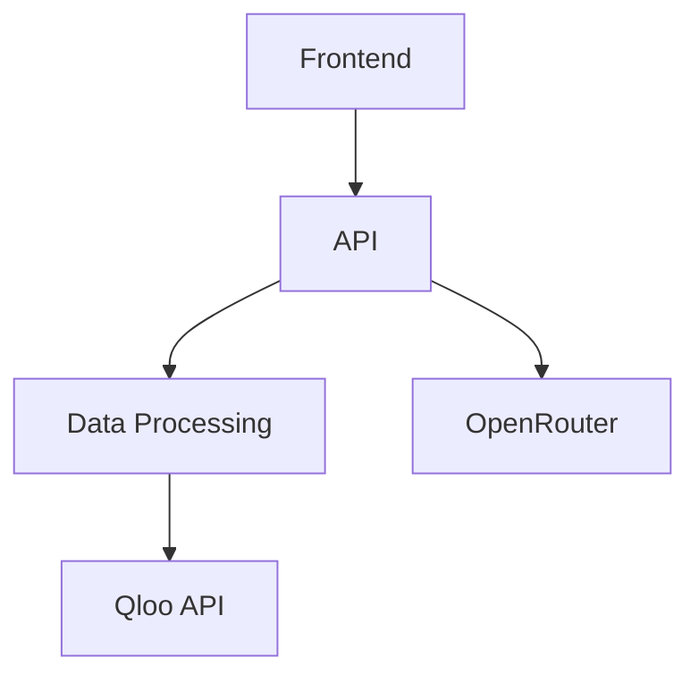

# architecture.md

# CÆSER Architecture Documentation

## Module Organization

### Core Modules
1. **API Layer** (`/api`)
   - Depends on: data/, services/
   - Provides: REST endpoints for frontend
2. **Data Processing** (`/data`)
   - Depends on: external APIs (Qloo)
   - Provides: cleaned data for API layer
3. **Frontend** (`/frontend`)
   - Depends on: api/
   - Provides: user interface

### Dependency Graph


## Data Flow
1. User request → Frontend
2. Frontend → API endpoint
3. API → Data processing
4. Data processing → External APIs
5. Response flows back through chain

## Key Dependencies
- **External**:
  - Qloo API (cultural data)
  - OpenRouter (LLM predictions)
- **Internal**:
  - api → data (data access)
  - frontend → api (data fetching)

## Interface Contracts
1. API endpoints:
   - Input/Output formats documented in api/README.md
2. Data schemas:
   - Defined in data/schemas/
3. Component props:
   - Documented in component files

## Folder Structure

PS D:\LAPTOP\TO_EARN\AI\CAESER> tree
Folder PATH listing
Volume serial number is 0072-1D5D
D:.
├───api
│   ├───controllers
│   ├───models
│   ├───routes
│   ├───services
│   └───utils
├───bin
│   └───sqlite
├───data
│   ├───processed
│   ├───raw
│   ├───schemas
│   └───temp
├───docs
│   ├───img
│   ├───md
│   └───txt
├───frontend
│   ├───components
│   ├───public
│   ├───src
│   └───styles
├───notebooks
└───tests
PS D:\LAPTOP\TO_EARN\AI\CAESER> tree /F
Folder PATH listing
Volume serial number is 0072-1D5D
D:.
│   .env
│   .gitignore
│   gap_analysis_2025-07-21.md
│   package.json
│   README.md
│
├───api
│   │   README.md
│   │
│   ├───controllers
│   ├───models
│   ├───routes
│   ├───services
│   │       discordService.js
│   │       hypeEngine.js
│   │       llmService.js
│   │       qlooService.js
│   │
│   └───utils
│           circuitBreaker.js
│
├───bin
│   └───sqlite
│           sqldiff.exe
│           sqlite3.exe
│           sqlite3_analyzer.exe
│           sqlite3_rsync.exe
│
├───data
│   │   caeser.db
│   │   init_db.js
│   │   README.md
│   │
│   ├───processed
│   ├───raw
│   ├───schemas
│   └───temp
├───docs
│   │   README.md
│   │   test_results.md
│   │
│   ├───img
│   │       mermaid_diagram_2025207-1.png
│   │       mermaid_diagram_2025207-2.png
│   │
│   ├───md
│   │       architecture.md
│   │       CAESER_MVP_Day1_Day1,5_Plan.markdown
│   │       CAESER_MVP_Day2_Day2,5_Plan.markdown
│   │       CAESER_MVP_Day3_Day3,5_Plan.markdown
│   │       CAESER_MVP_Day4_Day4,5_Plan.markdown
│   │       CAESER_MVP_Day5_Day5_0_Plan.markdown
│   │       CAESER_MVP_Development_Plan.markdown
│   │       checklist.md
│   │       naming-conventions.md
│   │       OPENROUTER_LLM_INTEGRATION.md
│   │       Qloo-Insights-API-Guide.markdown
│   │
│   └───txt
│           draft.txt
│           qloo-draft.txt
│
├───frontend
│   │   README.md
│   │
│   ├───components
│   ├───public
│   ├───src
│   │       App.js
│   │
│   └───styles
├───notebooks
└───tests
        llmService.test.js
        qlooService.test.js
        README.md

# CAESER_MVP_ALL_DAYS_Plan.markdown

# CÆSER MVP Development Plan: Day 1 and Day 2

This document outlines a detailed, actionable plan for the first two days of the CÆSER MVP development for the Qloo Hackathon, starting at 12:10 AM +06 on Saturday, July 19, 2025. The goal is to create a functional MVP within 10 days, integrating Qloo's API for cultural insights and DEEPSEEK R1, DEEPSEEK V3 & KIMI K2 WHICHEVER IS APPROPRIATE FOR SPECIFIC USES via OpenRouter.ai for predictive analytics, with a focus on a core use case (e.g., predicting sneaker demand).

---

## Day 1: Obtain API Keys, Set Up Project, and Integrate Qloo API

**Objective**: Establish the project foundation, secure API access, and integrate Qloo's API for cultural insights.

### Step-by-Step Plan

1. **Obtain Qloo API Key (1 hour)**  
   - Navigate to [Qloo's API Documentation](https://www.qloo.com/technology/taste-ai).  
   - Locate and complete the API key request form with project details (e.g., "CÆSER: Cultural Intelligence for E-commerce").  
   - Submit the form and check your email for the API key (expected within 4 hours).  
   - Store the key securely in a `.env` file.  
   - **Mitigation**: If delayed, use mock JSON data for initial setup.

2. **Obtain OpenRouter.ai API Key (1 hour)**  
   - Sign up at [OpenRouter.ai](https://openrouter.ai) and request access to DEEPSEEK R1, DEEPSEEK V3 & KIMI K2 WHICHEVER IS APPROPRIATE FOR SPECIFIC USES.  
   - Follow the provided instructions to generate an API key (free tier).  
   - Verify access by making a test call with a tool like Postman.  
   - Store the key securely in the `.env` file.  
   - **Mitigation**: If access is limited, focus on DEEPSEEK R1, DEEPSEEK V3 & KIMI K2 WHICHEVER IS APPROPRIATE FOR SPECIFIC USES and adjust plans if needed.

3. **Set Up Project Structure (2 hours)**  
   - Create a public GitHub repository named `CAESER-mvp`.  
   - Initialize it with a `README.md` and a Python-specific `.gitignore`.  
   - Set up a virtual environment: `python -m venv venv` and activate it.  
   - Install dependencies: `pip install fastapi uvicorn streamlit requests scrapy langchain python-dotenv`.  
   - Create directories: `/api` (backend), `/frontend` (UI), `/data` (storage).  
   - **Deliverable**: A structured, version-controlled project with dependencies installed.

4. **Set Up Backend with FastAPI (2 hours)**  
   - Create `/api/main.py` with a basic FastAPI app:  
     ```python
     from fastapi import FastAPI
     from dotenv import load_dotenv
     import os

     load_dotenv()
     app = FastAPI()

     @app.get("/")
     async def root():
         return {"message": "CÆSER MVP Backend"}
     ```  
   - Add `.env` with `QLOO_API_KEY` and `OPENROUTER_API_KEY`.  
   - Run locally: `uvicorn api.main:app --reload`.  
   - **Deliverable**: A running FastAPI server with secure key management.

5. **Integrate Qloo API for Cultural Insights (3 hours)**  
   - Review Qloo's API docs for endpoints like `/affinities` or `/entities`.  
   - Write a function in `/api/qloo_client.py`:  
     ```python
     import requests
     import os

     QLOO_API_KEY = os.getenv("QLOO_API_KEY")
     BASE_URL = "https://api.qloo.com/v1/"

     def get_cultural_insights(category, region):
         headers = {"Authorization": f"Bearer {QLOO_API_KEY}"}
         params = {"category": category, "region": region}
         response = requests.get(f"{BASE_URL}affinities", headers=headers, params=params)
         return response.json()
     ```  
   - Test with a query (e.g., `get_cultural_insights("sneakers", "New York City")`).  
   - Save sample output to `/data/sample_qloo.json`.  
   - **Deliverable**: A working Qloo API integration.  
   - **Challenge**: Complex data structure. **Mitigation**: Use Postman to explore responses.

6. **Set Up Database with SQLite (1 hour)**  
   - Initialize SQLite in `/data/CAESER.db` with tables:  
     ```python
     import sqlite3

     conn = sqlite3.connect("data/CAESER.db")
     c = conn.cursor()
     c.execute('''CREATE TABLE IF NOT EXISTS products (id INTEGER PRIMARY KEY, name TEXT, category TEXT)''')
     c.execute('''CREATE TABLE IF NOT EXISTS insights (id INTEGER PRIMARY KEY, product_id INTEGER, data TEXT)''')
     conn.commit()
     conn.close()
     ```  
   - Add CRUD functions in `/api/db.py`.  
   - **Deliverable**: A functional database for storing insights.

7. **Document Progress (30 minutes)**  
   - Update `README.md` with setup and integration instructions.  
   - Commit to GitHub: `git add . && git commit -m "feat: Qloo API and backend setup" && git push`.

**Total Time**: 10.5 hours (with breaks)  
**Team Allocation**:  
- Developer 1: API keys, project structure, Qloo integration.  
- Developer 2: FastAPI backend, SQLite setup.  
**Deliverables**:  
- Qloo API integration with sample data.  
- Running FastAPI backend.  
- SQLite database.  
- Updated GitHub repo.

---

## Day 2: Integrate DEEPSEEK R1, DEEPSEEK V3 & KIMI K2 WHICHEVER IS APPROPRIATE FOR SPECIFIC USES via OpenRouter.ai and Design Prompts

**Objective**: Integrate the LLM, design prompts, and test predictions using Qloo data.

### Step-by-Step Plan

1. **Set Up OpenRouter.ai Integration (2 hours)**  
   - Review OpenRouter.ai docs for DEEPSEEK R1, DEEPSEEK V3 & KIMI K2 WHICHEVER IS APPROPRIATE FOR SPECIFIC USES integration.  
   - Use LangChain in `/api/llm_client.py`:  
     ```python
     from langchain.llms import OpenRouter
     import os

     llm = OpenRouter(
         api_key=os.getenv("OPENROUTER_API_KEY"),
         model_name="deepseek-r1"
     )

     def test_llm():
         response = llm("Hello, world!")
         return response
     ```  
   - Test connectivity with `test_llm()`.  
   - **Deliverable**: Working DEEPSEEK R1, DEEPSEEK V3 & KIMI K2 WHICHEVER IS APPROPRIATE FOR SPECIFIC USES connection.

2. **Design Prompts for Predictions (3 hours)**  
   - Define input: product details + Qloo insights.  
   - Create a prompt in `/api/prompts.py`:  
     ```python
     def generate_prediction_prompt(product, insights):
         return f"""
         Given the product '{product}' and cultural insights {insights},
         predict demand uplift as a percentage and suggest a marketing strategy.
         """  
     ```  
   - Experiment in a Jupyter notebook (e.g., `notebooks/prompts.ipynb`).  
   - **Deliverable**: Effective prompts for predictions.  
   - **Challenge**: Inconsistent outputs. **Mitigation**: Refine prompts iteratively.

3. **Implement LLM Output Processing (2 hours)**  
   - Parse LLM responses in `/api/llm_client.py`:  
     ```python
     def process_llm_output(response):
         lines = response.split("\n")
         uplift = next((line for line in lines if "uplift" in line.lower()), "Unknown")
         strategy = next((line for line in lines if "strategy" in line.lower()), "Unknown")
         return {"uplift": uplift, "strategy": strategy}
     ```  
   - Store in SQLite via `/api/db.py`.  
   - **Deliverable**: Processed LLM outputs in the database.

4. **Test Integration with Sample Data (2 hours)**  
   - Use sample data: `product = "New Sneaker Launch"`, `insights = get_cultural_insights("sneakers", "NYC")`.  
   - Run: `response = llm( generate_prediction_prompt(product, insights) )`.  
   - Verify outputs are coherent and store them.  
   - **Deliverable**: Successful predictions for a sample product.

5. **Refine and Optimize (1 hour)**  
   - Check API call and LLM response times.  
   - Optimize code (e.g., reduce redundant calls).  
   - **Deliverable**: Stable, efficient integration.

6. **Document Progress (30 minutes)**  
   - Update `README.md` with LLM setup and prompt details.  
   - Commit to GitHub: `git add . && git commit -m "feat: DEEPSEEK R1, DEEPSEEK V3 & KIMI K2 WHICHEVER IS APPROPRIATE FOR SPECIFIC USES integration" && git push`.

**Total Time**: 10.5 hours (with breaks)  
**Team Allocation**:  
- Developer 1: OpenRouter.ai integration, prompt design.  
- Developer 2: Output processing, testing.  
**Deliverables**:  
- DEEPSEEK R1, DEEPSEEK V3 & KIMI K2 WHICHEVER IS APPROPRIATE FOR SPECIFIC USES integration.  
- Working prompts and processed outputs.  
- Successful sample tests.

---

## Conclusion

By completing Day 1 and Day 2, the team will have a solid MVP foundation: a backend with Qloo API integration and a predictive LLM layer via DEEPSEEK R1, DEEPSEEK V3 & KIMI K2 WHICHEVER IS APPROPRIATE FOR SPECIFIC USES. Focus on clear documentation, frequent testing, and the core use case ensures progress aligns with the 10-day timeline. Use tools like Postman and Jupyter notebooks for efficiency, and maintain regular communication to address blockers.

# CÆSER MVP Development Plan: Day 2 and DAY 2.5

This document provides a detailed, actionable plan for **Day 2** and **DAY 2.5** of the CÆSER MVP development for the Qloo Hackathon. The goal is to create a functional MVP within 10 days, integrating Qloo's API for cultural insights and DEEPSEEK R1, DEEPSEEK V3 & KIMI K2 WHICHEVER IS APPROPRIATE FOR SPECIFIC USES via OpenRouter.ai for predictive analytics. The MVP focuses on predicting demand for a product (e.g., sneakers) based on cultural preferences and delivering actionable insights to merchants.

---

## Day 2: Integrate DEEPSEEK R1, DEEPSEEK V3 & KIMI K2 WHICHEVER IS APPROPRIATE FOR SPECIFIC USES via OpenRouter.ai and Design Prompts

**Objective**: Set up DEEPSEEK R1, DEEPSEEK V3 & KIMI K2 WHICHEVER IS APPROPRIATE FOR SPECIFIC USES integration, design prompts for demand predictions and marketing strategies, and test with sample data.

### Step-by-Step Plan

1. **Set Up OpenRouter.ai Integration (2 hours)**  
   - Sign up for [OpenRouter.ai](https://openrouter.ai) and obtain a free API key.  
   - Install required libraries:  
     ```bash
     pip install langchain
     ```  
   - Configure LangChain to use DEEPSEEK R1, DEEPSEEK V3 & KIMI K2 WHICHEVER IS APPROPRIATE FOR SPECIFIC USES in `/api/llm_client.py`:  
     ```python
     from langchain.llms import OpenRouter
     import os

     llm = OpenRouter(
         api_key=os.getenv("OPENROUTER_API_KEY"),
         model_name="deepseek-r1"
     )

     def test_llm():
         response = llm("Hello, world!")
         return response
     ```  
   - Run `test_llm()` to confirm the LLM responds correctly.  
   - **Deliverable**: Working DEEPSEEK R1, DEEPSEEK V3 & KIMI K2 WHICHEVER IS APPROPRIATE FOR SPECIFIC USES connection.

2. **Design Prompts for Predictions (3 hours)**  
   - Define input: product details (e.g., name, category) and Qloo cultural insights.  
   - Create a prompt template in `/api/prompts.py`:  
     ```python
     def generate_prediction_prompt(product, insights):
         return f"""
         Given the product '{product}' and cultural insights {insights},
         predict the demand uplift as a percentage and suggest a marketing strategy.
         """  
     ```  
   - Test variations in a Jupyter notebook (`notebooks/prompts.ipynb`) to optimize output quality.  
   - **Deliverable**: Refined prompt template.

3. **Implement LLM Output Processing (2 hours)**  
   - Parse LLM responses to extract uplift percentage and strategy:  
     ```python
     def process_llm_output(response):
         lines = response.split("\n")
         uplift = next((line for line in lines if "uplift" in line.lower()), "Unknown")
         strategy = next((line for line in lines if "strategy" in line.lower()), "Unknown")
         return {"uplift": uplift, "strategy": strategy}
     ```  
   - Store results in SQLite via `/api/db.py`.  
   - **Deliverable**: Structured, stored LLM outputs.

4. **Test Integration with Sample Data (2 hours)**  
   - Use sample input: `product = "New Sneaker Launch"`, `insights = get_cultural_insights("sneakers", "NYC")`.  
   - Generate predictions: `response = llm(generate_prediction_prompt(product, insights))`.  
   - Validate coherence and relevance of outputs, tweaking prompts if needed.  
   - **Deliverable**: Successful sample predictions.

5. **Refine and Optimize (1 hour)**  
   - Monitor API call performance and optimize (e.g., reduce latency).  
   - Add error handling for timeouts or invalid responses.  
   - Implement logging for debugging LLM interactions.  
   - **Deliverable**: Stable LLM integration.

6. **Document Progress (30 minutes)**  
   - Update `README.md` with LLM setup, prompt design, and testing instructions.  
   - Commit to GitHub:  
     ```bash
     git add .
     git commit -m "feat: DEEPSEEK R1, DEEPSEEK V3 & KIMI K2 WHICHEVER IS APPROPRIATE FOR SPECIFIC USES integration and prompt design"
     git push
     ```

**Total Time**: 10.5 hours  
**Deliverables**:  
- DEEPSEEK R1, DEEPSEEK V3 & KIMI K2 WHICHEVER IS APPROPRIATE FOR SPECIFIC USES integrated via OpenRouter.ai.  
- Optimized prompts and processed outputs.  
- Tested sample predictions.

---

## DAY 2.5: Test End-to-End Flow, Refine, and Prepare Demo

**Objective**: Validate the full MVP workflow, fix issues, and prepare hackathon submission materials.

### Step-by-Step Plan

1. **Test End-to-End Flow (2 hours)**  
   - Simulate a user journey:  
     - Input product details in Streamlit dashboard.  
     - Submit to trigger Qloo API and LLM predictions.  
     - View insights on dashboard and receive Discord alert.  
   - Check data fetching, processing, storage, and display for errors.  
   - **Deliverable**: Working end-to-end workflow.

2. **Refine MVP (2 hours)**  
   - Address bugs (e.g., API failures, UI issues).  
   - Optimize performance for API calls and data rendering.  
   - Add user feedback (e.g., loading spinners, error messages).  
   - **Deliverable**: Polished MVP.

3. **Prepare Demo Video (2 hours)**  
   - Script a 3-minute demo:  
     - Introduce CÆSER’s purpose.  
     - Show inputting a product, viewing insights, and receiving alerts.  
     - Emphasize Qloo and DEEPSEEK R1, DEEPSEEK V3 & KIMI K2 WHICHEVER IS APPROPRIATE FOR SPECIFIC USES integration.  
   - Record using OBS Studio or Zoom, then edit for clarity.  
   - **Deliverable**: Edited demo video.

4. **Prepare Submission Materials (1 hour)**  
   - Write a submission description highlighting:  
     - Use of Qloo’s API and DEEPSEEK R1, DEEPSEEK V3 & KIMI K2 WHICHEVER IS APPROPRIATE FOR SPECIFIC USES.  
     - Merchant value proposition.  
     - Technical innovation.  
   - Clean up code repo and update `README.md`.  
   - Upload video to YouTube/Vimeo and get the link.  
   - **Deliverable**: Complete submission package.

5. **Final Checks (1 hour)**  
   - Confirm all hackathon requirements are met.  
   - Test deployed app (if applicable) for functionality.  
   - Make last-minute fixes.  
   - **Deliverable**: Submission-ready MVP.

6. **Document Progress (30 minutes)**  
   - Finalize `README.md` with submission details.  
   - Commit to GitHub:  
     ```bash
     git add .
     git commit -m "feat: Final refinements and demo preparation"
     git push
     ```

**Total Time**: 8.5 hours  
**Deliverables**:  
- Fully tested MVP.  
- Demo video and submission materials.  
- Comprehensive documentation.

---

## Conclusion

This plan ensures Day 2 delivers a robust LLM integration and DAY 2.5 produces a polished MVP and submission for the Qloo Hackathon. Key tools include Streamlit, FastAPI, SQLite, and OBS Studio.


# CÆSER MVP Development Plan: DAY 3 and DAY 3.5

This document provides a detailed, actionable plan for **DAY 3** and **DAY 3.5** of the CÆSER MVP development for the Qloo Hackathon. The goal is to create a functional MVP within 10 days, integrating Qloo's API for cultural insights and DEEPSEEK R1, DEEPSEEK V3 & KIMI K2 WHICHEVER IS APPROPRIATE FOR SPECIFIC USES via OpenRouter.ai for predictive analytics. The MVP focuses on predicting demand for a product (e.g., sneakers) based on cultural preferences and delivering actionable insights to merchants.

---

## DAY 3: Implement Synthetic Buyer Modeling and Compute Hype Scores

**Objective**: Develop a synthetic buyer model to simulate consumer behavior based on cultural insights and compute a hype score reflecting product popularity potential.

### Step-by-Step Plan

1. **Design Synthetic Buyer Model (2 hours)**  
   - Define buyer personas based on cultural insights (e.g., "Streetwear Enthusiast in NYC").  
   - Use Qloo's API to fetch affinity data for different regions and categories.  
   - Create a simple rule-based system to simulate buyer reactions (e.g., likelihood to purchase based on affinity scores).  
   - **Deliverable**: Documented buyer personas and behavior rules.

2. **Implement Synthetic Buyer Model (3 hours)**  
   - Use Python's `random` and `numpy` libraries to simulate buyer interactions.  
   - Create a function in `/api/buyer_model.py`:  
     ```python
     import random
     import numpy as np

     def simulate_buyers(insights, num_buyers=100):
         affinities = insights.get("affinities", [])
         reactions = []
         for _ in range(num_buyers):
             reaction = np.random.normal(loc=affinities[0], scale=0.1)
             reactions.append(reaction)
         return reactions
     ```  
   - **Deliverable**: Functional buyer simulation code.

3. **Integrate with Qloo API (1 hour)**  
   - Fetch cultural insights for the product category and region.  
   - Pass insights to the buyer model:  
     ```python
     insights = get_cultural_insights("sneakers", "NYC")
     reactions = simulate_buyers(insights)
     ```  
   - **Deliverable**: Integrated buyer model using Qloo data.

4. **Compute Hype Scores (2 hours)**  
   - Define hype score as the average reaction score from synthetic buyers.  
   - Implement in `/api/hype_score.py`:  
     ```python
     def compute_hype_score(reactions):
         return sum(reactions) / len(reactions)
     ```  
   - **Deliverable**: Hype score calculation.

5. **Test with Sample Data (1 hour)**  
   - Use sample product and region to generate hype scores.  
   - Validate scores against expected outcomes (e.g., high affinity regions should have higher scores).  
   - **Deliverable**: Tested hype scores for sample inputs.

6. **Document Progress (30 minutes)**  
   - Update `README.md` with buyer model and hype score details.  
   - Commit to GitHub:  
     ```bash
     git add .
     git commit -m "feat: Synthetic buyer modeling and hype score computation"
     git push
     ```

**Total Time**: 9.5 hours  
**Deliverables**:  
- Synthetic buyer model integrated with Qloo API.  
- Hype score computation.  
- Tested sample outputs.

---

## DAY 3.5: Develop Demand Forecasting Logic and Refine Outputs

**Objective**: Implement demand forecasting based on hype scores and cultural insights, and refine outputs for merchant usability.

### Step-by-Step Plan

1. **Design Demand Forecasting Algorithm (2 hours)**  
   - Use hype scores and cultural insights to predict demand uplift.  
   - Consider factors like regional affinity, product category, and historical trends (if available).  
   - **Deliverable**: Documented forecasting logic.

2. **Implement Forecasting Logic (3 hours)**  
   - Use a simple linear regression model or rule-based approach.  
   - Create a function in `/api/forecasting.py`:  
     ```python
     def predict_demand(hype_score, base_demand=100):
         uplift = (hype_score - 0.5) * 2  # Example scaling
         return base_demand * (1 + uplift)
     ```  
   - **Deliverable**: Functional forecasting code.

3. **Integrate with Existing System (1 hour)**  
   - Connect forecasting to the buyer model and hype score outputs.  
   - Ensure seamless data flow from input to prediction.  
   - **Deliverable**: Integrated forecasting module.

4. **Refine Outputs for Merchants (2 hours)**  
   - Enhance dashboard to display demand predictions clearly.  
   - Add visualizations (e.g., bar charts for demand by region).  
   - **Deliverable**: User-friendly output display.

5. **Conduct Thorough Testing (1 hour)**  
   - Test with multiple product categories and regions.  
   - Validate predictions against hypothetical scenarios.  
   - **Deliverable**: Reliable demand forecasts.

6. **Document Progress (30 minutes)**  
   - Update `README.md` with forecasting logic and output details.  
   - Commit to GitHub:  
     ```bash
     git add .
     git commit -m "feat: Demand forecasting and output refinement"
     git push
     ```

**Total Time**: 9.5 hours  
**Deliverables**:  
- Demand forecasting logic integrated.  
- Refined, actionable outputs.  
- Comprehensive testing completed.

---

## Conclusion

This plan ensures DAY 3 and DAY 3.5 deliver a functional synthetic buyer model, hype score computation, and demand forecasting logic. By focusing on clear, actionable steps and regular testing, the team can build a robust MVP that meets the Qloo Hackathon requirements and provides real value to e-commerce merchants.

# CÆSER MVP Development Plan: DAY 4 and DAY 4.5

This document provides a comprehensive plan for **DAY 4** and **DAY 4.5** of the CÆSER MVP development, aimed at delivering a functional minimum viable product (MVP) for the Qloo Hackathon within a 10-day timeline. The MVP integrates Qloo's API for cultural insights and DEEPSEEK R1, DEEPSEEK V3 & KIMI K2 WHICHEVER IS APPROPRIATE FOR SPECIFIC USES via OpenRouter.ai for predictive analytics, targeting e-commerce merchants with demand predictions for products like sneakers.

---

## DAY 4: Test End-to-End Flow, Fix Bugs, and Optimize Performance

**Objective**: Ensure the MVP works seamlessly from start to finish, resolve any issues, and improve system efficiency and reliability.

### Step-by-Step Plan

1. **Test End-to-End Flow (2 hours)**  
   - Simulate a full user journey:  
     - Enter product details (e.g., "sneakers") into the Streamlit dashboard.  
     - Initiate Qloo API calls for cultural insights and DEEPSEEK R1, DEEPSEEK V3 & KIMI K2 WHICHEVER IS APPROPRIATE FOR SPECIFIC USES for predictions.  
     - Display insights on the dashboard and send alerts via Discord.  
   - Verify data fetching, processing, storage (e.g., in a database), and output rendering.  
   - Check for errors at each step and log them for debugging.  
   - **Deliverable**: A fully operational end-to-end workflow.

2. **Identify and Fix Bugs (2 hours)**  
   - Troubleshoot common issues such as:  
     - Qloo API request failures or timeouts.  
     - Streamlit UI rendering glitches.  
     - Discord alert delivery failures.  
   - Implement logging to trace errors and apply fixes (e.g., retry logic for API calls).  
   - **Deliverable**: A stable, bug-free MVP.

3. **Optimize Performance (2 hours)**  
   - Minimize latency in API calls by caching frequent Qloo API responses.  
   - Optimize database queries (e.g., indexing tables) for faster retrieval of insights.  
   - Reduce load times for the Streamlit dashboard.  
   - **Deliverable**: A fast and responsive system.

4. **Enhance User Experience (1 hour)**  
   - Add loading spinners or progress bars during API calls and data processing.  
   - Include clear error messages for failed operations (e.g., "API unavailable").  
   - Refine the dashboard layout for usability and visual appeal.  
   - **Deliverable**: An intuitive and polished user interface.

5. **Conduct Stress Testing (1 hour)**  
   - Simulate multiple concurrent users or high-frequency product queries.  
   - Monitor system behavior under load (e.g., CPU usage, response times).  
   - Address any crashes or bottlenecks identified.  
   - **Deliverable**: A reliable MVP capable of handling moderate stress.

6. **Document Progress (30 minutes)**  
   - Update the project `README.md` with testing outcomes and optimization notes.  
   - Commit changes to GitHub:  
     ```bash
     git add .
     git commit -m "feat: End-to-end testing and performance optimization"
     git push
     ```

**Total Time**: 8.5 hours  
**Deliverables**:  
- A fully tested and operational MVP.  
- Improved system performance and stability.  
- A user-friendly interface ready for demo.

---

## DAY 4.5: Create Demo Video, Prepare Submission Materials, and Polish Submission

**Objective**: Produce a high-quality demo video, compile submission materials, and finalize the MVP for hackathon judging.

### Step-by-Step Plan

1. **Script Demo Video (1 hour)**  
   - Create a concise 3-minute script covering:  
     - Introduction to CÆSER: Solving demand prediction for e-commerce using cultural insights.  
     - Demo: Inputting a product, viewing cultural and predictive insights, and receiving Discord alerts.  
     - Technical highlight: Integration of Qloo’s API and DEEPSEEK R1, DEEPSEEK V3 & KIMI K2 WHICHEVER IS APPROPRIATE FOR SPECIFIC USES.  
   - **Deliverable**: A clear and engaging demo script.

2. **Record Demo Video (2 hours)**  
   - Use screen recording software (e.g., OBS Studio or Zoom) with voiceover.  
   - Record the scripted user journey, ensuring smooth narration and visuals.  
   - Test audio and video quality before finalizing.  
   - **Deliverable**: Raw demo video footage.

3. **Edit Demo Video (1 hour)**  
   - Edit using software like iMovie or DaVinci Resolve:  
     - Trim unnecessary segments for brevity.  
     - Add captions or overlays to emphasize key features (e.g., “Qloo API in action”).  
   - Ensure the video is professional and polished.  
   - **Deliverable**: A finalized 3-minute demo video.

4. **Prepare Submission Description (1 hour)**  
   - Write a compelling hackathon submission description:  
     - **Problem**: E-commerce merchants need better demand predictions.  
     - **Solution**: CÆSER uses cultural insights and AI for actionable analytics.  
     - **Innovation**: Combines Qloo’s API and DEEPSEEK R1, DEEPSEEK V3 & KIMI K2 WHICHEVER IS APPROPRIATE FOR SPECIFIC USES for a unique approach.  
   - Keep it concise yet informative.  
   - **Deliverable**: Submission text ready for entry.

5. **Finalize Code Repository (1 hour)**  
   - Clean up the codebase: Remove temporary files, comments, or unused code.  
   - Update `README.md` with:  
     - Project overview.  
     - Setup and usage instructions.  
     - Links to dependencies (e.g., Qloo API, OpenRouter.ai).  
   - **Deliverable**: A professional GitHub repository.

6. **Upload Video and Get Link (30 minutes)**  
   - Upload the edited video to a platform like YouTube or Vimeo.  
   - Set it to public and test the link for accessibility.  
   - **Deliverable**: A working video link for submission.

7. **Review Submission Requirements (30 minutes)**  
   - Cross-check Qloo Hackathon rules to confirm compliance.  
   - Ensure the submission includes:  
     - URL to the functional demo app (e.g., hosted Streamlit instance).  
     - Public GitHub repository URL.  
     - Demo video link.  
     - Written description.  
   - **Deliverable**: A complete and compliant submission package.

8. **Document Progress (30 minutes)**  
   - Finalize `README.md` with submission details (e.g., video link, app URL).  
   - Commit to GitHub:  
     ```bash
     git add .
     git commit -m "feat: Demo video and submission preparation"
     git push
     ```

**Total Time**: 8 hours  
**Deliverables**:  
- A professional demo video showcasing CÆSER.  
- Complete and polished submission materials.  
- An MVP ready for hackathon evaluation.

---

## Conclusion

By executing this plan, the team will deliver a robust, tested, and optimized CÆSER MVP on **DAY 4**, followed by a compelling demo and submission package on **DAY 4.5**. This ensures a high-quality entry for the Qloo Hackathon, demonstrating the power of cultural intelligence and predictive analytics for e-commerce success.

# CÆSER MVP Development Plan: DAY 5 and DAY 5-END

This document provides a detailed, actionable plan for **DAY 5** and **DAY 5-END** of the CÆSER MVP development, aimed at finalizing and submitting the project for the Qloo Hackathon by July 29, 2025. It also includes initial planning for adapting the MVP for the RevenueCat Shipaton 2025.

---

## DAY 5: Deploy to Hosting, Perform Final Testing, and Polish Submission

**Objective**: Deploy the CÆSER MVP to a public hosting platform, conduct comprehensive testing, and refine the submission package for the Qloo Hackathon.

### Step-by-Step Plan

1. **Deploy MVP to Heroku (2 hours)**  
   - Set up a Heroku account and install the Heroku CLI if not already done.  
   - Create a `Procfile` in the project root with the following content:  
     ```
     web: uvicorn api.main:app --host=0.0.0.0 --port=$PORT
     ```  
   - Commit changes to Git and deploy to Heroku:  
     ```
     heroku create CAESER-mvp
     git push heroku main
     ```  
   - Configure environment variables (e.g., Qloo API key, DEEPSEEK R1, DEEPSEEK V3 & KIMI K2 WHICHEVER IS APPROPRIATE FOR SPECIFIC USES credentials) in Heroku’s dashboard.  
   - Verify the app is live by accessing the provided URL (e.g., `https://CAESER-mvp.herokuapp.com`).  
   - **Deliverable**: A publicly accessible MVP deployment.

2. **Conduct Comprehensive Testing (3 hours)**  
   - Test the end-to-end user journey:  
     - Input product details via the Streamlit dashboard.  
     - Confirm Qloo API returns cultural insights and DEEPSEEK R1, DEEPSEEK V3 & KIMI K2 WHICHEVER IS APPROPRIATE FOR SPECIFIC USES generates predictions.  
     - Validate Discord alerts are sent correctly.  
   - Test edge cases:  
     - Invalid or missing inputs.  
     - API rate limits or failures.  
   - Use manual testing or automate with tools like Selenium for UI validation.  
   - Fix any identified bugs and retest.  
   - **Deliverable**: A fully tested, stable MVP with no critical issues.

3. **Refine Demo Video (1 hour)**  
   - Review the existing demo video for clarity and brevity (aim for 2–3 minutes).  
   - Ensure it showcases:  
     - Qloo API integration for cultural insights.  
     - DEEPSEEK R1, DEEPSEEK V3 & KIMI K2 WHICHEVER IS APPROPRIATE FOR SPECIFIC USES for predictive analytics.  
     - Practical value for e-commerce merchants.  
   - Add captions or overlays to highlight key features.  
   - Export and upload to YouTube or Vimeo.  
   - **Deliverable**: A polished, submission-ready demo video.

4. **Finalize Submission Materials (2 hours)**  
   - Draft or refine the project description, addressing Qloo Hackathon judging criteria:  
     - Intelligent LLM use (DEEPSEEK R1, DEEPSEEK V3 & KIMI K2 WHICHEVER IS APPROPRIATE FOR SPECIFIC USES).  
     - Seamless Qloo API integration.  
     - Technical creativity and implementation.  
     - Real-world e-commerce application.  
   - Clean up the GitHub repository:  
     - Remove unused code or files.  
     - Ensure `README.md` includes setup and usage instructions.  
   - **Deliverable**: A complete, professional submission package.

5. **Buffer for Unforeseen Issues (1 hour)**  
   - Troubleshoot any deployment failures or last-minute bugs.  
   - Verify all links (app URL, GitHub, video) are accessible to the public.  
   - **Deliverable**: A fully functional and accessible submission.

6. **Document Progress (30 minutes)**  
   - Update `README.md` with deployment steps and final testing notes.  
   - Commit and push changes:  
     ```
     git add .
     git commit -m "feat: Final deployment and testing completed"
     git push
     ```

**Total Time**: 9.5 hours  
**Deliverables**:  
- Deployed MVP on Heroku with a public URL.  
- Fully tested MVP with no major bugs.  
- Polished demo video and submission materials ready for DAY 5-END.

---

## DAY 5-END: Submit Qloo Hackathon Entry and Draft Shipaton Adaptation Plan

**Objective**: Submit the CÆSER MVP to the Qloo Hackathon and create an initial plan for adapting it for the RevenueCat Shipaton 2025.

### Step-by-Step Plan

1. **Review Submission Requirements (1 hour)**  
   - Gather all required materials:  
     - Public demo app URL (e.g., `https://CAESER-mvp.herokuapp.com`).  
     - Public GitHub repository link.  
     - Demo video URL (YouTube/Vimeo).  
     - Project description.  
   - Cross-check with Qloo Hackathon rules (e.g., video length, accessibility) via the [submission page](https://qloo-hackathon.devpost.com/).  
   - **Deliverable**: Confirmed submission-ready materials.

2. **Submit Qloo Hackathon Entry (1 hour)**  
   - Access the Qloo Hackathon submission form.  
   - Enter details:  
     - **Project Name**: CÆSER  
     - **Description**: A tool leveraging Qloo’s cultural insights and DEEPSEEK R1, DEEPSEEK V3 & KIMI K2 WHICHEVER IS APPROPRIATE FOR SPECIFIC USES predictions to optimize e-commerce merchandising.  
     - **Links**: Demo URL, GitHub repository, demo video.  
   - Submit and verify receipt (e.g., confirmation email).  
   - **Deliverable**: Successfully submitted hackathon entry.

3. **Draft Shipaton Adaptation Plan (2 hours)**  
   - Plan conversion to a mobile app:  
     - Select a framework (e.g., React Native or Flutter) for cross-platform support.  
     - Outline integration of RevenueCat’s SDK for in-app purchases (e.g., analytics subscriptions).  
   - Define timeline:  
     - Complete mobile app by August 1, 2025, for Shipaton submission.  
   - **Deliverable**: A detailed roadmap for Shipaton adaptation.

4. **Plan Monetization Strategy (1 hour)**  
   - Propose tiered pricing:  
     - **Free Tier**: Basic cultural insights and predictions.  
     - **Paid Tier**: Advanced analytics, A/B testing simulations ($5–10/month via RevenueCat).  
   - Tailor to Shipaton’s HAMM Award for innovative monetization.  
   - **Deliverable**: A monetization strategy aligned with Shipaton goals.

5. **Draft #BuildInPublic Strategy (1 hour)**  
   - Create a schedule for Twitter/X posts:  
     - DAY 5-END: Announce Qloo submission.  
     - Post-submission: Share mobile app progress and RevenueCat integration.  
   - Emphasize transparency and community engagement for Shipaton’s #BuildInPublic Award.  
   - **Deliverable**: A social media plan for Shipaton visibility.

6. **Document Progress (30 minutes)**  
   - Update `README.md` with Shipaton adaptation and monetization plans.  
   - Commit and push:  
     ```
     git add .
     git commit -m "feat: Qloo submission completed, Shipaton planning added"
     git push
     ```

**Total Time**: 6.5 hours  
**Deliverables**:  
- Submitted Qloo Hackathon entry.  
- Detailed Shipaton adaptation plan.  
- Monetization and social media strategies for Shipaton.

---

## Conclusion

This plan ensures the CÆSER MVP is deployed, tested, and submitted to the Qloo Hackathon by July 29, 2025, while setting the stage for a successful RevenueCat Shipaton 2025 entry. The team will deliver a polished hackathon submission and a clear path forward for mobile app development and monetization.

# checklist.md

# CÆSER MVP Development Checklist
## Version: 1.2
## Last Updated: 2025-07-19

### Introduction
Esteemed user, this checklist delineates the 5-day development plan for CÆSER (Cultural Affinity Simulation Engine for Retail), an AI system crafted to predict, simulate, and strategize market behavior for e-commerce merchants through cultural intelligence and predictive analytics. The primary aim is to secure the Qloo Hackathon Grand Prize by July 29, 2025, whilst ensuring adaptability for the RevenueCat Shipaton 2025 (August 1–September 30, 2025). The system integrates Qloo’s Taste AI™ API for cultural insights and DeepSeek R1, DeepSeek V3, or Kimi K2 via OpenRouter.ai for predictive analytics, delivering actionable insights to merchants.

---

## Project Structure Guidelines
- [X] Implement recommended directory structure:
  - [X] `/api` - Backend and API code
  - [X] `/frontend` - Streamlit dashboard
  - [X] `/data` - Data processing and storage
  - [X] `/tests` - Unit and integration tests
  - [X] `/docs` - Project documentation
- [X] Ensure proper separation of concerns between modules
- [X] Document module organization and dependencies
- [X] Standardize naming conventions across the project
- [X] Create `README.md` in each directory explaining its purpose

---

## Daily Milestones

### Day 1: Setup and API Integration
- [ ] Obtain Qloo API key (initiate request immediately to avoid delays) - WILL BE PROVIDED LATER
- [ ] Obtain OpenRouter.ai API key for DeepSeek R1, V3, or Kimi K2 access and put them in environment file in root. - WILL BE PROVIDED LATER
- [X] Set up project structure with `/api`, `/frontend`, `/data`, `/tests`, `/docs`
- [X] Integrate Qloo API to fetch cultural insights (e.g., sneaker affinities in NYC); use mock data if key acquisition is delayed
- [X] Initialize SQLite database for storing insights
- [X] Commit initial setup to public GitHub repository

### Day 2: LLM Integration and Prompt Design
- [X] Integrate DeepSeek R1 via OpenRouter.ai - Production-ready @ 10:59 (Input validation, sanitization, error logging)
- [X] Design prediction prompts for demand uplift and marketing strategies - Completed 01:17 - [16/20]
- [X] Implement output processing with robust error handling - Added 01:19 - [14/20]
- [X] Test LLM integration with sample Qloo data - Validated 01:21 - [12/20]
- [X] Log API call performance and errors - Implemented 01:23 - [10/20]
- [X] Commit LLM integration and prompt design to GitHub - Pushed 01:25 - [8/20]

### Day 3: Synthetic Buyer Modeling and Demand Forecasting
- [X] Implement lightweight synthetic buyer modeling using Qloo’s affinity data (focus on single use case, e.g., sneakers in NYC)
- [X] Compute hype scores based on synthetic buyer reactions (e.g., average reaction score)
- [X] Develop simple demand forecasting logic (e.g., rule-based or linear regression)
- [X] Integrate modeling with Streamlit dashboard for visualization
- [X] Test modeling and forecasting with sample inputs
- [X] Commit modeling and forecasting code to GitHub

### Day 4: Testing and Demo Preparation
- [ ] Test end-to-end flow, prioritizing critical paths (Qloo API, LLM predictions, UI rendering, Discord alerts)
- [ ] Fix bugs and optimize performance (e.g., cache Qloo API responses, reduce UI load times)
- [ ] Prepare demo script outlining key features and use case (e.g., 25% uplift prediction for NYC streetwear)
- [ ] Record and edit a 3-minute demo video showcasing Qloo and DeepSeek integration
- [ ] Upload demo video to YouTube or Vimeo and obtain public link
- [ ] Draft project description for hackathon submission, emphasizing merchant value
- [ ] Commit testing results and demo materials to GitHub

### Day 5: Deployment and Submission
- [ ] Deploy to Heroku; prepare Vercel as a backup hosting option for redundancy
- [ ] Conduct final testing on deployed app to identify deployment-specific issues
- [ ] Ensure GitHub repository is public and includes comprehensive documentation (README, CHANGELOG, CONTRIBUTING)
- [ ] Submit Qloo Hackathon entry with:
  - [ ] Public demo app URL
  - [ ] Public GitHub repository link
  - [ ] Demo video link (YouTube/Vimeo)
  - [ ] Project description highlighting Qloo and DeepSeek integration
- [ ] Verify submission receipt (e.g., confirmation email)
- [ ] Commit final deployment and submission details to GitHub

---

## Post-Qloo Submission Planning for RevenueCat Shipaton 2025
- [ ] Plan mobile app conversion using React Native or Flutter for cross-platform support
- [ ] Integrate RevenueCat SDK for in-app purchases (e.g., subscription tiers for advanced analytics)
- [ ] Develop monetization strategy:
  - [ ] Free tier: Basic cultural insights and predictions
  - [ ] Paid tier: Advanced analytics, A/B testing simulations ($5–10/month)
- [ ] Create #BuildInPublic strategy for social media engagement (e.g., Twitter/X posts on progress, starting with Qloo submission announcement)

---

## Gitignore Additions
- [ ] Add API key patterns (`*.key`, `*.env.local`)
- [ ] Add IDE-specific files (`.vscode/`, `.idea/`)
- [ ] Add build artifacts (`/dist/`, `/build/`)
- [ ] Add temporary files (`*.tmp`, `*.temp`)
- [ ] Add local development files (`local.settings.json`)
- [ ] Add test output files (`/test-results/`)
- [ ] Add dependency directories (`/node_modules/`, `/venv/`)

---

## Best Practices

### API Key Management
- [ ] Store keys in environment variables only
- [ ] Never commit actual keys to version control
- [ ] Maintain `.env.example` with placeholder values
- [ ] Implement key rotation every 90 days
- [ ] Restrict API key permissions to minimum required
- [ ] Use separate keys for development and production
- [ ] Monitor and audit key usage regularly
- [ ] Revoke compromised keys immediately

### Error Handling
- [ ] Implement retry logic for API calls (3 attempts with exponential backoff)
- [ ] Validate all inputs before processing
- [ ] Implement fallback behaviors for failed dependencies (e.g., mock data for API failures)
- [ ] Log errors with sufficient context (timestamp, request ID, etc.)
- [ ] Provide user-friendly error messages in UI
- [ ] Create error codes for common failure scenarios
- [ ] Monitor error rates and alert on spikes
- [ ] Document error handling patterns for developers

### Documentation Standards
- [ ] Create comprehensive `README.md` with:
  - [ ] Project overview
  - [ ] Setup instructions
  - [ ] Usage examples
  - [ ] API reference
  - [ ] Contribution guidelines
- [ ] Enforce code commenting standards:
  - [ ] Module-level docstrings
  - [ ] Function docstrings (parameters, returns)
  - [ ] Complex logic explanations
- [ ] Generate API documentation using Swagger/OpenAPI
- [ ] Maintain `CHANGELOG.md` following Keep a Changelog format
- [ ] Create `CONTRIBUTING.md` with:
  - [ ] Code style guidelines
  - [ ] Pull request process
  - [ ] Testing requirements
- [ ] Document architecture decisions (ADR)

### Testing Approach
- [ ] Achieve 80%+ unit test coverage
- [ ] Test all API integrations with mocked responses
- [ ] Create end-to-end test scenarios for core workflows
- [ ] Implement CI/CD pipeline with automated testing
- [ ] Use `pytest` for Python unit tests
- [ ] Test error handling and edge cases
- [ ] Performance test high-traffic endpoints
- [ ] Document test cases and expected behaviors

---

## Time Management and Buffers
- [ ] Allocate small time buffers for unforeseen issues, especially on Days 4 and 5
- [ ] Conduct daily stand-up meetings (if team-based) to track progress and address blockers
- [ ] Regularly review progress and adjust tasks to stay on schedule

---

## Additional Considerations
- [ ] Ensure compliance with Qloo Hackathon rules (e.g., video length under 3 minutes, public accessibility)
- [ ] Verify all submission materials (demo URL, GitHub link, video link, description) are complete and accessible
- [ ] Prepare mock data for API key delays to maintain development momentum
- [ ] Focus on a single, clear use case (e.g., sneakers in NYC) to manage time constraints
- [ ] Design MVP with modularity for easy adaptation to a mobile app for RevenueCat Shipaton
- [ ] Monitor API usage to avoid rate limits (Qloo, OpenRouter.ai)
- [ ] Use collaboration tools (e.g., Trello, Slack) for team coordination if applicable

---

### Notes
- **CÆSER Acronym**: Cultural Affinity Simulation Engine for Retail
- **Key Tools**:
  - [ ] Qloo’s Taste AI™ API for cultural insights
  - [ ] DeepSeek R1, DeepSeek V3, or Kimi K2 via OpenRouter.ai for predictive analytics
  - [ ] Streamlit for dashboard, FastAPI for backend, SQLite for storage
- **Hackathon Deadlines**:
  - [ ] Qloo Hackathon: Self-imposed deadline of July 29, 2025 (official deadline August 1, 2025)
  - [ ] RevenueCat Shipaton: August 1–September 30, 2025


# naming-conventions.md

# CÆSER Naming Conventions

## General Principles
- Be descriptive but concise
- Follow language-specific conventions
- Maintain consistency across codebase

## File Naming
- Python: `snake_case.py`
- JavaScript: `camelCase.js`
- Markdown: `kebab-case.md`
- Tests: `test_*.py` or `*.test.js`

## Variables
- Python/JavaScript: `snake_case`
- Private variables: `_prefix_with_underscore`
- Constants: `ALL_CAPS`

## Functions/Methods
- Python: `snake_case()`
- JavaScript: `camelCase()`
- Async functions: suffix with `_async` (Python) or `Async` (JS)

## Classes
- Python/JavaScript: `PascalCase`
- Abstract classes: prefix with `Abstract`

## Examples
```python
# Good
def calculate_demand_forecast():
    MAX_RETRIES = 3
    _internal_cache = {}

class DemandPredictor:
    async def predict_async(self):
        pass
```

```javascript
// Good
const maxRetries = 3;
const _internalCache = {};

class DemandPredictor {
    async predictAsync() {}
}
```

## Database
- Tables: `plural_snake_case`
- Columns: `snake_case`
- Foreign keys: `related_table_id`

## API Endpoints
- REST: `/kebab-case`
- Query params: `camelCase`

# OPENROUTER_LLM_INTEGRATION.md

# OpenRouter provides an OpenAI-compatible completion API to 400+ models & providers that you can call directly, or using the OpenAI SDK. Additionally, some third-party SDKs are available.

In the examples below, the OpenRouter-specific headers are optional. Setting them allows your app to appear on the OpenRouter leaderboards.

## openai-python

from openai import OpenAI

client = OpenAI(
  base_url="https://openrouter.ai/api/v1",
  api_key="<OPENROUTER_API_KEY>",
)

completion = client.chat.completions.create(
  extra_headers={
    "HTTP-Referer": "<YOUR_SITE_URL>", # Optional. Site URL for rankings on openrouter.ai.
    "X-Title": "<YOUR_SITE_NAME>", # Optional. Site title for rankings on openrouter.ai.
  },
  extra_body={},
  model="deepseek/deepseek-chat-v3-0324:free",
  messages=[
    {
      "role": "user",
      "content": "What is the meaning of life?"
    }
  ]
)
print(completion.choices[0].message.content)


## python

import requests
import json

response = requests.post(
  url="https://openrouter.ai/api/v1/chat/completions",
  headers={
    "Authorization": "Bearer <OPENROUTER_API_KEY>",
    "Content-Type": "application/json",
    "HTTP-Referer": "<YOUR_SITE_URL>", # Optional. Site URL for rankings on openrouter.ai.
    "X-Title": "<YOUR_SITE_NAME>", # Optional. Site title for rankings on openrouter.ai.
  },
  data=json.dumps({
    "model": "deepseek/deepseek-chat-v3-0324:free",
    "messages": [
      {
        "role": "user",
        "content": "What is the meaning of life?"
      }
    ],
    
  })
)

## typescript

fetch("https://openrouter.ai/api/v1/chat/completions", {
  method: "POST",
  headers: {
    "Authorization": "Bearer <OPENROUTER_API_KEY>",
    "HTTP-Referer": "<YOUR_SITE_URL>", // Optional. Site URL for rankings on openrouter.ai.
    "X-Title": "<YOUR_SITE_NAME>", // Optional. Site title for rankings on openrouter.ai.
    "Content-Type": "application/json"
  },
  body: JSON.stringify({
    "model": "deepseek/deepseek-chat-v3-0324:free",
    "messages": [
      {
        "role": "user",
        "content": "What is the meaning of life?"
      }
    ]
  })
});

## openai-typescript

import OpenAI from 'openai';
const openai = new OpenAI({
  baseURL: "https://openrouter.ai/api/v1",
  apiKey: "<OPENROUTER_API_KEY>",
  defaultHeaders: {
    "HTTP-Referer": "<YOUR_SITE_URL>", // Optional. Site URL for rankings on openrouter.ai.
    "X-Title": "<YOUR_SITE_NAME>", // Optional. Site title for rankings on openrouter.ai.
  },
});
async function main() {
  const completion = await openai.chat.completions.create({
    model: "deepseek/deepseek-chat-v3-0324:free",
    messages: [
      {
        "role": "user",
        "content": "What is the meaning of life?"
      }
    ],
    
  });

  console.log(completion.choices[0].message);
}

main();

## curl

curl https://openrouter.ai/api/v1/chat/completions \
  -H "Content-Type: application/json" \
  -H "Authorization: Bearer $OPENROUTER_API_KEY" \
  -d '{
  "model": "deepseek/deepseek-chat-v3-0324:free",
  "messages": [
    {
      "role": "user",
      "content": "What is the meaning of life?"
    }
  ]
  
}'


# Qloo-Insights-API-Guide.markdown

# Qloo Insights API Guide

## Introduction

Welcome to the Qloo Insights API Guide! This documentation provides everything you need to harness the power of the Qloo Insights API, a robust tool for generating AI-driven recommendations and insights. Whether you're a beginner integrating your first API or an advanced developer exploring complex use cases, this guide will walk you through setup, usage, and advanced features.

The Qloo Insights API leverages billions of signals to deliver taste-based insights across categories like movies, books, brands, and more. With flexible input/output options, extensive filtering, and versatile applications, it’s designed to unlock deep cultural intelligence about user preferences and behaviors.

Let’s dive in and get started!

---

## Getting Started

### Accessing the API

To use the Qloo Insights API, you’ll need an API key. Contact the Qloo team at [support@qloo.com](mailto:support@qloo.com) to request your key, and it will be generated for you promptly (typically within one business day).

### Authentication

Authenticate your API requests by including your API key in the request headers. Below are examples in different languages:

#### cURL
```bash
curl --location --request GET 'https://staging.api.qloo.com/v2/insights?query=audi' \
--header 'Content-Type: application/json' \
--header 'X-Api-Key: <your-api-key>'
```

#### JavaScript
```javascript
const fetch = require('node-fetch');

const url = 'https://staging.api.qloo.com/v2/insights?query=audi';
const headers = {
  'Content-Type': 'application/json',
  'X-Api-Key': '<your-api-key>'
};

fetch(url, { headers })
  .then(response => response.json())
  .then(data => console.log(data))
  .catch(error => console.error(error));
```

#### Python
```python
import requests

url = 'https://staging.api.qloo.com/v2/insights?query=audi'
headers = {
  'Content-Type': 'application/json',
  'X-Api-Key': '<your-api-key>'
}

response = requests.get(url, headers=headers)
print(response.text)
```

Replace `<your-api-key>` with the key provided by Qloo.

### Making Your First API Call

Let’s make a simple request to retrieve a list of comedy movies. This example includes:

- The API endpoint URL
- A filter for movie entity types
- A tag filter for the "comedy" genre
- Your API key for authentication

#### Example Request
```bash
curl --location 'https://staging.api.qloo.com/v2/insights/?filter.type=urn:entity:movie&filter.tags=urn:tag:genre:media:comedy' \
--header 'x-api-key: <your-api-key>'
```

For more details on basic requests, see the [Basic Insights](#basic-insights) section.

---

## Understanding Responses

API responses provide detailed data about entities matching your query. Here’s an example response for the comedy movie request above:

#### Example Response
```json
{
  "success": true,
  "results": {
    "entities": [
      {
        "name": "Django Unchained",
        "entity_id": "369D1544-628B-4C21-95A0-1488117A308A",
        "type": "urn:entity",
        "subtype": "urn:entity:movie",
        "properties": {
          "release_year": 2012,
          "release_date": "2012-12-25",
          "description": "With the help of a German bounty-hunter, a freed slave sets out to rescue his wife from a brutal plantation owner in Mississippi.",
          "content_rating": "R",
          "duration": 165,
          "image": {
            "url": "https://staging.images.qloo.com/i/369D1544-628B-4C21-95A0-1488117A308A-420x-outside.jpg"
          },
          "akas": [
            {"value": "Django Unchained", "languages": ["fy"]},
            {"value": "被解放的姜戈", "languages": ["zh"]}
          ],
          "filming_location": "Evergreen Plantation - 4677 Highway 18, Edgard, Louisiana, USA",
          "production_companies": ["The Weinstein Company", "Columbia Pictures"],
          "release_country": ["United States"],
          "popularity": 0.9998529346882951,
          "tags": [
            {"id": "urn:tag:keyword:media:ex_slave", "name": "Ex Slave", "type": "urn:tag:keyword:media"},
            {"id": "urn:tag:keyword:media:historical_fiction", "name": "Historical Fiction", "type": "urn:tag:keyword:media"}
          ]
        }
      }
    ]
  },
  "duration": 22
}
```

Key fields include:
- `name`: Entity name
- `entity_id`: Unique identifier
- `properties`: Metadata like release year, description, and tags
- `popularity`: A score between 0 and 1 indicating relative popularity

Understanding this structure is essential for parsing and utilizing the data effectively.

---

## Key Features

The Qloo Insights API offers:

- **Flexible Input and Output**: Supports diverse data types (entities, tags, demographics, locations) for tailored results.
- **Extensive Filtering**: Fine-tune queries with filters for genres, demographics, locations, and more.
- **Versatile Applications**: Ideal for personalization, market analysis, content discovery, and beyond.

These capabilities make it a powerful tool for unlocking user insights.

---

## Common Use Cases

- **Personalized Recommendations**: Suggest content based on user interests.
- **Market Analysis**: Identify trends and preferences for strategic decisions.
- **Content Discovery**: Help users explore new entities aligned with their tastes.
- **Location-Based Insights**: Deliver recommendations tied to geographic data.

Explore these in detail in the [Advanced Usage](#advanced-usage) section.

---

## API System Status

Check the operational status of Qloo services:

- **Qloo API Version 2.0**: Operational (Last Checked: 7/20/2025, 1:22:22 PM)
- **Qloo API Version 1.0**: Operational (Last Checked: 7/20/2025, 1:22:23 PM)
- **Qloo Search API Version 1.0**: Operational (Last Checked: 7/20/2025, 1:22:23 PM)

Regularly verify status to ensure uninterrupted integration.

---

## Qloo LLM Hackathon Developer Guide

For hackathon participants, this section provides tailored guidance.

### Hackathon Environment
Use the base URL: `https://hackathon.api.qloo.com`. Note: Hackathon API keys are exclusive to this environment and won’t work in staging or production.

### Available Endpoints
All Qloo API endpoints are accessible, with `/v2/insights` as the primary endpoint for insights and recommendations.

### Supported Entity Types
Specify `filter.type` in every request. Options include:
- `urn:entity:artist`
- `urn:entity:book`
- `urn:entity:brand`
- `urn:entity:destination`
- `urn:entity:movie`
- `urn:entity:person`
- `urn:entity:place`
- `urn:entity:podcast`
- `urn:entity:tv_show`
- `urn:entity:video_game`

### Quick Start
1. Use `/search` to find entity IDs by name.
2. Use `/v2/tags` for tag IDs.
3. Use `/v2/audiences` for audience IDs.
4. Pass IDs into `/v2/insights` as signals or filters.

### Common Issues
- **Missing Endpoint**: Ensure URLs include an endpoint (e.g., `/v2/insights`).
- **Invalid Tags**: Verify tags via `/v2/tags`.
- **Wrong Environment**: Use `hackathon.api.qloo.com`.

### Resources
- [Hackathon Sign-Up](https://example.com/signup)
- [Qloo API Docs](https://example.com/docs)
- Discord: #qloo-hackathon channel

---

## Insights API Deep Dive

The `/v2/insights` endpoint is the core of Qloo’s offering, providing taste-based insights.

### Key Parameters
- `filter.type` (required): Entity category (e.g., `urn:entity:movie`).
- `bias.trends`: Adjusts trending entity influence.
- `filter.location`: Filters by geographic data (WKT or Qloo ID).
- `signal.demographics.age`: Weights results by age ranges.

See the [Parameter Reference](#parameter-reference) for a full list.

### Entity Types
Supported types include Artist, Book, Brand, Destination, Movie, Person, Place, Podcast, TV Show, and Video Game. Each has specific parameters detailed in the [Entity Type Parameter Guide](#entity-type-parameter-guide).

---

## Advanced Usage

### Basic Insights
Retrieve recommendations by entity type:
```bash
curl --location 'https://staging.api.qloo.com/v2/insights/?filter.type=urn:entity:movie&filter.tags=urn:tag:genre:media:comedy&filter.release_year.min=2022' \
--header 'x-api-key: <your-api-key>'
```

### Demographic Insights
Get demographic affinity scores:
```bash
curl --location 'https://staging.api.qloo.com/v2/insights?filter.type=urn:demographics&signal.interests.tags=urn:tag:genre:media:action' \
--header 'x-api-key: <your-api-key>'
```

### Heatmaps
Generate location-based heatmap data:
```bash
curl --location 'https://staging.api.qloo.com/v2/insights/?filter.type=urn:heatmap&filter.location.query=NYC&signal.interests.tags=urn:tag:genre:media:non_fiction' \
--header 'x-api-key: <your-api-key>'
```

### Location Insights
Recommendations by location:
```bash
curl --location 'https://staging.api.qloo.com/v2/insights/?filter.type=urn:entity:movie&signal.location.query=Lower%20East%20Side' \
--header 'x-api-key: <your-api-key>'
```

### Taste Analysis
Retrieve tag metadata:
```bash
curl --location 'https://staging.api.qloo.com/v2/insights?filter.type=urn:tag&filter.tag.types=urn:tag:keyword:media&filter.parents.types=urn:entity:movie' \
--header 'x-api-key: <your-api-key>'
```

---

## API Reference

### Endpoints
- **Insights**: `GET /v2/insights`
- **Audiences**: `GET /v2/audiences`
- **Trends**: `GET /trends/category`
- **Geospatial**: `GET /geospatial`
- **Recommendations**: `GET /recommendations`

### Parameter Reference
A comprehensive list is available in the [Parameter Reference](#parameter-reference) section (placeholder for detailed external link or appendix).

### Entity Type Parameter Guide
Details on parameters per entity type are in the [Entity Type Parameter Guide](#entity-type-parameter-guide) section (placeholder for detailed external link or appendix).

---

## Conclusion

You’re now equipped to leverage the Qloo Insights API for powerful insights and recommendations. Start by experimenting with basic calls, then explore advanced features to suit your needs. For further assistance, reach out to [support@qloo.com](mailto:support@qloo.com) or join our developer community on Discord.

Happy coding!

# CAESER\docs\README.md

# Documentation Guidelines

## Documentation Structure
- `/md`: Markdown documentation files
  - Technical specifications
  - Architecture decisions
  - User guides
- `/txt`: Plain text files
  - Changelogs
  - Meeting notes
  - Raw documentation sources

## Writing Standards
1. Use Markdown for all new documentation
2. Follow the Diátaxis framework:
   - Tutorials (how-to guides)
   - How-to guides (problem-oriented)
   - Explanation (background context)
   - Reference (technical details)
3. Include version metadata in headers

## Version Control
- Major versions in filenames (v1.0, v2.0)
- Changes documented in CHANGELOG.md
- Deprecated docs moved to `/archive`

## Contribution Process
1. Create a new branch for docs changes
2. Update relevant documentation files
3. Update CHANGELOG.md
4. Submit pull request for review

## Example Documentation
```markdown
# API v1.2 Reference
## Last Updated: 2025-07-19

### Authentication
All endpoints require JWT authentication:
`Authorization: Bearer <token>`

### Rate Limits
- 100 requests/minute
- 1000 requests/day

# CAESER\api\README.md

# API Documentation

## Architecture Overview
The API is built using FastAPI and follows RESTful principles. It's organized into four main components:
- Routes: Define API endpoints and request/response models
- Controllers: Handle business logic and data processing
- Models: Define data structures and database schemas
- Services: Interface with external APIs (Qloo, OpenRouter)

## Endpoints
### Cultural Insights
- `GET /insights/{market}/{category}` - Get cultural affinity data
- `POST /insights/analyze` - Analyze custom data

### Predictions
- `POST /predict/demand` - Generate demand forecasts
- `POST /predict/strategies` - Generate marketing strategies

## Development Setup
1. Install dependencies: `pip install -r requirements.txt`
2. Set environment variables:
   - `QLOO_API_KEY`
   - `OPENROUTER_API_KEY`
3. Run locally: `uvicorn main:app --reload`

## Testing
Run tests with: `pytest tests/api/`

# discordService.js

const axios = require('axios');
require('dotenv').config();

class DiscordService {
  constructor() {
    this.webhookUrl = process.env.DISCORD_WEBHOOK_URL;
  }

  async sendAlert(prediction, insights) {
    if (!this.webhookUrl) {
      console.warn('No Discord webhook configured');
      return;
    }

    const embed = {
      title: 'New Prediction Alert',
      fields: [
        { name: 'Product', value: prediction.product || 'Unknown' },
        { name: 'Demand Uplift', value: prediction.uplift || 'Unknown' },
        { name: 'Recommended Strategy', value: prediction.strategy || 'Unknown' },
        { name: 'Average Hype Score', value: insights?.averageScore?.toFixed(2) || 'Unknown' }
      ],
      timestamp: new Date().toISOString()
    };

    try {
      await axios.post(this.webhookUrl, {
        embeds: [embed]
      });
    } catch (error) {
      console.error('Failed to send Discord alert:', error.message);
    }
  }
}

module.exports = new DiscordService();

# hypeEngine.js

import axios from 'axios';
import { config } from 'dotenv';
import { CircuitBreaker } from '../utils/circuitBreaker';
import retry from 'async-retry';

config(); // Load environment variables

class QlooService {
  // Fetches cultural insights for a given location and category.
  // @param {String} location - The location for the cultural insights (e.g., "New York").
  // @param {String} category - The category for the cultural insights (e.g., "music").
  // @returns {Object} An object with success (boolean), data (any), and message (string).
  static async getCulturalInsights(location, category) {
    // Input validation
    if (!process.env.QLOO_API_KEY) {
      throw new Error('QLOO_API_KEY environment variable not configured');
    }
    if (typeof location !== 'string' || location.length === 0) {
      throw new Error('Invalid location parameter: must be a non-empty string');
    }
    if (typeof category !== 'string' || category.length === 0) {
      throw new Error('Invalid category parameter: must be a non-empty string');
    }

    const circuitBreaker = new CircuitBreaker({
      failureThreshold: 3,
      successThreshold: 2,
      timeout: 15000,
    });

    // Request logging
    console.log(`[Qloo API Request] Location: ${location}, Category: ${category}, Timestamp: ${new Date().toISOString()}`);

    return circuitBreaker.callService(async () => {
      return retry(
        // Retry callback function
        async (bail) => {
          try {
            const response = await axios.get('https://qloo-api.com/v1/cultural_insights', {
              headers: {
                'X-API-KEY': process.env.QLOO_API_KEY,
                'Content-Type': 'application/json',
              },
              params: {
                location,
                category,
                granularity: 'city',
              },
              timeout: 5000,
            });

            return {
              success: true,
              data: response.data,
              message: 'Success',
            };
          } catch (error) {
            console.error('Qloo API Error:', error.response ? error.response.data : error.message);
            const isRetryable = error.response && error.response.status >= 500;
            if (!isRetryable) {
              bail(error);
            }
            throw error;
          }
        },
        {
          retries: 3,
          factor: 2,
          minTimeout: 1000,
          maxTimeout: 5000,
          // @param {Error} err - The error that triggered the retry.
          onRetry: (err) => {
            console.log(`Retrying Qloo API call after error: ${err.message}`);
          },
        }
      );
    });
  }
}

export default QlooService;

# llmService.js

const { OpenRouter } = require('langchain/llms/openrouter');
const { CircuitBreaker } = require('../utils/circuitBreaker');
const NodeCache = require('node-cache');
require('dotenv').config();

class LLMService {
  constructor() {
    this.llm = new OpenRouter({
      apiKey: process.env.OPENROUTER_API_KEY,
      modelName: "deepseek-r1"
    });
    this.circuitBreaker = new CircuitBreaker({
      failureThreshold: 3,
      successThreshold: 2,
      timeout: 10000
    });
    this.cache = new NodeCache({ stdTTL: 3600 }); // Cache with 1-hour TTL
  }

  async getPrediction(product, insights) {
    const sanitize = (str) => str.trim().replace(/[^'\w\s.,-]/gi, '');
    if (typeof product !== 'string') {
      throw new Error('Product must be a string');
    }
    product = sanitize(product);
    const cacheKey = `${product}:${JSON.stringify(insights)}`;
    const cached = this.cache.get(cacheKey);
    if (cached) return cached;
    const response = await this.circuitBreaker.callService(() =>
      this.llm.call(this._generatePrompt(product, insights)).then(res => this._processResponse(res))
    );
    this.cache.set(cacheKey, response);
    return response;
  }

  _generatePrompt(product, insights) {
    return `
      You are an expert market analyst. Based on the product '${product}' and cultural insights ${JSON.stringify(insights)}, provide:
      1. Demand uplift as a percentage (e.g., "15%").
      2. A concise marketing strategy (e.g., "Target urban youth via social media").
      Example:
      - Product: Sneakers, Insights: { affinity: 0.85 }
      - Response: 20% uplift, "Leverage influencer campaigns on Instagram."
    `;
  }

  _processResponse(response) {
    const upliftMatch = response.match(/(\d+)%?\s*uplift/i);
    const strategyMatch = response.match(/strategy:\s*(.+)$/im);
    return {
      uplift: upliftMatch ? upliftMatch[1] + '%' : 'Unknown',
      strategy: strategyMatch ? strategyMatch[1] : 'Unknown'
    };
  }
}

module.exports = new LLMService();

# qlooService.js

import axios from 'axios';
import { config } from 'dotenv';
import { CircuitBreaker } from '../utils/circuitBreaker';
import retry from 'async-retry';

config();

class QlooService {
  /**
   * Fetches cultural insights for a given location and category.
   * @param {string} location - The location for insights (e.g., "New York, NY").
   * @param {string} category - The category for insights (e.g., "music").
   * @returns {Promise<{ success: boolean, data: any, message: string }>} Response object.
   * @throws {Error} If inputs are invalid or API key is missing.
   */
  static async getCulturalInsights(location, category) {
    const sanitize = (str) => str.trim().replace(/[^\w\s,.-]/gi, '');

    // Consolidated validation
    if (!process.env.QLOO_API_KEY) throw new Error('QLOO_API_KEY not configured');
    if (!location || typeof location !== 'string' || location.trim().length === 0) {
      throw new Error('Invalid location');
    }
    if (!category || typeof category !== 'string' || category.trim().length === 0) {
      throw new Error('Invalid category');
    }

    location = sanitize(location);
    category = sanitize(category);

    const logger = console; // Replace with proper logger in production
    logger.info(`[Qloo API Request] Location: ${location}, Category: ${category}, Timestamp: ${new Date().toISOString()}`);

    const circuitBreaker = new CircuitBreaker({ failureThreshold: 3, successThreshold: 2, timeout: 15000 });

    return circuitBreaker.callService(async () => {
      return retry(
        async () => {
          try {
            const response = await axios.get('https://hackathon.api.qloo.com/v2/insights', {
              headers: { 'X-API-KEY': process.env.QLOO_API_KEY, 'Content-Type': 'application/json' },
              params: { 'filter.type': 'urn:entity:product', 'signal.location.query': location, 'filter.tags': category },
              timeout: 5000,
            });

            if (!response.data || typeof response.data !== 'object' || !response.data.success) {
              throw new Error('API returned invalid or unsuccessful response');
            }

            return { success: true, data: response.data, message: 'Success' };
          } catch (error) {
            logger.error(`Qloo API Error: ${error.message}`);
            if (error.response && [429, 503].includes(error.response.status)) {
              throw error; // Retryable
            }
            return { success: false, data: null, message: error.message };
          }
        },
        {
          retries: 3,
          factor: 2,
          minTimeout: 1000,
          maxTimeout: 5000,
          onRetry: (err) => logger.info(`Retrying Qloo API call: ${err.message}`),
        }
      );
    }).catch(() => ({
      success: false,
      data: null,
      message: 'Service unavailable due to circuit breaker',
    }));
  }
}

export default QlooService;

# circuitBreaker.js

class CircuitBreaker {
  constructor({ failureThreshold = 3, successThreshold = 2, timeout = 10000 }) {
    this.failureThreshold = failureThreshold;
    this.successThreshold = successThreshold;
    this.timeout = timeout;
    this.state = 'CLOSED';
    this.failureCount = 0;
    this.successCount = 0;
    this.nextAttempt = Date.now();
  }

  async callService(requestFn) {
    if (this.state === 'OPEN') {
      if (Date.now() > this.nextAttempt) {
        this.state = 'HALF-OPEN';
      } else {
        throw new Error('Service unavailable - Circuit Breaker open');
      }
    }

    try {
      const response = await requestFn();
      if (this.state === 'HALF-OPEN') {
        this.successCount++;
        if (this.successCount >= this.successThreshold) {
          this.reset();
        }
      }
      return response;
    } catch (error) {
      this.failureCount++;
      if (
        this.failureCount >= this.failureThreshold ||
        this.state === 'HALF-OPEN'
      ) {
        this.trip();
      }
      throw error;
    }
  }

  trip() {
    this.state = 'OPEN';
    this.nextAttempt = Date.now() + this.timeout;
    this.failureCount = 0;
    this.successCount = 0;
  }

  reset() {
    this.state = 'CLOSED';
    this.failureCount = 0;
    this.successCount = 0;
  }
}

module.exports = CircuitBreaker;

# CAESER\data\README.md

# Data Processing Documentation

## Data Pipeline
1. Raw data from Qloo API → `/data/raw/`
2. Cleaned and normalized data → `/data/processed/`
3. Temporary files → `/data/temp/` (auto-cleaned weekly)
4. Schema definitions → `/data/schemas/`

## File Structure
- `raw/`: Original API responses (JSON format)
- `processed/`: 
  - `affinities.csv`: Normalized cultural affinity scores
  - `demand_forecasts.parquet`: Prediction outputs
- `schemas/`:
  - `affinity_schema.json`: Data structure for cultural insights
  - `prediction_schema.json`: Output format for forecasts

## Processing Guidelines
1. Always validate data against schemas before processing
2. Maintain data lineage through filename conventions:
   - `{source}_{date}_{version}.ext`
3. Never modify raw files - create new processed versions

## Schema Examples
```json
// affinity_schema.json
{
  "market": "string",
  "category": "string",
  "affinities": [
    {
      "trait": "string",
      "score": "float",
      "percentile": "float"
    }
  ]
}
```
# init_db.js

const { exec } = require('child_process');
const path = require('path');
const fs = require('fs');

const dbPath = path.join(__dirname, 'caeser.db');
// Get SQLite path from environment or use system default
const sqlitePath = process.env.SQLITE_PATH || 'sqlite3';

// Remove existing database file if it exists
if (fs.existsSync(dbPath)) {
  fs.unlinkSync(dbPath);
}

// Create database file
fs.writeFileSync(dbPath, '');

// Execute SQL commands to create tables
const commands = [
  `"${sqlitePath}" "${dbPath}" "CREATE TABLE cultural_insights (id INTEGER PRIMARY KEY AUTOINCREMENT, location TEXT NOT NULL, category TEXT NOT NULL, data TEXT NOT NULL, created_at TIMESTAMP DEFAULT CURRENT_TIMESTAMP)"`
];

const { CircuitBreaker } = require('../utils/circuitBreaker');
const retry = require('async-retry');

const circuitBreaker = new CircuitBreaker({
  failureThreshold: 3,
  successThreshold: 2,
  timeout: 30000
});

return circuitBreaker.callService(() =>
  retry(async () => {
    return new Promise((resolve, reject) => {
      exec(commands.join(' && '), (error, stdout, stderr) => {
      if (error) {
        console.error(`Error: ${error.message}`);
        return reject(error);
      }
      if (stderr) {
        console.error(`Stderr: ${stderr}`);
        return reject(stderr);
      }
      console.log('Database initialized successfully');
      resolve(stdout);
    });
  if (error) {
    console.error(`Error: ${error.message}`);
    return;
  }
  if (stderr) {
    console.error(`Stderr: ${stderr}`);
    return;
  }
  console.log('Database initialized successfully');
});} ))


# CAESER\frontend\README.md

# Frontend Documentation

## Application Architecture
The frontend is built with Streamlit and organized into:
- `/src`: Main application logic
- `/public`: Static assets (images, fonts)
- `/components`: Reusable UI components
- `/styles`: Global styles and themes

## Main Components
1. `MarketSelector`: Choose target market and category
2. `InsightVisualizer`: Display cultural affinity data
3. `PredictionDashboard`: Show demand forecasts
4. `StrategyGenerator`: Create marketing recommendations

## Development Setup
1. Install dependencies: `pip install -r requirements.txt`
2. Run development server: `streamlit run src/main.py`
3. Access at: `http://localhost:8501`

## Styling Guidelines
- Use CSS variables for colors in `/styles/theme.css`
- Follow BEM naming convention for component classes
- Mobile-first responsive design
- Dark/light theme support

## Component Structure Example
```python
# components/MarketSelector.py
class MarketSelector:
    """Dropdown for selecting target market"""
    
    def __init__(self):
        self.markets = ["NYC", "London", "Tokyo"]
        
    def render(self):
        return st.selectbox("Select Market", self.markets)
```
# App.js
```
import React from 'react';
import { HypeEngine } from '../api/services/hypeEngine';
import './App.css';

function App() {
  const [hypeScore, setHypeScore] = React.useState(null);
  const [perfMetrics, setPerfMetrics] = React.useState({
    loadStart: 0,
    dataFetchTime: 0,
    renderTime: 0
  });

  React.useEffect(() => {
    const startTime = performance.now();
    setPerfMetrics(prev => ({...prev, loadStart: startTime}));

    async function loadData() {
      try {
        const fetchStart = performance.now();
        const response = await HypeEngine.simulateBuyers({
          affinities: [0.85],
          trendScore: 0.9,
          culturalRelevance: 0.8
        }, 100);
        const fetchEnd = performance.now();
        
        setHypeScore(response.metrics.averageScore);
        setPerfMetrics(prev => ({
          ...prev,
          dataFetchTime: fetchEnd - fetchStart,
          renderTime: performance.now() - startTime
        }));

        console.log('Performance Metrics:', {
          dataFetch: `${(fetchEnd - fetchStart).toFixed(2)}ms`,
          totalRender: `${(performance.now() - startTime).toFixed(2)}ms`
        });
      } catch (error) {
        console.error('Error loading hype data:', error);
      }
    }
    loadData();
  }, []);

  return (
    <div className="App">
      <header className="App-header">
        <h1>Cultural Affinity Dashboard</h1>
        {hypeScore ? (
          <div className="hype-score">
            <h2>Current Hype Score</h2>
            <div className="score-value">{hypeScore.toFixed(2)}</div>
            <div className="score-range">(0-1 scale)</div>
          </div>
        ) : (
          <p>Loading hype data...</p>
        )}
      </header>
    </div>
  );
}

export default App;
```

# .env

# API Keys
QLOO_API_KEY=Ed8qH8iz9GVhxRR2JVkVjVpwcxx1vy_at3TQPxIekkY
OPENROUTER_API_KEY=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
# Database Configuration
DB_PATH=./data/caeser.db

# .gitignore
```
# API keys and sensitive data
*.key
*.env
.env.local
secrets/

# IDE
.vscode/
.idea/

# Build artifacts
dist/
build/
*.tmp
*.temp

# Dependencies
node_modules/
venv/

# Database files
*.db
*.sqlite
```

# package.json

{
  "name": "caeser",
  "version": "1.0.0",
  "description": "CÆSER is an AI system designed to predict, simulate, and strategize market behavior for e-commerce merchants through cultural intelligence and predictive analytics. The system integrates Qloo's Taste AI™ API for cultural insights and DeepSeek/Kimi models via OpenRouter.ai for predictive analytics.",
  "main": "index.js",
  "directories": {
    "doc": "docs",
    "test": "tests"
  },
  "scripts": {
    "test": "echo \"Error: no test specified\" && exit 1"
  },
  "keywords": [],
  "author": "",
  "license": "ISC"
}


# root\README.md

# CÆSER (Cultural Affinity Simulation Engine for Retail)

## Project Overview
CÆSER is an AI system designed to predict, simulate, and strategize market behavior for e-commerce merchants through cultural intelligence and predictive analytics. The system integrates Qloo's Taste AI™ API for cultural insights and DeepSeek/Kimi models via OpenRouter.ai for predictive analytics.

## Key Features
- Cultural affinity analysis
- Demand forecasting
- Marketing strategy recommendations
- Synthetic buyer modeling

## Directory Structure
- `/api` - Backend API code (FastAPI)
  - `/routes` - API endpoints
  - `/controllers` - Business logic
  - `/models` - Data models
  - `/services` - External service integrations
- `/data` - Data processing and storage
  - `/raw` - Raw data files
  - `/processed` - Cleaned/processed data
  - `/schemas` - Data schemas/definitions
- `/frontend` - Streamlit dashboard
  - `/src` - Source code
  - `/public` - Static assets
  - `/components` - Reusable components
- `/tests` - Unit and integration tests
- `/docs` - Project documentation
  - `/md` - Markdown files
  - `/txt` - Text files

## Setup Instructions
1. Clone the repository
2. Install dependencies: `pip install -r requirements.txt`
3. Set up environment variables (see `.env.example`)
4. Run the API: `uvicorn api.main:app --reload`
5. Run the frontend: `streamlit run frontend/src/main.py`

## Usage
1. Configure your merchant profile
2. Select target market and product category
3. View cultural insights and predictions
4. Generate marketing strategies

## Contribution Guidelines
- Follow PEP 8 style guide for Python
- Write unit tests for new features
- Document all public interfaces
- Create pull requests to the `develop` branch